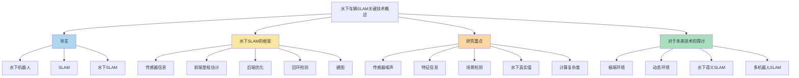
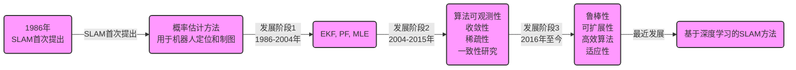
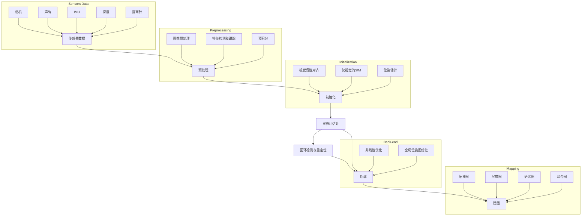
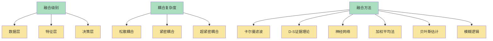
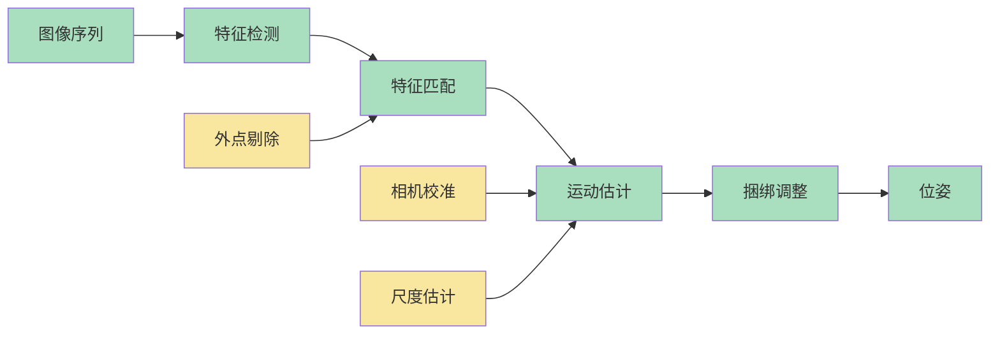

# 水下场景关键 SLAM 算法

综述阅读笔记[Remote Sensing | Free Full-Text | An Overview of Key SLAM Technologies for Underwater Scenes (mdpi.com)](https://www.mdpi.com/2072-4292/15/10/2496#)

## 文章主要内容和架构

<table>
  <tr>
    <td colspan="3" align="center"><strong>文章架构摘要</strong></td>
  </tr>
  <tr>
    <td><strong>水下SLAM框架</strong></td>
    <td><strong>研究重点</strong></td>
    <td><strong>应用前景</strong></td>
  </tr>
  <tr>
    <td>传感器信息（重要的部分）</td>
    <td>传感器噪声</td>
    <td>极端环境</td>
  </tr>
  <tr>
    <td>前端里程计估计</td>
    <td>特征信息</td>
    <td>动态环境</td>
  </tr>
  <tr>
    <td>后端优化</td>
    <td>场景检测</td>
    <td>水下语义SLAM</td>
  </tr>
  <tr>
    <td>回环检测</td>
    <td>水下真值</td>
    <td>多机器人SLAM</td>
  </tr>
  <tr>
    <td>地图构建</td>
    <td>计算复杂度</td>
    <td></td>
  </tr>
</table>

## 导言部分

水下机器人分为两大类：遥控操作潜水器（ROVs）和自主水下航行器（AUVs） 。这些机器人主要用于海洋资源调查、海底生物研究、水下结构检测和海洋数据采集。

SLAM（Simultaneous Localization and Mapping），即同步定位与地图构建，是机器人技术中的一种关键技术。SLAM的基本任务是在未知环境中，利用机器人自身携带的传感器获取环境信息，并在导航和定位的过程中构建环境的结构一致地图。解决了机器人在缺乏先验信息的环境中实现**机器人的定位和运动轨迹的获取**问题，目前广泛运用于无人机，扫地机器人，无人车，智能可穿戴设备中。

**SLAM的引入与早期发展**：SLAM技术于1986年在IEEE机器人与自动化会议上首次提出，旨在解决空间不确定性描述和转换表示的问题。早期的研究主要集中在**概率估计方法**的提出，如扩展卡尔曼滤波器(EKF)、粒子滤波器(PF)和最大似然估计(MLE)。

**SLAM的中期发展**：从2004年到2015年，SLAM进入了算法分析时代，研究重点包括算法的可观测性、收敛性、稀疏性和一致性。该阶段的研究进一步完善了SLAM算法的理论基础和实用性。

**现代SLAM技术的发展**：自2016年以来，SLAM研究的重点转向算法的鲁棒性、可扩展性和资源受限条件下的高效算法。此外，随着计算机视觉和深度学习方法的兴起，基于**深度学习的SLAM方法**逐渐成为研究热点。这些方法利用视觉传感器进行环境感知，并通过深度学习提高SLAM的精度和鲁棒性。

**视觉SLAM的兴起**：近年来，视觉SLAM作为一种替代传统SLAM的方法，得到了广泛应用。视觉SLAM利用相机捕获的图像进行定位和建图，具有成本低、信息获取能力强等优点。常见的视觉SLAM方法包括单目SLAM、双目SLAM和RGB-D SLAM。

水下环境会屏蔽 GPS 等无线电信号，惯性导航方法在水下容易积累误差，因此水下航行器的精确定位和导航任务非常困难。目前传统的水下定位方法如短基线（SBL）和超短基线（USBL），需要在目标区域安装带有接收装置的基阵，或者需要水下潜航器定期进行位置校正。这些方法虽然有用，但成本高昂，而且探测范围受到信标的限制。此外，潜航器需要频繁浮出水面，往往需要付出更多的努力。因此SLAM技术在水下会有更广泛的运用背景。然而，水下环境中的光照、纹理和动态变化对SLAM算法提出了更高的要求。为解决这些问题，研究者们提出了**多种传感器融合的方法**，如视觉-惯性融合和声纳-视觉融合，以提高水下SLAM的精度和鲁棒性。

## 水下 SLAM 框架

同步定位和绘图系统包括三个过程：感知、定位和绘图。感知传感器和外感知传感器用于获取环境信息，从而使机器人能够估计和定位自身的位置和姿势，然后，生成环境地图。SLAM问题本质上是一个状态估计问题，通过运动方程和观测方程来进行数学描述：
$$
x_k = f(x_{k-1}, u_k, w_k) 
\\
z_{k,j} = h(y_j, x_k, v_{k,j})
$$
其中，$x_k$ 表示机器人在时间 $k$ 的位置，$u_k$ 表示时间 $k$ 的机器人输入，$w_k$ 表示时间 $k$ 的噪声，$z_{k,j}$ 是时间 $k$ 对第 $j$ 个路标点的观测数据，$y_j$ 表示第 $j$ 个路标点，$v_{k,j}$ 是时间 $k$ 对第 $j$ 个路标点的噪声。下图为SLAM 过程示意图。虚线为真实轨迹。实线为估计轨迹。

目前视觉 SLAM 是水下机器人常用的传感方法，也是本文的主要议题之一。下图展示了视觉 SLAM 的基本理论框架，包括传感器数据、前端、后端、闭环检测和映射。传感器数据收集后发送到前端，前端使用视觉里程计进行帧间运动估计。闭环用于减少传感器噪声和模型误差累积造成的累积误差和漂移。后端处理视觉里程计在不同时刻测量到的摄像头位置和闭环检测信息，并对其进行优化，以获得全局一致的轨迹和地图。

水下环境有以下特点特点：**结构不确定性**(水下环境通常是非结构化的，缺乏明显的特征和标志物。这使得特征提取和匹配变得困难);**光照条件差**；**浑浊度高**；**动态环境**(水下环境中常有动态物体如海洋生物、水流等，这些动态现象会干扰传感器数据的稳定性。)；**信号传输困难**(水下无法使用GPS等无线电信号进行定位，传统的导航方法如惯性导航会累积误差)。因此传统的 SLAM 方法直接用于该领域可能会产生各种问题。

**笔者注：**文章中提到了(水下环境对 GPS 和惯性测量单元的排斥)，在文章中没给出具体的参考文献，个人感觉惯性测量单元（IMU）在SLAM算法中对水下环境是足够适用的，也就是说这个传感器和地面相比得到的数据有相似的可信度，个人后续的研究会聚焦于此。

### 传感器信息

在水下SLAM系统中，传感器是关键组件，能够通过获取的信息来确定当前位置、估算轨迹并构建环境地图。水下环境中的传感器主要分为内感传感器( Proprioceptive Sensors)和外感传感器(Exteroceptive Sensors)两大类。

#### 1. 内感传感器

内感传感器用于获取水下机器人自身的状态和位置信息（速度、方向、加速度和深度信息），在没有外部帮助的情况下估算其位置和姿态。常用的内感传感器包括：

- **深度传感器**：通过水压计算水下机器人的深度。
- **高度计**：测量机器人相对于海洋层流或者海底的相对距离。
- **多普勒速度计（DVL）**：通过发射声波脉冲并接收多普勒位移回波来计算速度。
- **惯性测量单元（IMU）**：由加速度计和陀螺仪组成，负责测量加速度和角加速度。
- **罗盘**：提供方向参考。

#### 2. 外感传感器

外感传感器用于获取周围环境的信息，主要包括视觉传感器和声纳传感器。

- **视觉传感器**：视觉SLAM算法利用相机捕获的图像进行定位和建图。常见的视觉传感器包括**单目**相机、**双目**相机和**RGB-D**相机。单目相机结构简单且成本低，但在深度信息缺失的情况下可能受限。双目相机可以通过视差原理获取深度信息，而RGB-D相机可以直接获取RGB图像和深度图。然而，由于红外光在水下环境中的严重衰减，RGB-D相机的使用受到限制，因此单目和双目相机仍是水下视觉传感器的主流选择。
- **声纳传感器**：声纳可以在无光环境下通过反射声波来检测和定位物体，适用于水下光照不足的情况。声纳传感器按扫描模式可分为前视声纳（FLS）、侧扫声纳（SSS）和声透镜声纳（ALS）。前视声纳进一步分为单波束和多波束声纳。声纳传感器能够在复杂的光照条件下提供高分辨率的3D测量数据，是水下SLAM的重要传感器。
- **激光传感器**：激光传感器能够在复杂光照条件和无光学特征的场景中提供高频测距和高分辨率的三维测量数据。激光雷达生成的点云数据可以方便地接入SLAM系统，帮助绘制海底地图和创建详细的三维模型。此外，这些数据可以用于探测环境中的物体，绘制出更精确的导航地图。但激光雷达测量的数据质量容易受到极端环境（如浑浊水体、光照变化）和运动平滑性（如水流、AUV自身运动）造成的点云对齐误差的影响。目前需要结合多传感器融合技术以提高系统的稳定性和精度。

#### 3. 多传感器融合

单一类型的传感器在水下SLAM系统中通常有一定的局限性。为了提高SLAM的精度和鲁棒性，研究者们将多种传感器融合到系统中。常见的融合方法包括视觉-惯性融合（由视觉和IMU组成）、激光-视觉融合（由激光和视觉组成）以及多传感器融合（结合声纳、IMU、视觉等）。多传感器融合可以分为**数据层融合**、**特征层融合**和**决策层融合**，根据融合的**复杂程度**还可以分为松散耦合、**紧密耦合**和**超紧密耦合**。融合方法包括**加权平均法**、**卡尔曼滤波**、**贝叶斯估计**、**D-S证据理论**、**模糊逻辑**和神经网络等。

视觉和惯性测量（IMU）两种传感模式具有互补特性，通过结合使用，可以显著提高视觉-惯性里程测量或SLAM的精度。视觉传感器能够提供丰富的环境信息，而IMU则能提供高频率的运动数据，使得系统可以更好地感知和理解复杂环境。主要的视觉惯性定位方法可分为两类：基于**卡尔曼滤波**的方法和基于**图的优化**方法。下面给出具体的例子：

| 方法类别             | 具体方法  | 描述                                                         | 特点与优势                                                   | 备注                                            |
| -------------------- | --------- | ------------------------------------------------------------ | ------------------------------------------------------------ | ----------------------------------------------- |
| **卡尔曼滤波方法**   | MSCKF     | 利用卡尔曼滤波器进行状态估计，实时融合视觉和惯性数据。       | 提高定位和建图的精度。                                       |                                                 |
|                      | ROVIO     | 同样基于卡尔曼滤波进行状态估计。                             | 提高定位和建图的精度。                                       |                                                 |
| **图优化方法**       | OKVIS     | 采用紧密耦合的融合方式，使用成本函数将视觉和惯性数据结合，进行非线性优化。 | 更高的精度，算法层面对IMU误差项和信息矩阵进行严格推导，系统层面开发了精确的实时SLAM硬件和算法。 | Leutenegger提出OKVIS2，通过边际化创建姿态图边。 |
|                      | VINS-Mono | 紧密耦合的非线性优化方法，融合预集成的IMU测量值和特征观测值。 | 高精度的视觉惯性里程表，四自由度姿态图优化增强全局一致性，能够保存和加载地图，实现地图重用和组合。 | 由单目摄像头和低成本IMU组成。                   |
|                      | SVIn2     | 基于关键帧的同步定位和绘图系统，融合视觉传感器、IMU、深度计和声纳。 | 解决定位漂移和跟踪损失问题，实现基于词袋库的闭环检测和重新定位功能，特别适用于水下环境。 | 采用紧密耦合的融合方式。                        |
| **水下图像增强方法** | AHE       | 自适应直方图均衡                                             | 提高图像对比度和清晰度。                                     |                                                 |
|                      | MF        | 中值滤波                                                     | 消除图像中的噪声。                                           | 其实应该还有各种各样的图像滤波方式              |
|                      | DCP       | 暗通道先验算法                                               | 消除图像中的雾霾，提高图像清晰度。                           | DCP算法具有较好的性能。                         |

### 前端测距估算

视觉里程计是通过利用相机获取的相邻图像信息来估算相机运动的方法。它通过计算静态特征点在连续帧中的相对位移，从而计算出相对平移和旋转增量，并将其连接成全球参考坐标系上的轨迹。根据实现方法，视觉里程计可以分为几何方法和深度学习方法两大类。

**几何方法**：

- **特征点法**：这种方法通过算法提取图像中的特征点（如FAST, SIFT, SURF, ORB等），在相邻帧中进行匹配，并利用几何关系得到相机的旋转矩阵和平移矩阵。其目标是最小化重投影误差，通常通过计算像素坐标值的差异来实现。

基于特征的视觉里程测量结构如上图所示吗，其中**图像序列**：从相机获取连续的图像序列。**特征检测**：在图像中检测出特征点。**特征匹配**：在连续的图像帧之间进行特征点匹配。**外点剔除**：剔除匹配中的外点（错误匹配点）。**运动估计**：根据特征匹配结果估算相机的运动（旋转和平移）。**相机校准**：进行相机参数的校准。**尺度估计**：估算场景的尺度信息。**捆绑调整**：进行捆绑调整以优化整体的位姿估计。**位姿**：最终得到相机的位姿（位置和姿态）。

**直接法**：如SVO和DSO，这些方法最小化光度误差，通过假设灰度值恒定来匹配两幅连续图像。直接法在环境中有许多重复纹理或缺乏角点时更适用，但计算量较大，通常需要GPU加速。

下面是几何方法的对比:

| 分类 | 特征点法                                                   | 直接法                                                       |
| ---- | ---------------------------------------------------------- | ------------------------------------------------------------ |
| 概念 | 基于特征点匹配；最小化重投影误差                           | 基于灰度不变性；最小化光度误差                               |
| 劣势 | 需要高质量和大量的特征点                                   | 对光照变化敏感，难以实现闭环检测和重定位                     |
| 特点 | 数据关联与位姿估计解耦；构建稀疏地图，需要闭环检测和重定位 | 数据关联与位姿估计耦合；构建半稠密或稠密地图，适合多传感器融合 |

**深度学习方法**：

- 深度学习方法从图像中提取高层特征表示，而无需传统的特征提取器。在水下场景中，深度学习方法通常是一种优秀的视觉里程计解决方案。早期的深度学习视觉里程计方法通常是**替代系统中的某些工作**，被称为混合视觉里程计。随后，逐渐出现了一些纯粹基于神经网络的**端到端视觉里程计**方法。这些系统可以进一步分为**监督学习**和**无监督学习**两类。

### 后端优化

SLAM（同时定位与地图构建）本质上是对机器人自身及其周围空间的不确定性进行估计。随着时间的推移，前端里程计估算在相机位姿估计中会累积误差。基于前端里程计，后端可以在更大规模和更长时间内对整个系统的状态进行优化。在水下视觉SLAM中，主流的状态优化算法包括基于滤波理论的扩展卡尔曼滤波器（EKF）和基于非线性优化理论的图优化。这些算法在水下环境中的应用研究有限，需要进一步研究其有效性。

在线性优化中，利用滤波模型，该模型基于贝叶斯概率理论。滤波模型将SLAM问题转换为确定相机主体位姿和周围环境空间特征的联合概率。

图优化SLAM的目标是根据环境观测来估计移动机器人位姿的最大后验概率（MAP）。通过贝叶斯定理，可以得到如下公式： 
$$
P(X∣U)∝∏_iP(x_{i+1}∣x_i,u_i)×∏_{ij}P(x_j∣x_i,u_{ij})
$$
其中，X表示机器人的位姿，U表示约束条件。图优化SLAM的关键是计算概率分布最大化时的最大后验优化结果，即将要估计变量的最大后验概率转换为最大似然估计。

### 环路闭合检测

闭环检测是一种对地图进行全局优化的方法，用于抑制摄像机姿势的估计值与实际值之间的误差累积。在摄像机移动过程中，算法会计算地图之间的相似度，以确定摄像机是否已到达访问过的场景。一旦检测到，信息就会传送到后端进行优化，确保估计轨迹在几何上保持一致，并消除累积误差，闭环检测流程如下图所示。其中的名词解释如下：

**关键帧处理（Key frames processing）**处理相机捕获的图像序列，提取关键帧。**关键帧**是指在相机移动过程中具有显著特征的图像帧。

**几何粗略检测（Geometry rough detection）**使用几何方法对关键帧进行粗略检测，初步筛选出可能存在**回环的候选帧**。

**视觉词袋相似度计算（Visual BoW similarity calculation）**计算候选回环帧与当前帧之间的视觉词袋（BoW）相似度。视觉词袋模型是一种基于特征的图像表示方法，可以有效比较图像之间的相似性。

**点云重新匹配验证（Point cloud re-matching for verification）**对可疑回环帧进行点云重新匹配，以验证回环的存在。通过更精细的点云匹配，确保回环检测的准确性。

**回环帧识别（Loop closure frames）**最终确认回环帧，并将其纳入SLAM系统的优化过程中，以修正累计误差。

### 绘图

水下SLAM系统生成的最终地图形式根据方法和实现的功能不同而有所差异。一般来说，这些地图可以分为以下几类：

#### 1. 拓扑图

拓扑图具有高度的抽象性，适合面积大、结构简单的环境。其特点是：

- **表示方法**：环境表示为拓扑图，图中的节点与环境中的特征状态或位置相对应，节点间的边表示共同数据关联。
- **优点**：存储和搜索空间小，计算效率高，可用于路径规划，能够使用复杂高效的搜索和推理算法。
- **缺点**：缺乏度量信息，不适用于精确导航，依赖于拓扑节点的识别和匹配，当环境过于相似时难以区分。

#### 2. 比例尺地图

包括栅格地图和地标地图：

- **栅格地图**：
  - **表示方法**：将三维环境划分为大小相等的立方体，每个立方体代表空间中的一个区域，值反映障碍物的概率。
  - **优点**：保留了整个环境的信息，适用于自我定位、路径规划、定位、导航和避障，可以融合多传感器信息。
  - **缺点**：随着环境规模的增大，需要更多的计算和存储空间，定位过程中的搜索空间大，实时性差。
- **地标地图**：
  - **表示方法**：使用环境的几何特征（如点、线、平面）表示，根据特征点的密度分为稀疏、半密集和密集地图。
  - **优点**：稀疏地图用于定位，密集地图用于导航和避障。
  - **缺点**：稀疏地图信息量少，密集地图需要大量计算和存储空间。
- **点云地图**：
  - **表示方法**：环境由大量三维空间点描述，将物体离散成密集的点云。
  - **优点**：适用于定位、导航、避障和三维重建。
  - **缺点**：大规模环境需要更多计算和存储空间。

#### 3. 语义地图

语义地图由若干可区分的语义元素组成，重点在于将语义概念与地图中的物体联系起来，赋予它们抽象的含义：

- **优点**：使移动机器人更智能地行动，执行复杂的交互任务。
- **缺点**：物体类型在不同环境中往往不同，难以为所有物体分配语义概念，对象间差异大，创建复杂环境认知地图困难，算法需要更大的计算量。

#### 4. 混合地图

没有一种地图表示法能充分满足所有任务要求和性能标准。混合地图结合了多种地图表示法的优势，实现不同的目标：

- **优点**：利用每种地图表示法的优势，满足定位、导航、避障、路径规划、三维重建、交互等多种任务需求。
- **缺点**：系统复杂，需要更高的计算和存储能力。

| 地图类型 | 描述                                                         | 优点                                                         | 缺点                                                         |
| -------- | ------------------------------------------------------------ | ------------------------------------------------------------ | ------------------------------------------------------------ |
| 拓扑图   | 环境表示为拓扑图，节点表示特征状态或位置，边表示共同数据关联。 | 存储和搜索空间小，计算效率高，可用于路径规划，能够使用复杂高效的搜索和推理算法。 | 缺乏度量信息，不适用于精确导航，依赖于拓扑节点的识别和匹配，难以区分相似环境。 |
| 栅格地图 | 将三维环境划分为立方体，每个立方体代表一个区域，值反映障碍物的概率。 | 保留整个环境的信息，适用于自我定位、路径规划、定位、导航和避障，可以融合多传感器信息。 | 随环境规模增大需要更多计算和存储空间，定位过程中的搜索空间大，实时性差。 |
| 地标地图 | 使用几何特征（如点、线、平面）表示环境，根据特征点密度分为稀疏、半密集和密集地图。 | 稀疏地图用于定位，密集地图用于导航和避障。                   | 稀疏地图信息量少，密集地图需要大量计算和存储空间。           |
| 点云地图 | 环境由大量三维空间点描述，将物体离散成密集的点云。           | 适用于定位、导航、避障和三维重建。                           | 大规模环境需要更多计算和存储空间。                           |
| 语义地图 | 由可区分的语义元素组成，将语义概念与物体联系起来，赋予抽象含义。 | 使移动机器人更智能地行动，执行复杂的交互任务。               | 物体类型不同，难以为所有物体分配语义概念，对象间差异大，创建复杂环境认知地图困难，算法需要更大计算量。 |
| 混合地图 | 结合多种地图表示法，利用每种地图表示法的优势，实现不同目标。 | 满足多种任务需求，如定位、导航、避障、路径规划、三维重建、交互等。 | 系统复杂，需要更高的计算和存储能力。                         |

## 研究重点和难点

根据上述内容，下表中总结了一些水下 SLAM 方面的研究成果。

| 论文         | 传感器                             | 方法           | 优化             | 回环检测 | 场景                   |
| ------------ | ---------------------------------- | -------------- | ---------------- | -------- | ---------------------- |
| LSD-SLAM     | 单目                               | 直接           | 位姿图           | 是       | 大规模、一致性地图     |
| DSO          | 相机                               | 直接和稀疏     | 非线性联合       | 否       | -                      |
| SVO          | 单目                               | 半直接         | 最小化重投影误差 | 否       | -                      |
| ORB-SLAM2    | 单目，立体，RGB-D                  | 间接           | BA               | 是       | 纹理化环境             |
| ORB-SLAM3    | 单目，立体，RGB-D，小孔，鱼眼，IMU | 间接           | BA               | 是       | 纹理化环境             |
| ROVIO        | IMU，相机                          | 直接           | EKF              | 否       | UAV中使用              |
| OKVIS        | 相机，IMU                          | 间接           | 关键帧边缘化     | 否       | 手持室内运动，骑自行车 |
| OKVIS2       | 立体，IMU                          | 间接           | 共同观测边缘化   | 是       | -                      |
| SVIn2        | 立体，IMU，深度，声纳              | 间接           | 紧密耦合         | 是       | 水下环境               |
| VINS-Mono    | 单目，IMU                          | 间接           | 紧密耦合和位姿图 | 是       | UAV中使用              |
| MSCKF        | 单目，立体，IMU                    | 间接           | EKF              | 否       | 真实环境轨迹           |
| DeepVIO      | 立体                               | 自监督学习方法 | -                | 否       | -                      |
| SelfVIO      | 单目，IMU                          | 自监督学习方法 | -                | 否       | -                      |
| Dolphin SLAM | 声纳，相机，DVL，IMU               | 间接           | 仿生             | 是       | 水下环境               |
| AEKF-SLAM    | 声纳（主要）                       | 间接           | AEKF             | 是       | 水下环境               |
|              | 激光，AHRS，DVL，压力传感器        | 间接           | EKF              | 否       | 水下管道结构           |
|              | 单目                               | 间接           | BA               | 是       | 自主水下船体检查       |

然而，考虑到水下环境的特殊性，传统的 SLAM 算法在扩展到这一领域时遇到了许多问题。因此，水下 SLAM 仍有许多尚未解决的问题需要关注。

#### 1 极端环境下的水下SLAM

在复杂或密闭的水下环境中，如水下储能设施、码头、淹没的隧道和下水道，人工检查往往很危险或不切实际，需要使用无人水下航行器进行远程检查。这些环境中的低照度、浑浊度和缺乏特征等因素严重限制了水下检测机器人的能力，是一个重要的研究方向。

#### 2 动态环境中的水下SLAM

SLAM系统的姿态计算原理会受到动态物体的影响。在水下环境中，动态现象如海洋生物、机器人运动引起的水流、气泡等非常普遍。动态环境下生成的地图比静态环境下生成的地图缺陷更多。深度学习技术提供了动态特征提取和处理的新思路，尽管由于水下数据集不足，算法进展缓慢，但其仍被认为是解决动态问题的重要方法。

#### 3 水下语义SLAM

目前的SLAM系统大多基于几何特征，忽略了环境中的语义信息。语义SLAM在映射过程中同时获取环境的几何结构和语义信息，并识别环境中独立个体的位置、姿态和功能属性。这些信息能使机器人更有效地应对复杂场景，但在水下环境中，由于光照条件和移动物体的影响，语义识别面临许多挑战。

#### 4 多机器人水下SLAM

由于水下场景面积大、结构单一，依靠单个机器人进行SLAM效率较低。多机器人SLAM需要建立多个SLAM系统，并收集每个机器人的信息。地图融合是多机器人SLAM的重要过程，能够将多个局部地图合并为一个全局地图。回环检测方法和机器人联合方法被用于识别和合并相同场景，但在相似场景中可能会导致误识别，因此建立有效的多地图融合过程是研究重点。

| 研究方向             | 描述                                                         | 挑战                                                         | 未来发展                                                     |
| -------------------- | ------------------------------------------------------------ | ------------------------------------------------------------ | ------------------------------------------------------------ |
| 极端环境下的水下SLAM | 在复杂或密闭的水下环境中进行远程检查，如水下储能设施、码头、淹没的隧道和下水道。 | 低照度、浑浊度和缺乏特征等因素限制了检测能力。               | 需要解决低照度、浑浊度和特征缺乏的问题。                     |
| 动态环境中的水下SLAM | 动态物体（如海洋生物、机器人运动引起的水流、气泡等）影响特征匹配和计算结果。 | 动态现象普遍存在，生成的地图比静态环境下生成的地图缺陷更多，算法进展受限于数据集不足。 | 深度学习提供了新方法，有望解决动态问题。                     |
| 水下语义SLAM         | 在映射过程中同时获取环境的几何结构和语义信息，并识别环境中独立个体的位置、姿态和功能属性。 | 光照条件和移动物体（如鱼群）的影响使得语义识别面临挑战，大量动态物体存在也不利于最终合成。 | 利用深度学习进行语义提取和处理，以提高SLAM系统的智能和功能。 |
| 多机器人水下SLAM     | 多机器人协同工作，通过地图融合将多个局部地图合并为一个全局地图。 | 相似场景导致误识别，机器人视角不一致，难以观测到相同地点。   | 建立有效的地图融合和回环检测方法，解决相似场景的误识别问题。 |

## 附录 A（水下数据集）

水下 SLAM 的难点之一是获取水下真实值，这间接导致了水下定位和合成专用数据集的匮乏。在本文中，我们介绍了几个公开的水下 SLAM 数据集，可供研究人员用于实验比较。详情请参阅下表。

| 数据集名称                                                   | 描述                                                         |
| ------------------------------------------------------------ | ------------------------------------------------------------ |
| [使用UWSim生成的模拟数据集 (2016)](https://ieeexplore.ieee.org/abstract/document/7761315) | 本文提供了七个不同模拟数据集的开放集合，这些数据集是使用水下模拟器生成的。这些数据集展示了三条轨迹和两个基于真实珊瑚礁镶嵌图的模拟海底视觉数据。 |
| [水下洞穴声纳和视觉数据集 (2017)](https://journals.sagepub.com/doi/full/10.1177/0278364917732838) | [数据集](http://cirs.udg.edu/caves-dataset/)是在一个水下洞穴的非结构化环境中使用自主水下航行器测试平台收集的。该航行器配备了两个机械扫描成像声纳传感器，同时绘制洞穴的水平和垂直表面、一个多普勒速度计、两个惯性测量单元、一个深度传感器和一个垂直安装的相机，用于在特定点对海底进行真值验证。 |
| [使用水下传感器套件收集的数据集 (2018)](https://ieeexplore.ieee.org/stamp/stamp.jsp?tp=&arnumber=8604819) | 使用提议的传感器套件在各种环境中收集声纳、视觉、惯性和深度数据。具体来说，在巴巴多斯的现场试验期间，收集了沉船和珊瑚礁数据。更多数据是在北卡罗来纳州的幻想湖和佛罗里达州高泉附近的不同地点收集的。 |
| [Aqualoc (2019)](https://journals.sagepub.com/doi/full/10.1177/0278364919883346?casa_token=fjwJnhWPUlUAAAAA%3ATMOSYZvS2UX_9ZpOUhBLoXWc-j5s6dD8ir5VeV9KOg2kq4ICsp0pAhQVfOd_AuZcqg9u4_jrmnTBDos) | 组成该[数据集](http://www.lirmm.fr/aqualoc)的数据序列是在三个不同深度（几米、270米和380米）记录的。以ROS包和原始数据的形式提供了17个序列。对于每个序列，还使用运动结构库离线计算了轨迹，以便与实时定位方法进行比较。 |
| [VAROS合成水下数据集 (2021)](https://openaccess.thecvf.com/content/ICCV2021W/OceanVision/papers/Zwilgmeyer_The_VAROS_Synthetic_Underwater_Data_Set_Towards_Realistic_Multi-Sensor_Underwater_ICCVW_2021_paper.pdf) | 通过首先定义模拟水下航行器的航路点创建姿态序列。使用光线追踪方法渲染场景，该方法生成集成直接光和间接体积散射的真实图像。[VAROS数据集]( https://www.ntnu.edu/arosvisiongroup/varos.)版本1提供了图像、惯性测量单元（IMU）和深度计数据，以及地面真值姿态、深度图像和表面法线图像。 |
| [具有高精度地面实况的海洋机器人水深测绘和SLAM数据集 (2022)](https://journals.sagepub.com/doi/full/10.1177/02783649211044749) | 本文展示了一个[数据集](https://www.Seaward.Science/data/poshttps://www.Seaward.Science/data/pos)，其中包括四次独立调查，旨在测试水深SLAM算法，使用两种现代声纳传感器、典型的水下航行器导航传感器和高精度（2厘米水平，10厘米垂直）实时运动学（RTK）GPS地面实况。 |

[Aqualoc 数据集](https://seafile.lirmm.fr/d/79b03788f29148ca84e5/)专门用于开发水下航行器在海底附近航行时的同步定位和地图绘制方法。数据序列是在三种不同的环境中记录的：几米深的港口，以及水深 270 米和 380 米的两个地点。数据采集由配备了单目单色摄像机、低成本惯性测量单元、压力传感器和计算单元的遥控潜水器完成。采集的数据包括 17 个序列，以 ROS 软件包的形式提供，并作为原始数据使用。数据集的序列图像如下所示。

