# SVIn2： 基于多传感器融合的水下 SLAM 系统

https://doi.org/10.1177/02783649221110259

## 摘要

本文介绍了基于关键帧紧密耦合的新型同步定位和绘图（SLAM）系统 SVIn2，该系统在非线性优化框架中融合了扫描剖面声纳、视觉、惯性和水压信息，适用于小型和大型挑战性水下环境。 所开发的实时系统具有强大的初始化、闭环和重新定位功能，这使得该系统在水下场景中常见的雾霾、模糊、弱光和光照变化等情况下也能保持可靠。 在过去的十年中，视觉惯性测距和 SLAM 系统在室内和室外环境中为移动机器人提供了出色的性能，但由于水下环境固有的困难，这些系统往往在水下失效。 我们的方法通过使用额外的传感器并利用它们的互补特性来克服以往方法的弱点。 特别是，我们利用（1）声波测距信息来改进重建和定位，这要归功于可靠的距离测量；（2）来自水压传感器的深度信息可用于稳健初始化、细化比例，并有助于限制紧密耦合集成中的漂移。 所开发的开源软件已成功用于在基准数据集和众多真实水下场景中测试和验证所提出的系统，包括使用定制的水下传感器套件和自动水下航行器 Aqua2 收集的数据集。 SVIn2 在这些数据集的准确性和鲁棒性方面表现出色，并支持其他机器人任务，例如，在有障碍物的情况下规划水下机器人。

## 1. 导言

我们提出了一种同步定位和绘图（SLAM）系统，该系统利用摄像头、惯性测量单元（IMU）、声纳和压力传感器的互补特性，实现水下航行器在充满挑战和高度非结构化的水下环境中的稳健自主。

自主水下航行器（AUV）为水下环境（如洞穴、桥梁、水坝、石油钻井平台和沉船）的自动勘探和测绘提供了独特的机会，这对经济、保护和科学发现都是极其重要的任务。 目前，水下航行器的自主性受到一系列挑战的阻碍。 由于陆地上的定位基础设施（如全球定位系统）在水下无法使用，因此挑战之一与状态估计有关。 近年来，许多视觉里程测量和 SLAM 系统（[Davison et al、 2014](https://journals.sagepub.com/doi/full/10.1177/02783649221110259#bibr9-02783649221110259)，[2018](https://journals.sagepub.com/doi/full/10.1177/02783649221110259#bibr12-02783649221110259)；[Forster等人，2017b](https://journals.sagepub.com/doi/full/10.1177/02783649221110259#bibr22-02783649221110259)；[Klein和Murray，2007](https://journals.sagepub.com/doi/full/10.1177/02783649221110259#bibr34-02783649221110259)；[Mur-Artal等人、 2015](https://journals.sagepub.com/doi/full/10.1177/02783649221110259#bibr43-02783649221110259)）开发的单目、立体或多摄像机装备，主要用于室内和室外环境，可分为*直接*（基于特征）、*直接*或*半直接*方法。 视觉通常与惯性测量相结合，以提高姿态估计的准确性和鲁棒性，称为*视觉-惯性测距（VIO）*或*视觉-惯性 SLAM（VI-SL*AM）（[Leutenegger et al、 2015](https://journals.sagepub.com/doi/full/10.1177/02783649221110259#bibr37-02783649221110259)；[Mourikis 和 Roumeliotis，2007](https://journals.sagepub.com/doi/full/10.1177/02783649221110259#bibr42-02783649221110259)；[Mur-Artal 和 Tardós，2017](https://journals.sagepub.com/doi/full/10.1177/02783649221110259#bibr44-02783649221110259)；[Qin 等人，2018](https://journals.sagepub.com/doi/full/10.1177/02783649221110259#bibr51-02783649221110259)；[Sun 等人，2018](https://journals.sagepub.com/doi/full/10.1177/02783649221110259#bibr70-02783649221110259)）。 正如之前的研究（[Joshi 等人，2019](https://journals.sagepub.com/doi/full/10.1177/02783649221110259#bibr31-02783649221110259)；[Quattrini Li 等人，2016a](https://journals.sagepub.com/doi/full/10.1177/02783649221110259#bibr52-02783649221110259)）所示，由于水下环境固有的挑战，现有的视觉或视觉-惯性状态估计包在水下会产生不准确的轨迹，甚至完全失去跟踪能力。 特别是，基于视觉的水下状态估算面临许多挑战，包括能见度、光线和颜色衰减（[Fabbri et al、 2018](https://journals.sagepub.com/doi/full/10.1177/02783649221110259#bibr16-02783649221110259)；[Roznere 和 Quattrini Li, 2019](https://journals.sagepub.com/doi/full/10.1177/02783649221110259#bibr62-02783649221110259)；[Skaff et al、](https://journals.sagepub.com/doi/full/10.1177/02783649221110259#bibr66-02783649221110259)

[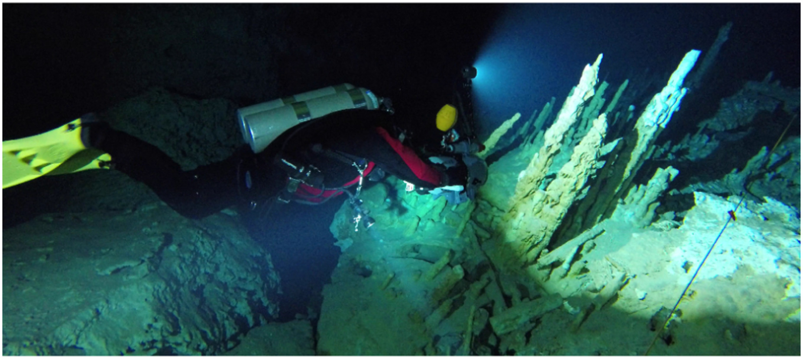**Figure 1**。 位于墨西哥金塔纳罗奥州的水下洞穴，使用水下立体钻机收集数据。](https://journals.sagepub.com/doi/full/10.1177/02783649221110259#bibr66-02783649221110259)

在这项工作中，我们提出了一种新颖的 SLAM 系统 *SVIn2* ，该系统以水下环境为目标，通过选择不同的传感器配置子集（包括：视觉（单眼、立体摄像机或多摄像机）、惯性（线性加速度和角速度）和数字管道剖面声纳（DPP-声纳）），可轻松适用于其他领域--例如室内和室外： 视觉（单目、立体摄像机或多摄像机）、惯性（线性加速度和角速度）、数字管道剖面声纳（DPP-sonar）（[Imagenex Technology Corp, 2022](https://journals.sagepub.com/doi/full/10.1177/02783649221110259#bibr28-02783649221110259)）--即机械扫描剖面声纳和/或水深数据。 这使得我们的系统具有多功能性，适用于不同的传感器套件和水下航行器。 我们增强了最先进的视觉惯性状态估计软件包 OKVIS（[Leutenegger 等人，2015](https://journals.sagepub.com/doi/full/10.1177/02783649221110259#bibr37-02783649221110259)），在一个紧密耦合的基于非线性优化的框架中容纳了来自 DPP 声纳的声程数据。 由于 DPP 声纳能提供有关障碍物存在的可靠信息，并具有精确的比例尺，因此这种增强方法能改进轨迹估计，尤其是在水下能见度变化的情况下。 然而，在长轨迹中，漂移可能会累积，从而导致错误的轨迹。 为了解决漂移问题，我们在优化过程中引入了水压传感器的深度测量、使用词袋（BoW）框架的闭环和重新定位功能，以及更稳健的初始化过程，以利用水深测量来完善尺度。 这些新增功能使所提出的方法能够稳健、准确地估计机器人的轨迹，而其他方法则会出现轨迹不正确或完全丧失定位功能的情况。

为了验证我们提出的方法，首先，我们在 EuRoC 微型航空飞行器 (MAV) 公共数据集（[Burri 等人，2016](https://journals.sagepub.com/doi/full/10.1177/02783649221110259#bibr4-02783649221110259)）上将所提出的闭环方法与其他最先进的系统进行了比较，评估了所提出的闭环方法的性能，同时在我们的系统中禁用了 DPP 声纳和水压测量的融合。 其次，我们在不同条件下获得的多个水下数据集上测试了所提出的完整系统。 更具体地说，水下数据包括视觉、惯性、水深和声程测量，这些数据是使用定制的传感器套件（[Rahman等人，2018a](https://journals.sagepub.com/doi/full/10.1177/02783649221110259#bibr55-02783649221110259)）从不同地点收集的；此外，Aqua2水下航行器（[Dudek等人，2005](https://journals.sagepub.com/doi/full/10.1177/02783649221110259#bibr11-02783649221110259)）也收集了数据，包括视觉、惯性和水深测量。 水下数据集的结果表明，其他最先进的系统会失去跟踪能力和/或无法保持一致的比例，而我们提出的方法能保持正确的比例，不会出现偏差。 在缺乏水下地面真实轨迹的情况下，我们使用 COLMAP（[Schönberger et al. 第三，我们使用靶标（](https://journals.sagepub.com/doi/full/10.1177/02783649221110259#bibr63-02783649221110259)[Fiala，2005](https://journals.sagepub.com/doi/full/10.1177/02783649221110259#bibr19-02783649221110259)）进行了基于三维地标的验证，以显示 SVIn2 的估计精度。 第四，我们使用名为 AQUALOC（[Ferrera et al.） 第五，我们进行了一项消融研究，以观察每个传感器对定位精度的贡献。](https://journals.sagepub.com/doi/full/10.1177/02783649221110259#bibr18-02783649221110259)

本文的贡献在于通过更完整的系统描述和额外的实验分析，包括消融研究、基于地标的验证、与 SfM 软件包的比较以及在公共水下数据集上的实验，大大扩展了我们在（[Rahman 等人，2018b](https://journals.sagepub.com/doi/full/10.1177/02783649221110259#bibr56-02783649221110259)，[2019](https://journals.sagepub.com/doi/full/10.1177/02783649221110259#bibr57-02783649221110259) ）中介绍的初步结果。 代码在（[拉赫曼，2020](https://journals.sagepub.com/doi/full/10.1177/02783649221110259#bibr54-02783649221110259)）上开源发布。

本文结构如下：下一节讨论当前水下和水上状态估计的最新技术。 第 3 节概述了拟议的管道，以及为图像预处理步骤开发的方法和使用的符号。 第 4 节介绍了紧密耦合的 DPP-声纳、立体相机、惯性和水深传感器集成的数学公式和推导。 第 5 节和第 6 节分别介绍了姿态初始化和闭环/定位步骤。 第 7 节介绍了从公开航空数据集和各种具有挑战性的水下环境中获得的实验结果。 最后，我们将总结本文并讨论未来的工作方向。

## 2. 相关工作

几十年来，研究人员一直在研究机器人状态估计问题。 在此，我们重点介绍那些专门针对水下环境的研究，以及最近关于视觉惯性状态估计的研究。 如需更全面的概述，读者可参考[Cadena等（2016）](https://journals.sagepub.com/doi/full/10.1177/02783649221110259#bibr5-02783649221110259)和[Huang（2019）](https://journals.sagepub.com/doi/full/10.1177/02783649221110259#bibr27-02783649221110259)的最新研究。

### 2.1. 基于声学传感器的水下导航

[Paull 等人（2013 年）](https://journals.sagepub.com/doi/full/10.1177/02783649221110259#bibr49-02783649221110259)回顾了 AUV 导航和定位的常用传感器和一般方法。 最近，[Maurelli等人（2021年）](https://journals.sagepub.com/doi/full/10.1177/02783649221110259#bibr40-02783649221110259)讨论了AUV的主动和被动定位技术。 声纳（例如成像声纳、扫描剖面声纳和多波束声纳）和/或照相机被用来约束来自死点定位系统（即 IMU 或多普勒速度记录仪 (DVL)）的航位漂移。

大多数水下导航算法（[Johannsson et al、 2005](https://journals.sagepub.com/doi/full/10.1177/02783649221110259#bibr30-02783649221110259)；[Leonard 和 Durrant-Whyte, 2012](https://journals.sagepub.com/doi/full/10.1177/02783649221110259#bibr36-02783649221110259)；[Rigby 等人，2006](https://journals.sagepub.com/doi/full/10.1177/02783649221110259#bibr60-02783649221110259)；[Snyder, 2010](https://journals.sagepub.com/doi/full/10.1177/02783649221110259#bibr67-02783649221110259)）都是基于声学传感器，如 DVL 和超短基线 (USBL)。 由 Stone Aerospace 公司设计的 DEPTHX（DEep Phreatic THermal eXplorer）（[Stone，2007](https://journals.sagepub.com/doi/full/10.1177/02783649221110259#bibr68-02783649221110259)）配备了许多传感器，用于绘制竖井地图（[Gary 等人，2008](https://journals.sagepub.com/doi/full/10.1177/02783649221110259#bibr24-02783649221110259)），包括一个 IMU、两个深度传感器、一个 DVL 和 54 个窄单波束回声探测器。 Sunfish（[Richmond等人，2018](https://journals.sagepub.com/doi/full/10.1177/02783649221110259#bibr59-02783649221110259)）是一种水下SLAM系统，使用多波束声纳、基于光纤陀螺仪（FOG）IMU的水下测距系统、DVL和压力深度传感器，已开发用于自主水下洞穴探测。

许多研究都试图在不需要昂贵的 DVL 或惯性导航系统 (INS) 的情况下降低水下机器人的成本。 [Williams 等人（2000 年）](https://journals.sagepub.com/doi/full/10.1177/02783649221110259#bibr78-02783649221110259)介绍了一种基于 EKF 的水下机器人 SLAM，该机器人配有一个机械扫描声纳，用于绘制水平面地图。 [White等人（2010）](https://journals.sagepub.com/doi/full/10.1177/02783649221110259#bibr77-02783649221110259)介绍了在古代水下蓄水池中使用机械扫描声纳进行绘图和定位的现场实验，该声纳同样定位在水平面上，并使用了粒子过滤器。 [Folkesson 等人（2007 年）](https://journals.sagepub.com/doi/full/10.1177/02783649221110259#bibr20-02783649221110259)使用炽热阵列前视声纳（由两个声纳头组成，一个垂直，一个水平，为两个声纳头探测到的特征提供三维位置），利用成本相对较低的自动潜航器进行实时特征跟踪，而不需要 DVL 和昂贵的惯性导航系统（INS）。 在后一项工作的基础上，[Fallon等人（2013）](https://journals.sagepub.com/doi/full/10.1177/02783649221110259#bibr17-02783649221110259)将该系统扩展到了特征再采集。 [Mallios等人（2016）](https://journals.sagepub.com/doi/full/10.1177/02783649221110259#bibr39-02783649221110259)首次展示了自动潜航器使用水平安装的扫描声纳作为主要传感器在洞穴内进行有限穿透的成果。

[Westman等人（2018）](https://journals.sagepub.com/doi/full/10.1177/02783649221110259#bibr76-02783649221110259)和[Ozog等人（2015）](https://journals.sagepub.com/doi/full/10.1177/02783649221110259#bibr48-02783649221110259)分别提出了一种基于成像声纳的SLAM和三维照片马赛克算法。 [Teixeira等人（2019）](https://journals.sagepub.com/doi/full/10.1177/02783649221110259#bibr72-02783649221110259)介绍了使用多波束声纳的水下场景密集重建。 [McConnell 等人（2020）](https://journals.sagepub.com/doi/full/10.1177/02783649221110259#bibr41-02783649221110259)融合了两个多波束声纳，一个水平放置，一个垂直放置，以解决仰角不确定的问题。 同样，[Joe 等人（2021 年）](https://journals.sagepub.com/doi/full/10.1177/02783649221110259#bibr29-02783649221110259)提出了多波束声纳和剖面声纳的测绘传感器配置，利用前者覆盖的较大视场和后者的窄波束。

[Carreras 等人（2003 年）](https://journals.sagepub.com/doi/full/10.1177/02783649221110259#bibr7-02783649221110259)提出了一种基于地标的导航方法，是利用摄像头进行水下定位的早期尝试。 还研究了使用下视立体摄像机的 SLAM 系统（[Eustice 等人，2005](https://journals.sagepub.com/doi/full/10.1177/02783649221110259#bibr14-02783649221110259)，[2006](https://journals.sagepub.com/doi/full/10.1177/02783649221110259#bibr15-02783649221110259) ），用于绘制泰坦尼克号的地图。 [Corke 等人（2007 年）](https://journals.sagepub.com/doi/full/10.1177/02783649221110259#bibr8-02783649221110259)比较了基于声学传感器节点网络的水下定位方法和基于视觉的水下定位方法，前者能够估算彼此间的距离，后者则显示了在某些情况下在水下使用视觉方法的可行性。 有人提出了使用摄像头和成像声纳的导航和规划算法，用于悬停式自主水下航行器（HAUV）的船体检查应用（[Hong等人，2019](https://journals.sagepub.com/doi/full/10.1177/02783649221110259#bibr25-02783649221110259)；[Hover等人，2012](https://journals.sagepub.com/doi/full/10.1177/02783649221110259#bibr26-02783649221110259)）。 同一小组还针对相同应用开发了纯视觉 SLAM 系统（[Kim 和 Eustice, 2013](https://journals.sagepub.com/doi/full/10.1177/02783649221110259#bibr33-02783649221110259)；[Ozog 和 Eustice, 2014](https://journals.sagepub.com/doi/full/10.1177/02783649221110259#bibr47-02783649221110259)；[Ozog 等人，2016](https://journals.sagepub.com/doi/full/10.1177/02783649221110259#bibr46-02783649221110259)）。 最近的工作融合了立体相机和 DVL，用于水下 SLAM（[Xu 等人，2021](https://journals.sagepub.com/doi/full/10.1177/02783649221110259#bibr80-02783649221110259)）。

我们的研究方向是减少水下 SLAM 所需的传感器，而不像上述一些研究那样需要 DVL 或昂贵的 INS。 我们考虑了一种不同的传感器配置，将机械扫描声纳置于与图像平面平行的垂直面上，以便绘制洞穴结构图，这将在本文后面讨论。

### 2.2. 视觉-惯性状态估计

视觉通常与 IMU 结合使用，因为它们具有互补的特性：摄像头是捕捉外部世界的外感知传感器，而 IMU 则提供有关自身运动的信息。 此外，将视觉与 IMU 相结合可以解决基于单目视觉的 SLAM 中的*尺度*问题，因为它可用于估计摄像机帧之间的运动。 重力也可以估算，这使得两个旋转自由度（DoF）--即绝对俯仰和滚动--可以观测，提供了将视觉与 IMU 集成的另一个优势。 下面，我们将重点介绍一些最先进的视觉惯性 VIO 和 SLAM 方法。 一类状态估计方法基于卡尔曼滤波器。 这方面的例子包括多状态约束卡尔曼滤波器（MSCKF）（[Mourikis and Roumeliotis, 2007](https://journals.sagepub.com/doi/full/10.1177/02783649221110259#bibr42-02783649221110259)）--它已被应用于水下领域（[Shkurti et al、 2011b](https://journals.sagepub.com/doi/full/10.1177/02783649221110259#bibr65-02783649221110259)）及其立体扩展（[Sun 等人，2018](https://journals.sagepub.com/doi/full/10.1177/02783649221110259#bibr70-02783649221110259)）；ROVIO（[Bloesch 等人，2017](https://journals.sagepub.com/doi/full/10.1177/02783649221110259#bibr3-02783649221110259)）；以及 REBiVO（[Tarrio 和 Pedre，2017](https://journals.sagepub.com/doi/full/10.1177/02783649221110259#bibr71-02783649221110259)）。 另一系列方法对传感器状态进行优化--通常是在滑动窗口内--将问题表述为*图优化*问题。 基于特征的视觉惯性系统，如 OKVIS（[Leutenegger 等人，2015](https://journals.sagepub.com/doi/full/10.1177/02783649221110259#bibr37-02783649221110259)）、视觉惯性 ORB-SLAM（[Mur-Artal 和 Tardós, 2017](https://journals.sagepub.com/doi/full/10.1177/02783649221110259#bibr44-02783649221110259)）和 ORB-SLAM3 （[Campos et al、 2021](https://journals.sagepub.com/doi/full/10.1177/02783649221110259#bibr6-02783649221110259)）的优化函数包括 IMU 误差项和重投误差。 *前端*跟踪机制维持一个有界的*关键帧*窗口，并将窗口外不再使用的状态和特征边缘化，以限制优化所需的计算量。 VINS-Mono（[Qin等人，2018](https://journals.sagepub.com/doi/full/10.1177/02783649221110259#bibr51-02783649221110259)）采用了类似的方法，并为每幅图像保留了最少数量的特征。 现有特征由 Kanade-Lucas-Tomasi（KLT）稀疏光流算法在局部窗口中跟踪。 虽然 KLT 稀疏特征允许 VINS-Mono 在低成本嵌入式系统上实时运行，但这种方法往往会导致在挑战性环境（例如能见度低的水下环境）中跟踪失败。 此外，为了进行循环检测，还需要计算关键帧的附加特征及其描述符。 [Delmerico 和 Scaramuzza（2018 年）](https://journals.sagepub.com/doi/full/10.1177/02783649221110259#bibr10-02783649221110259)对不同方法的资源使用情况进行了全面比较，特别是监测了资源使用情况。 [Shkurti 等人（2011a）](https://journals.sagepub.com/doi/full/10.1177/02783649221110259#bibr64-02783649221110259)和 [Quattrini Li 等人（2016b）](https://journals.sagepub.com/doi/full/10.1177/02783649221110259#bibr53-02783649221110259)介绍了水下领域特征的性能评估，重点是沉船环境。

### 2.3. 为什么要将视觉与声学传感器结合用于水下环境

基于视觉的水下导航因其高度非结构化的特性而成为一项艰巨的任务。 与此同时，摄像头是最便宜、体积小、重量轻、能效高的传感器之一，可提供丰富多样的周围环境信息。 在我们最近的工作中（[Joshi 等人，2019](https://journals.sagepub.com/doi/full/10.1177/02783649221110259#bibr31-02783649221110259)），我们比较了开源视觉惯性系统在水下数据集中的性能。 结果表明，由于光和颜色衰减、模糊和漂浮微粒等原因，直接方法和基于特征的方法的 VO/VIO 都具有挑战性。 具体来说，对于直接方法，由于光照变化频繁，亮度恒定假设经常被违反。 对于间接方法，低对比度和微粒会导致虚假特征。 如果没有死区重定位的帮助，纯 VO 在没有运动预测的情况下往往会丢失轨迹，因为很难在后续帧中可靠地跟踪特征。 与视觉不同的是，声纳测距不受浑浊度、光和颜色衰减的影响，因此是对照相机的补充。 DPP 声纳通过提供具有比例尺的特征来提高三维重建的质量，这反过来又有助于定位。

为了实现稳健的跟踪，视觉惯性状态估计系统需要适当的*初始化*。 带有IMU的ORB-SLAM（[Mur-Artal and Tardós，2017](https://journals.sagepub.com/doi/full/10.1177/02783649221110259#bibr44-02783649221110259)）通过首先运行单目SLAM观察姿态，然后估计IMU偏差来执行初始化。 VINS-Mono 采用松耦合传感器融合方法，使单目视觉与惯性测量相一致，从而实现估计器初始化。 除了良好的初始化之外，为了减少基于滑动窗口和边际化的状态估计中的漂移，*环路闭合*--识别之前看到的地方的能力--也是一个重要的方案。 目前，ORB-SLAM（[Mur-Artal等人，2015](https://journals.sagepub.com/doi/full/10.1177/02783649221110259#bibr43-02783649221110259)）及其与IMU的扩展（[Mur-Artal和Tardós，2017](https://journals.sagepub.com/doi/full/10.1177/02783649221110259#bibr44-02783649221110259)）是最可靠的基于特征的SLAM系统之一，该系统使用词袋（BoW）方法进行闭环和重新定位。 VINS-Mono 也使用了相同的技术。 另一种基于 BoW 的方法对一组相关区域进行了聚类，显示了在具有相似性的区域（如珊瑚礁）中对光照变化的鲁棒性（[Maldonado-Ramírez 等人，2016](https://journals.sagepub.com/doi/full/10.1177/02783649221110259#bibr38-02783649221110259)）。 考虑到 OKVIS 在添加新传感器方面的模块性和在水下环境跟踪方面的鲁棒性，我们决定扩展 OKVIS，使其包括 DPP 声纳数据、水压测量、环路闭合功能，以及使用水深进行两步比例细化的更鲁棒的初始化，以专门针对水下环境。

## 3. 系统概述和前言

SVIn2 管道如[图 2](https://journals.sagepub.com/doi/full/10.1177/02783649221110259#fig2-02783649221110259)所示。 机器人传感器配置可包括摄像头（单声道、立体声或多声道）、IMU、DPP 声纳和水压传感器。 后两个传感器可以禁用，作为标准视觉惯性系统运行。

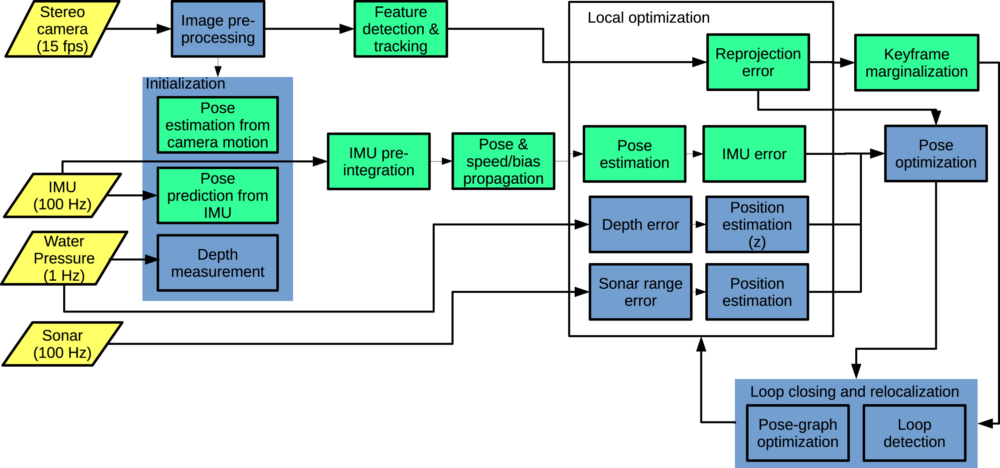**Figure 2**。 所提出SVIn2 方法的概览；黄色为传感器馈送及其频率；绿色为 OKVIS（[Leutenegger 等人，2015](https://journals.sagepub.com/doi/full/10.1177/02783649221110259#bibr37-02783649221110259)）组件；蓝色为我们引入的组件，用于处理声学范围和水深数据、水下视觉效果、初始化以及闭环和重新定位（[Rahman et al、](https://journals.sagepub.com/doi/full/10.1177/02783649221110259#bibr56-02783649221110259)

为了应对上述水下环境的挑战，我们通过添加一个可选的图像预处理步骤来增强管道，以改进水下特征检测。 特别是，我们在*图像预处理步骤中使用了**对比度受限自适应直方图均衡**（CLAHE）滤波器（[Pisano等人，1998](https://journals.sagepub.com/doi/full/10.1177/02783649221110259#bibr50-02783649221110259)）。*

在利用 IMU、摄像头和水深对 SLAM 系统进行初始化后，SLAM 系统使用图像检测特征并随时间跟踪特征；使用 IMU 检测运动；使用深度传感器和 DPP 声纳传感器--所有这些传感器都被送入一个局部优化框架，以最小化为每个传感器定义的误差项。 基于词袋的闭环机制可纠正随时间累积的漂移。

[图 3](https://journals.sagepub.com/doi/full/10.1177/02783649221110259#fig3-02783649221110259) 显示了由立体摄像机、IMU、压力传感器和 DPP 声纳组成的传感器套件，其视场覆盖 360 o与图像平面平行的平面。 以这种配置使用 DPP 声纳的理由是为了绘制水下洞穴结构图。 在正式定义了本文后续部分所使用的符号、象征和状态表示之后，以下各节将详细描述所建议的初始化、传感器融合优化、闭环和重新定位步骤。

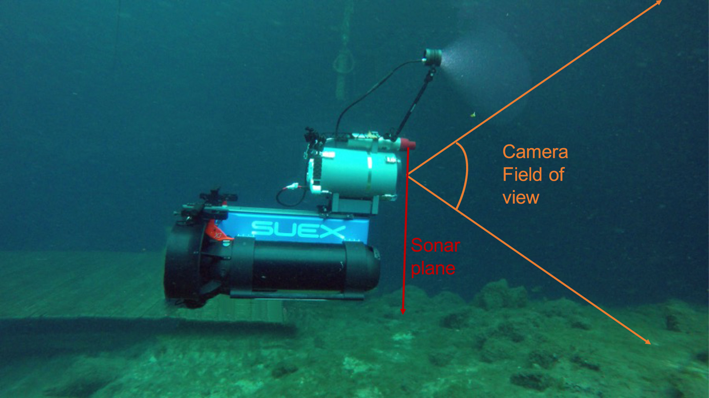**Figure 3**。 安装在双 DPV 上的定制传感器套件。 DPP 声纳在传感器周围扫描，而摄像机则在前方观测。 请注意，该装置具有中性浮力和平衡，无需任何支撑即可悬停在原地并保持直立。

### 3.1 符号和状态

我们定义了完整传感器套件的以下坐标系：第$i$ 个摄像头$C_i$、IMU $I$、深度（压力）$D$、DPP-声纳（声学范围）$S$ 和世界 $W$。一个齐次变换矩阵$x_Ty = [x_Ry | x_py]$ 表示两个任意坐标系$X$ 和$Y$ 之间的变换，旋转矩阵$x_Ry$（对应的四元数是$x_qy$）和位置向量$x_py$。例如，$X$ 和$Y$ 可以分别是$W$ 和$I$，因此$W_TI$ 标识从 IMU 到世界的变换矩阵。$x_Cy(q)$ 是一个将四元数$x_qy$ 转换为其等效旋转矩阵$x_Ry$ 的函数。系统估计的机器人（$R$）状态$x_R$ 定义为

$$
x_R = \left[
\begin{array}{c}
W_pI^T \
W_qI^T \
W_vI^T \
b_g^T \
b_a^T
\end{array}
\right]^T \in \mathbb{R}^3 \times SO(3) \times \mathbb{R}^9
$$
其中，$W_pI$ 是位置，$W_qI$ 是表示为四元数的姿态，$W_vI$ 是线速度，所有这些都是在 IMU 参考系$I$ 中相对于世界坐标系$W$ 表示的。状态向量还包含陀螺仪和加速度计偏置$b_g$ 和$b_a$。

为了解决状态估计问题，我们在最小坐标中定义了相关的误差状态向量。扰动发生在状态流形的切空间中。从最小坐标到切空间的变换可以使用双射映射来完成([Blanco, 2010](https://journals.sagepub.com/doi/full/10.1177/02783649221110259#bibr2-02783649221110259); [Forster et al., 2017a](https://journals.sagepub.com/doi/full/10.1177/02783649221110259#bibr21-02783649221110259); [Leutenegger et al., 2015](https://journals.sagepub.com/doi/full/10.1177/02783649221110259#bibr37-02783649221110259))，并且状态向量$x_R$ 的每个分量的误差为

$$
\delta x_R = \left[
\begin{array}{c}
\delta p^T \
\delta \theta^t \
\delta v^t \
\delta b_g^T \
\delta b_a^T
\end{array}
\right]^T \in \mathbb{R}^{15}
$$

其中$\delta \theta \in \mathbb{R}^3$ 是旋转的最小扰动（可以转换为其四元数等效项以进行指数映射）。

### 4. 基于声呐-视觉-惯性-压力测量的紧耦合非线性优化

提出的系统在一个紧耦合的非线性优化框架内融合了视觉、声学范围、惯性和水压测量。我们定义了代价函数$J(x)$，包括重投影误差$e_r$ 和 IMU 误差$e_s$，并增加了 DPP-声呐误差$e_t$ 和水深误差$e_u$。

$$
J(x) = \sum_{i=1}^{n} \sum_{k=1}^{K} \sum_{j \in J(i,k)} e^{i,j,k}_r P_{r}^k e^{i,j,k}_r + \sum_{k=1}^{K-1} e_{s}^{K^T} P_{s}^{k} e_{s}^{k} + \sum_{k=1}^{K-1} e_{t}^{k^T} P_{t}^{k} e_{t}^{k} + \sum_{k=1}^{K-1} P_{u}^{k} \| e_{u}^{k} \|^2
$$

其中$i$ 表示在第$k$ 帧中观察到的地标索引$j$ 的摄像头索引。例如，在一个立体相机系统中，$n=2$，其中左相机为$i=1$ 和右相机为$i=2$；请注意 SVIIn2 支持任意$n$ 的多相机系统，从$n=1$ 开始。$P_{r}^k$、$P_{s}^{k}$、$P_{t}^{k}$ 和$P_{u}^{k}$ 分别表示第$k$ 帧的视觉地标、IMU、声呐范围和水深测量的信息矩阵（权重）。请注意，视觉地标、IMU 和声呐测量是向量，而深度测量是标量。

直观地说，IMU 误差项结合了加速度计和陀螺仪在相机测量之间的测量值，并表示姿态、速度和偏置误差。重投影误差捕捉到相机坐标系$C$ 中关键点测量值与根据相机投影模型投影到成像平面上的对应地标之间的像素差异。重投影和 IMU 误差项遵循 Leutenegger et al. (2015) 的公式。DPP-声呐误差描述了声学范围测量和对应视觉特征点之间的误差。请注意，声呐测量为更密集的三维重建提供了额外的点。深度误差限制了重力方向上的机器人位置状态误差。谷歌的 Ceres Solver (Agarwal et al., 2015) ——非线性优化框架——最小化代价函数$J(x)$，其中包含这些误差项，以实时估计机器人状态$x_R$。

为了完整性，接下来的子部分将详细讨论每个误差项。

### 4.1.1 IMU 运动模型

我们采用一个 IMU 运动模型，将原始陀螺仪测量值$\omega_m$ 和原始加速度计测量值$a_m$ 与 IMU 的真实角速度$\omega$ 和真实线加速度$a$ 关联起来，分别在时间$t$ 表示为：

$$
\begin{aligned}
\omega_m(t) &= _I\omega(t) + b_g(t) + n_g(t) \\
a_m(t) &= _Ia(t) + b_a(t) + _I\mathbf{R}_{WI}(t)w(t)g + n_a(t)
\end{aligned}
$$

在上面的方程中，IMU 测量值在其本地坐标系$I$ 中获取，其中考虑了重力$wg$ 转换到 IMU 参考系下的旋转矩阵$_I\mathbf{R}_{W}$，陀螺仪偏置$b_g$，加速度计偏置$b_a$ 和加性噪声。加速度和陀螺仪读数中的加性噪声被假设为高斯白噪声，其特性为$n_a \sim \mathcal{N}(0_{3\times1}, \sigma_a^2 I_{3\times3})$，$n_g \sim \mathcal{N}(0_{3\times1}, \sigma_g^2 I_{3\times3})$。

类似于 Trawny 和 Roumeliotis (2005) 的工作，我们假设噪声在所有三个空间方向上都是相等的，并且陀螺仪和加速度计的偏置是非静态的，并且模拟为随机游走过程。偏置特性为：$n_{bg} \sim \mathcal{N}(0_{3\times1}, \sigma_{bg}^2 I_{3\times3})$，$n_{ba} \sim \mathcal{N}(0_{3\times1}, \sigma_{ba}^2 I_{3\times3})$。

根据 Leutenegger et al. (2015) 的公式，加速度计偏置被建模为有界随机游走，其时间常数$\tau > 0$，而陀螺仪偏置被建模为随机游走。偏置驱动噪声，即$n_{bg}$ 和$n_{ba}$ 对应于过程噪声，而测量噪声，即$n_b$ 和$n_a$ 对应于测量噪声。

描述连续时间 IMU 运动学结合偏置模型的微分方程为：

$$
\begin{aligned}
_I\dot{q}_{W}(t) &= \frac{1}{2} \Omega(\omega_m(t) - b_g(t) - n_g(t))_I {q}_{W}(t) \\
\dot{b}_g(t) &= n_{bg}(t) \\
_W\dot{\mathbf{v}}_I(t) &= _W\mathbf{R}_{I}(t) (a_m(t) - b_a(t) - n_a(t)) - w g \\
\dot{b}_a(t) &= -\frac{1}{\tau} b_a(t) + n_{ba}(t) \\
_W\dot{\mathbf{p}}_I(t) &= _W\mathbf{v}_I(t)
\end{aligned}
$$

其中矩阵$\Omega$ 定义为：

$
\Omega(\omega) = 
\begin{bmatrix}
-\lfloor \omega \times \rfloor & \omega \\
-\omega^T & 0 
\end{bmatrix} 
,
\lfloor \omega \times \rfloor = 
\begin{bmatrix}
0 & -\omega_z & \omega_y  \\
\omega_z & 0 & -\omega_x  \\
-\omega_y & \omega_x & 0  \\
\end{bmatrix} 
\in \mathfrak{so}(3)
$

### 4.1.2 线性化误差状态模型

连续时间的误差状态线性化模型形式为：

$$
\delta \mathbf{x}_R = 
\begin{bmatrix}
\delta \mathbf{p} \\
\delta \mathbf{\theta} \\
\delta \mathbf{v} \\
\delta \mathbf{b}_g \\
\delta \mathbf{b}_a
\end{bmatrix}
\approx
\begin{bmatrix}
0 & 0 & I & 0 & 0 \\
0 & -[\omega_m - \hat{b}_g]_\times & 0 & -I & 0 \\
0 & -\hat{\mathbf{R}}[a_m - \hat{b}_a]_\times & 0 & -\hat{\mathbf{R}} & 0 \\
0 & 0 & 0 & 0 & -\frac{1}{\tau}I
\end{bmatrix}
\begin{bmatrix}
\delta \mathbf{p} \\
\delta \mathbf{\theta} \\
\delta \mathbf{v} \\
\delta \mathbf{b}_g \\
\delta \mathbf{b}_a
\end{bmatrix}
+
\begin{bmatrix}
0 & 0 & 0 & 0 \\
-I & 0 & 0 & 0 \\
0 & -\hat{\mathbf{R}} & 0 & 0 \\
0 & 0 & I & 0 \\
0 & 0 & 0 & I
\end{bmatrix}
\begin{bmatrix}
n_g \\
n_a \\
n_{bg} \\
n_{ba}
\end{bmatrix}
= \mathbf{F}_c (\mathbf{x}_R) \delta \mathbf{x}_R + \mathbf{G}_c (\mathbf{x}_R) n
$$

其中 ($\hat{(\cdot)}$) 表示预测，$\lfloor\cdot\rfloor_\times$ 对应于与向量关联的反对称矩阵。

由于在积分周期内连续时间系统矩阵$F_c$ 是常数，离散时间线性化误差状态转移矩阵可以通过以下公式获得：

$$
F_d (x_R, \Delta t) = \exp (F_c (x_R) \Delta t) \approx I_{15} + F_c (x_R) \Delta t
$$

其中$\Delta t$ 是积分时间步长。

协方差传播方程可以通过更新递归计算，即，对于第$p$ 次 IMU 测量，协方差的离散时间更新形式为：

$$
W_{R}^{p+1} = F_d (\hat{x}_R^p, \Delta t) W_{R}^{p} F_d (\hat{x}_R^p, \Delta t)^T + G_d (\hat{x}_R^p) Q_d G_d (\hat{x}_R^p)^T \Delta t
$$

其中$Q_d = \text{diag} (\sigma_g^2 I_3, \sigma_a^2 I_3, \sigma_{bg}^2 I_3, \sigma_{ba}^2 I_3)$ 是包含各个过程噪声密度的对角矩阵。

### 4.1.3 IMU 测量误差公式

我们将 IMU 误差项$e_s^k (x_R^k, x_R^{k+1}, z_s^k)$ 表示为机器人状态在时间步$k$ 和$k+1$（当拍摄图像时）的函数，所有 IMU 测量值$z_s^k$ 包含这些时间实例之间的陀螺仪和加速度计数据。我们假设一个近似的正态条件概率密度函数$f$ 具有零均值和方差$W_s^k$，以及给定相机测量$k$ 和$k+1$ 时机器人状态的关联条件协方差$Q (\delta \hat{x}_R^{k+1} | x_R^k, z_s^k)$

$$
f (e_s^k | x_R^k, x_R^{k+1}) \approx \mathcal{N} (0, W_s^k)
$$

使用预测方程，我们现在可以将 IMU 误差项公式化如下，这是基于前一状态的预测值和实际状态之间的差异

$$
e_s^k\left( \mathbf{x}_R^k, \mathbf{x}_R^{k+1}, z_s^k \right) = 
\begin{bmatrix}
\mathbf{_I}R_W^k \left( \mathbf{w\hat{P}}_I^{k+1} - \mathbf{wP}_I^{k+1} \right) \\
2 \left[ \mathbf{_I}q_W^k \otimes \mathbf{w\hat{q}}_I^{k+1} \otimes \mathbf{wq}_I^{k+1^{-1}} \right]_{1:3} \\
\mathbf{I}_R^W \left( \mathbf{w\hat{v}}_I^{k+1} - \mathbf{wv}_I^{k+1} \right) \\
\hat{b}_g^{k+1} - b_g^{k+1} \\
\hat{b}_a^{k+1} - b_a^{k+1}
\end{bmatrix} \in \mathbb{R}^{15}
$$

通过应用误差传播定律，关联的信息矩阵$P_s^k$ 可以通过以下公式获得

$$
P_s^k = W_s^{k-1} = \left( \frac{\partial e_s^k}{\partial \delta \mathbf{\hat{x}}_R^{k+1}} Q \left( \delta \mathbf{x}_R^{k+1} | \mathbf{x}_R^k, z_s^k \right) \frac{\partial e_s^k}{\partial \delta \mathbf{\hat{x}}_R^{k+1}}^T \right)^{-1}
$$

### 4.1.2 重投影误差公式(应该是4.2)

相机观察到视觉特征，这些特征用于更新机器人的运动估计。与 Leutenegger et al. (2015) 的方法类似，这些视觉特征通过立体匹配来创建局部地图。通过在局部地图中使用最近的关键帧及其地标的稀疏集合窗口，首先利用 IMU 的位姿预测进行 3D-2D 匹配以限制搜索空间，然后进行 2D-2D 匹配。在这两个匹配步骤中，通过应用 IMU 位姿预测和 RANSAC 方法，利用卡方检验（3D-2D 匹配）和 RANSAC 方法来拒绝异常值。

重投影误差公式化为图像坐标中特征观测值$z_{i,j}^k$ 和对应的 3D 点$c_i p^j$ 投影到图像平面上的差值，其中$i$ 是相机索引，$j$ 是在第$k$ 帧图像中可见的 3D 地标索引

$$
e^{i,j,k}_r = z^{i,j,k} - h_i(c_i p^j)
$$

这里$h_i(.)$ 表示相机投影模型。

假设一个透视相机模型，零均值和高斯白噪声$n_{i,j}^k$ 下的特征测量定义为

$$
z^{i,j,k} = \frac{1}{z_{i,j,k}} \begin{bmatrix}
x^{i,j,k} \\
y^{i,j,k}
\end{bmatrix} + n^{i,j,k}
$$

$$
\begin{bmatrix} x^{i,j,k} \\ y^{i,j,k} \\ z^{i,j,k} \end{bmatrix} = c_i p^j = c_i C_I (q) I_C W (q^k) \left( wP^j - wP_I^k \right) + c_i P_I
$$

测量的雅可比矩阵$H^k$ 计算为

$$
H^k = H_{proj} C_I (q) \begin{bmatrix} H_\theta^k & 0_{3 \times 9} & H_p^k \end{bmatrix}
$$

其中，$H_{proj}, H_\theta^k$ 和$ H_p^k$ 分别是将第$i$ 个摄像机中的投影$h_i(\cdot)$ 对同质坐标、方向和位移的雅可比矩阵：

$$
H_{proj} = \frac{1}{\hat{z}^{i,j,k}} \begin{bmatrix} 1 & 0 & -\frac{\hat{x}^{i,j,k}}{\hat{z}^{i,j,k}} \\ 0 & 1 & -\frac{\hat{y}^{i,j,k}}{\hat{z}^{i,j,k}} \end{bmatrix}
$$

$$
H_\theta^k = \lfloor \left( I_C W \left( \hat{q}^k \right) \left( wP^j - wP_I^k \right) \right)  \rfloor_\times{\delta \theta}
$$

$$
H_p^k = -I_C W \left( \hat{q}^k \right)
$$

### 4.3. DPP-声呐误差项公式

尽管声学测距数据较为稀疏，但它们提供了关于障碍物存在的可靠信息，其中包括视觉特征所在的位置；因此，DPP-声呐有助于修正机器人位姿估计以及优化视觉和声呐共同提供的地标使用。在水下环境能见度低的情况下，当难以找到视觉特征时，DPP-声呐提供了具有准确尺度的特征。[图4](https://journals.sagepub.com/doi/full/10.1177/02783649221110259#fig4-02783649221110259) 展示了使用所提方法进行的视觉-声学重建。

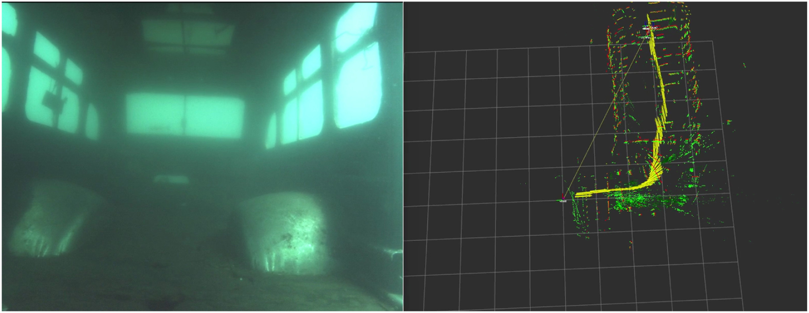
**图4**. 美国北卡罗来纳州幻想湖潜水公园的沉没巴士。（左）从巴士内部收集的数据的样本图像。（右）重建的俯视图。黄色箭头代表机器人的位姿；绿色和红色点分别来自视觉和DPP-声呐特征。

声呐测距误差遵循这样的直觉：当DPP-声呐在某个距离检测到任何障碍物时，对应的视觉特征将在大致相同的距离处。考虑到[图3](https://journals.sagepub.com/doi/full/10.1177/02783649221110259#fig3-02783649221110259)中所示的传感器配置，出现了一个特定的挑战：由于两个传感器覆盖的视场不同，DPP-声呐特征在一段时间后与视觉特征匹配——参见[图5](https://journals.sagepub.com/doi/full/10.1177/02783649221110259#fig5-02783649221110259)，在时间 *k* 时，相机检测到某些特征；经过一段时间（直到 *k* + *n*），DPP-声呐才经过这些视觉特征并获得相关测量。为了解决这一挑战，接近DPP-声呐回波检测到的视觉特征被组合在一起构建一个补丁。然后，为了将DPP-声呐的测距数据融合到传统的VIO框架中，接近每个声呐点的检测视觉补丁引入了额外的约束：声呐点到补丁的距离。这里，我们假设基于视觉特征的补丁足够小，并且与DPP-声呐点大致共面。[图6](https://journals.sagepub.com/doi/full/10.1177/02783649221110259#fig6-02783649221110259) 说明了在声呐误差项公式中DPP-声呐与视觉特征之间的关系。

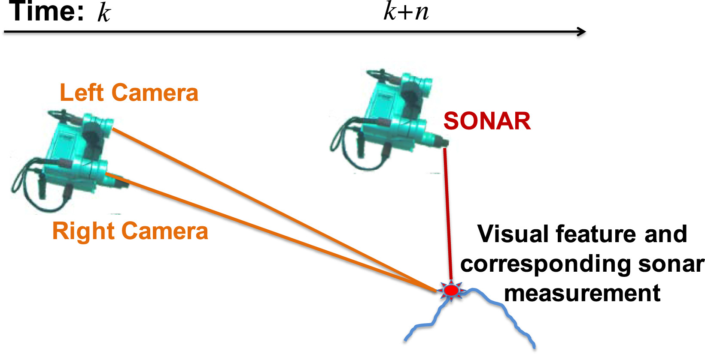
**图5**. DPP-声呐测距与立体相机特征之间的关系。时间 *k* 检测到的视觉特征只有在延迟后，即在时间 *k* + *n* 被DPP-声呐检测到，其中 *n* 取决于传感器移动的速度。

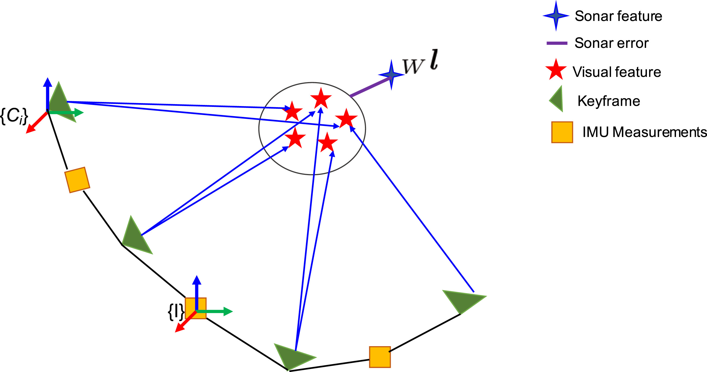
**图6**. DPP-声呐误差公式。

算法1展示了如何在时间步$k$给定机器人位置$\mathbf{wP}_I^k$和DPP-声呐测量值$z_t^k$的情况下计算距离误差$e_t^k$。DPP-声呐返回距离$r$和头部位置$\theta$测量值，这些测量值用于通过几何变换在齐次坐标系中获得每个声呐地标$\mathbf{w^l} = [l_x, l_y, l_z, 1]$：

$$
\mathbf{w^l} = \left( \mathbf{wT_I} \mathbf{T_S} \left[ \mathbf{I}_3 \mid r \cos(\theta), r \sin(\theta), 0 \right]_S \right)^T
$$

#### 算法1
**DPP-声呐距离误差算法**

**输入**：时间步$k$机器人位置估计$\mathbf{wP}_I^k$

- 声呐测量值$z_t^k = [r, \theta]$，时间步$k$
- 当前视觉地标列表$\mathcal{L}_{\vartheta}$
- 距离阈值$T_d$

**输出**：时间步$k$的距离误差$e_t^k$

1. 计算世界坐标系中的声呐地标$\mathbf{w^l}$
   $
   \mathbf{w^l} = \left( \mathbf{wT_I} \mathbf{T_{TS}} \left[ I_3 | r \cos(\theta), r \sin(\theta), 0 \right]_S \right)^T
   $
2. 创建声呐地标周围的视觉地标列表$\mathcal{L}_S$
   $
   \mathcal{L}_S = \emptyset
   $
3. 对每个$\mathcal{L}_{\vartheta}$中的视觉地标$\ell_i$：
   - 计算视觉地标与声呐地标之间的欧几里得距离$d_s = \|\mathbf{w^l} - \text{mean}(\ell_i)\|$
   - 如果$d_s < T_d$，则$\mathcal{L}_S = \mathcal{L}_S \cup \ell_i$
4. 计算声呐点到补丁的距离$\hat{r} = \|\mathbf{w\hat{P}}_I^k - \text{mean}(\mathcal{L}_S)\|$
5. 返回距离误差$e_t^k = r - \hat{r}$

声呐距离预测使用算法1的第2-9行计算

$$
\hat{r} = \|\mathbf{w\hat{P}}_I^k - \text{mean}(\mathcal{L}_S)\|
$$

其中$\mathcal{L}_S$是声呐地标周围的视觉地标子集，距离误差项公式为两个距离之差。注意，我们近似使用视觉补丁的质心($\text{mean}(\mathcal{L}_S)$)来滤除视觉地标上的噪声。

给定声呐测量值$z_t^k$，误差项$e_t^k(\mathbf{wP}_I^k, z_t^k)$用于校正位置$\mathbf{wP}_I^k$。我们假设一个近似的正态条件概率密度函数$f$，其均值为零，方差为$W_t^k$，并且条件协方差$Q(\delta \mathbf{p}^k | z_t^k)$随着新的传感器测量值的迭代而更新

$$
f(e_t^k | \mathbf{wP}_I^k) \approx \mathcal{N}(0, W_t^k)
$$

信息矩阵为

$$
P_t^k = W_t^{k-1} = \left( \frac{\partial e_t^k}{\partial \delta \hat{\mathbf{p}}^k} Q \left( \delta \hat{\mathbf{p}}^k \mid z_t^k \right) \frac{\partial e_t^k}{\partial \delta \hat{\mathbf{p}}^k}^T \right)^{-1}
$$

雅可比矩阵可以通过对期望的距离测量$r$关于机器人位置的求导获得

$$
\frac{\partial e_t^k}{\partial \delta \mathbf{p}_t^k} = \begin{bmatrix}
\frac{-l_x + wP_x}{r}, \frac{-l_y + wP_y}{r}, \frac{-l_z + wP_z}{r}
\end{bmatrix}
$$

### 水深误差项公式

压力传感器基于水压提供准确的深度测量值。水深值沿着与世界$W$的$z$轴对齐的重力方向提取——由于紧耦合IMU积分而可观察。时间步$k$的深度数据为

$$
\mathbf{wP}_{zD}^k = d^k - d^0
$$

更精确地，$\mathbf{wP}_{zD}^k = (d^k - d^0) + \text{init\_disp\_from\_IMU}$，以考虑从IMU轴沿$z$轴的初始位移，这是视觉SLAM用于跟踪传感器套件/机器人的主要参考系。

通过深度测量值$z_u^k$，深度误差项$e_u^k(\mathbf{wP}_{zD}^k, z_u^k)$可以计算为机器人位置沿$z$方向和深度数据之间的差值。误差项可以定义为

$$
e_u^k(\mathbf{wP}_{zD}^k, z_u^k) = |\mathbf{wP}_{zI}^k - \mathbf{wP}_{zD}^k|
$$

权重$P_u^k$根据传感器的噪声方差计算，遵循与声呐类似的方法，雅可比矩阵推导简单。

## 5. 初始化：两步尺度细化

如 ([Mur-Artal and Tardós, 2017](https://journals.sagepub.com/doi/full/10.1177/02783649221110259#bibr44-02783649221110259); [Qin et al., 2018](https://journals.sagepub.com/doi/full/10.1177/02783649221110259#bibr51-02783649221110259)) 所述，紧耦合非线性系统需要一个稳健且准确的初始化以成功进行状态估计。我们对基于视觉-惯性状态估计系统的对比研究（[Joshi et al., 2019](https://journals.sagepub.com/doi/full/10.1177/02783649221110259#bibr31-02783649221110259)）表明，在水下环境中，大多数先进的系统无法初始化或错误地初始化，导致状态估计过程发散。在这项工作中，我们提出了一种稳健的初始化方法，使用相机、IMU 和水压传感器的深度估计。使用这三种传感器引入了对尺度的约束，从而在初始化期间允许更准确的估计。尽管声学测距测量被用于紧耦合优化，但由于上一节中描述的数据关联挑战，它们并未被用于初始化：如果机器人没有移动，声学测距和视觉特征之间没有匹配——参见[图3](https://journals.sagepub.com/doi/full/10.1177/02783649221110259#fig3-02783649221110259)。因此，考虑到传感器配置，如果使用DPP-声呐进行初始化，将会有显著的延迟进行初始化，并且在DPP-声呐和相机获得共同视场之前，该区域将无法映射。

所提出的初始化方法如下工作。首先，系统需要跟踪一定数量的视觉特征（在我们的实验中，15个特征效果良好）。此要求避免在无特征场景中初始化，例如，仅有少量浮动颗粒作为特征的水域。其次，从立体视觉获得的初始尺度通过两步细化。

第一步使用压力传感器提供的准确深度测量值来修正从相机估计的初始比例因子。特别是，包含比例因子 $ s_1 $，相机 $ C_i $ 和深度传感器 $ D $ 之间的变换可以表示为：

$$
wP_{z,D} = s_1 \ast wP_{z,C_i} + wR_{z,C_i} \ast p_D
$$

对于第 $ k $ 帧，求解上述方程的 $ s_1 $ 提供了初始相机比例 $ wP_{r1C_i} $ 的第一次修正，即：

$$
wP_{r1C_i} = s_1 \ast wP_{C_i}
$$

第二步将方程 (27) 中从相机得到的修正测量值与 IMU 预积分值对齐。类似于第一步， $ C_i $ 和 IMU $ I $ 之间的变换可以表示为：

$$
wP_I = s_2 \ast wP_{r1C_i} + wR_{C_i C_j} p_I
$$

比例因子为 $ s_2 $。

在两步比例修正的基础上，我们的方法类似于 (Qin et al., 2018)，近似初始速度和重力向量。从本节的连续公式中，考虑时间间隔 $\Delta t_{k,k+1} \in \left[t_k, t_{k+1}\right]$，IMU 测量在两个连续帧 $ k $ 和 $ k + 1 $ 之间的状态离散预测可以写为：

$$
wP_I^{k+1} = wP_I^k + wV_I^k \Delta t_{k,k+1} - \frac{1}{2} wg \Delta t_{k,k+1}^2 + wR_I^k \alpha_I^{k+1}\\
wV_I^{k+1} = wV_I^k - wg \Delta t_{k,k+1} + wR_I^k \beta_I^{k+1}
$$

重新排列等式 (29)，得到与 $\alpha_{I_k}^{k+1}$ 和 $\beta_{I_k}^{k+1}$ 相关的IMU预积分项，表示在时间间隔 $\Delta t_{k,k+1}$ 内 $k$ 和 $k+1$ 之间的运动，结果如下：
$$
\alpha_{I_k}^{k+1} = _{I}R_W^k\left( wP_I^{k+1} - wP_I^k - wV_I^k \Delta t_{k,k+1} + \frac{1}{2} wg \Delta t_{k,k+1}^2 \right)\\
\beta_{I_k}^{k+1} =_{I}R_W^k \left( wV_I^{k+1} - wV_I^k + wg \Delta t_{k,k+1} \right)
$$

在等式 (30) 中，通过用等式 (28) 代入 $ wP_I^{k+1} $ 和 $ wP_I^k $，我们可以通过解决以下线性最小二乘问题估计 $ x_S = \left[ v_I^k, ..., v_I^{k+n}, wg, s_2 \right]^T $：

$$
\min_{\chi_S} \sum_{k \in K} \left\| \lambda_{2_{S_k}}^{k+1} - H_{S_k}^{k+1} \chi_S \right\|^2\\
\text{where} \ \ \
\hat{z}_{{S_k}}^{k+1} = \begin{bmatrix}
\hat{a}_{I_k}^{k+1} - _IR_{WW}^k R_{C_i}^k c_i p_I^{k+1} + IR_{C_iC_i}^k  p_I^k \\
\hat{\beta}_{I_k}^{k+1}
\end{bmatrix}\\
and \ \ \ 
H_{S_k}^{k+1} = \begin{bmatrix}
-I \Delta t_{k,k+1} & 0 & \frac{1}{2} _IR_{WW}^k \Delta t_{k,k+1}^2 & _IR_W^k \left( wp_{r1_{C_i}}^{k+1} - wp_{r1_{C_i}}^k \right) \\
-I & _IR_{WV}^k R_I^{k+1} & _IR_{WV}^k \Delta t_{k,k+1} & 0
\end{bmatrix}
$$

## 6. 闭环和重定位

任何基于滑动窗口和边缘化的优化方法都会在位姿估计上产生漂移，并随着时间累积。为了消除这种漂移并实现全局一致性，我们添加了一个全局优化和重定位方案。我们采用了DBoW2（[Gálvez-López and Tardós, 2012](https://journals.sagepub.com/doi/full/10.1177/02783649221110259#bibr23-02783649221110259)），一个二进制词袋（BoW）地点识别模块，并增强OKVIS进行闭环检测和重定位。BoW数据库包含在本地跟踪期间每个关键帧中检测到的关键点描述符。闭环步骤将使用跟踪步骤中检测到的现有特征。

我们的方法维护一个表示关键帧之间连接的位姿图，其中一个节点表示一个关键帧，如果两个关键帧之间匹配的关键点比率超过0.75，则它们之间存在一条边。我们的实验表明，生成的位姿图非常稀疏。使用这样的图，对于每个新关键帧，闭环模块只在BoW数据库中查找候选帧，这些候选帧位于当前边缘化窗口之外，并且得分大于或等于在位姿图中检查的节点的邻近关键帧的得分。如果检测到闭环，该方法将保留得分最高的候选帧，并在本地窗口中的当前关键帧与闭环候选关键帧之间添加一条连接及其特征对应关系。因此，位姿图将根据闭环信息进行更新。通过PnP RANSAC进行异常值剔除后，执行2D-2D描述符匹配，然后通过当前窗口关键帧中的已知地标与闭环候选帧之间的3D-2D匹配进行几何验证。

闭环检测触发全局重定位模块，该模块对本地窗口中当前关键帧的位姿与位姿图中的闭环关键帧的位姿进行对齐。此对齐作为漂移校正传递到窗口化声呐-视觉-惯性-压力优化线程。通过额外的优化步骤进一步改进估计——类似于方程（[3](https://journals.sagepub.com/doi/full/10.1177/02783649221110259#disp-formula3-02783649221110259)）：考虑与闭环候选帧匹配的地标，计算DPP-声呐和重投影误差项；参见方程（[32](https://journals.sagepub.com/doi/full/10.1177/02783649221110259#disp-formula33-02783649221110259)）。

$$
J(\mathbf{x}) = \sum_{i=1}^{n} \sum_{k=1}^{K} \sum_{j \in \text{Loop}(i,k)} e_{r}^{i,j,k} \mathbf{P}_{r}^{i,j,k} e_{r}^{i,j,k} + \sum_{k=1}^{K-1} e_{t}^{kT} \mathbf{P}_{t}^{k} e_{t}^{k}
$$

在闭环检测后，基于6自由度（位置和旋转，$\mathbf{x_T} = [\mathbf{x_p}, \mathbf{x_q}]$）的位姿图优化在姿态之间的相对约束上进行，以纠正漂移。当前关键帧$i$在当前窗口和关键帧$j$（无论是闭环候选关键帧还是连接关键帧）之间的相对变换可以通过$\Delta \mathbf{T}_{ij} = \mathbf{T}_j \mathbf{T}_i^{-1}$计算。关键帧$i$和$j$之间的误差项$e_{\mathbf{x_T}}^{i,j}$在切线空间中被最小化地表示为：

$$
e_{\mathbf{x}_T}^{i,j} = \Delta T_{ij} \hat{T}_{i} \hat{T}_{j}^{-1}
$$

其中 ($\cdot$) 表示从本地声呐-视觉-惯性-深度优化中获得的估计值。要最小化的代价函数为

$$
J(\mathbf{x}_T) = \sum_{i,j} e_{\mathbf{x}_T}^{i,j} \mathbf{P}_{\mathbf{x}_T}^{i,j} e_{\mathbf{x}_T}^{i,j} + \sum_{(i,j) \in \text{Loop}} \rho \left( e_{\mathbf{x}_T}^{i,j} \mathbf{P}_{\mathbf{x}_T}^{i,j} e_{\mathbf{x}_T}^{i,j} \right)
$$

其中$\mathbf{P}_{\mathbf{x}_T}^{i,j}$ 是信息矩阵，设置为单位矩阵，如 (Strasdat, 2012)，$\rho$ 是Huber损失函数，用于降低任何错误闭环的权重。

## 7. 实验结果

我们首先在标准数据集上验证SVIn2，提出的状态估计系统，以确保闭环和初始化在水上也能正常工作。在此验证过程中，SVIn2还与其他最先进的方法进行了比较——即VINS-Mono（[Qin et al., 2018](https://journals.sagepub.com/doi/full/10.1177/02783649221110259#bibr51-02783649221110259)）、基本的OKVIS（[Leutenegger et al., 2015](https://journals.sagepub.com/doi/full/10.1177/02783649221110259#bibr37-02783649221110259)）和GRASP实验室的MSCKF（[Mourikis and Roumeliotis, 2007](https://journals.sagepub.com/doi/full/10.1177/02783649221110259#bibr42-02783649221110259)）实现（[Research group of Prof. Kostas Daniilidis, 2018](https://journals.sagepub.com/doi/full/10.1177/02783649221110259#bibr58-02783649221110259)）。其次，我们在几个不同的水下数据集上测试了提出的方法，这些数据集是使用定制传感器套件（[Rahman et al., 2018a](https://journals.sagepub.com/doi/full/10.1177/02783649221110259#bibr55-02783649221110259)）和Aqua2 AUV（[Dudek et al., 2005](https://journals.sagepub.com/doi/full/10.1177/02783649221110259#bibr11-02783649221110259)）收集的。第三，我们进行了一项消融研究，以评估每个传感器的贡献。最后，我们使用公开可用的水下数据集验证了提出的方法。

实验是在一台配备Intel i7-7700 CPU @ 3.6 GHz、32 GB RAM、运行Ubuntu 16.04和ROS Kinetic的台式电脑上，以及在一台装有Intel i3-6100U CPU @ 2.3 GHz和16 GB RAM的机器人板载Intel NUC上运行的。

### 7.1. 在视觉-惯性基准上的验证

作为许多视觉-惯性状态估计系统（包括OKVIS（立体）、VINS-Mono和MSCKF）使用的标准基准数据集，我们考虑了EuRoC数据集（[Burri et al., 2016](https://journals.sagepub.com/doi/full/10.1177/02783649221110259#bibr4-02783649221110259)），该数据集由空中无人机收集的传感器数据组成。在我们的方法中，我们禁用了水深和DPP-声呐集成，只评估闭环方案，因为EuRoC中没有这些传感器。

按照当前的基准实践，通过最小化估计/地面真实位置之间的最小均方误差来对齐地面真实轨迹和估计轨迹，这些位置在时间上接近，旋转和平移变化（[Umeyama, 1991](https://journals.sagepub.com/doi/full/10.1177/02783649221110259#bibr74-02783649221110259)）。在这样的对齐之后，计算每对地面真实/估计位姿的误差——即绝对轨迹误差（ATE）。ATE的均方根误差（RMSE）是针对平移计算的——在[表1](https://journals.sagepub.com/doi/full/10.1177/02783649221110259#table1-02783649221110259)中显示了EuRoC数据集中的几个机器厅序列。对于每个包，每个序列运行5次，并取最佳运行（根据RMSE）。与OKVIS相比，我们的方法在每个序列中显示了降低的RMSE。这验证了闭环后位姿估计的改进。SVIn2的RMSE也低于MSCKF，并且与VINS-Mono的结果相当。[图7](https://journals.sagepub.com/doi/full/10.1177/02783649221110259#fig7-02783649221110259)显示了每种方法的轨迹以及EuRoC数据集中一个机器厅序列的地面真实。

**表1**. 每个EuRoC机器厅序列的最佳绝对轨迹误差（RMSE，以米为单位）。

|       | SVIn2 | OKVIS（双目） | VINS-Mono | MSCKF |
| ----- | ----- | ------------- | --------- | ----- |
| MH 01 | 0.13  | 0.15          | 0.07      | 0.21  |
| MH 02 | 0.08  | 0.14          | 0.08      | 0.24  |
| MH 03 | 0.07  | 0.12          | 0.05      | 0.24  |
| MH 04 | 0.13  | 0.18          | 0.15      | 0.46  |
| MH 05 | 0.15  | 0.24          | 0.11      | 0.54  |

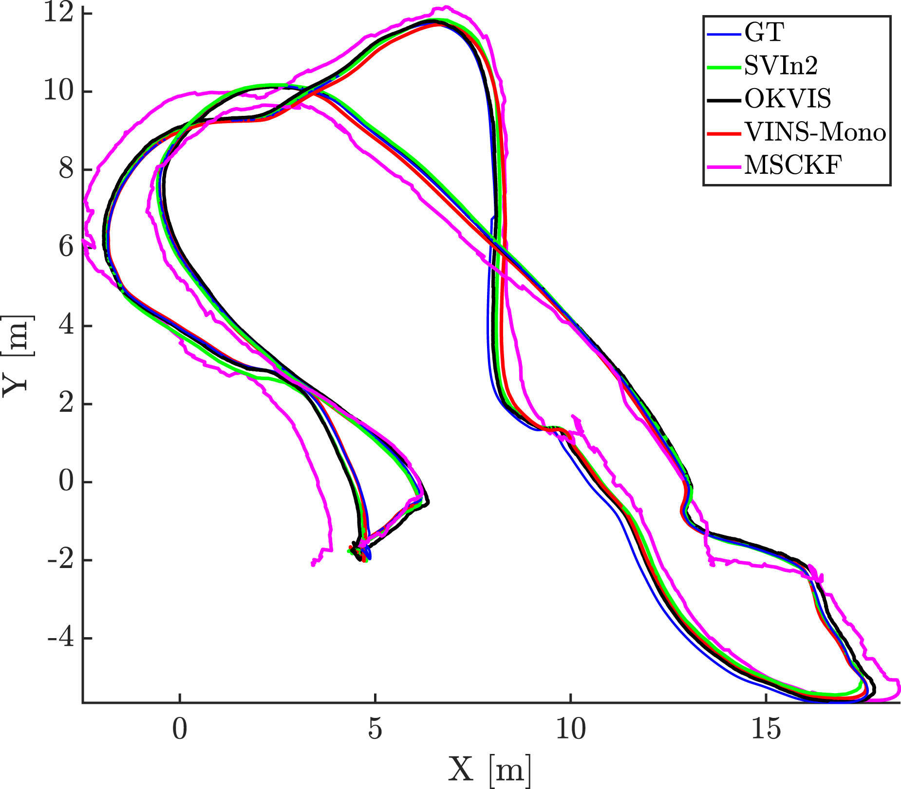

**图7**. EuRoC数据集MH 04序列上的轨迹。

最近，ORB-SLAM3（[Campos et al., 2021](https://journals.sagepub.com/doi/full/10.1177/02783649221110259#bibr6-02783649221110259)）、Kimera（[Rosinol et al., 2020](https://journals.sagepub.com/doi/full/10.1177/02783649221110259#bibr61-02783649221110259)）、VI-DSO（[Von Stumberg et al., 2018](https://journals.sagepub.com/doi/full/10.1177/02783649221110259#bibr75-02783649221110259)）报告了更低的RMSE，其中ORB-SLAM3在EuRoC数据集中显示了最低的RMSE。因此，我们将SVIn2与ORB-SLAM3在水下数据集上的性能进行了比较。

### 7.2. 在水下数据集上的验证

在四个不同的水下数据集上测试了SVIn2，其中DPP-声呐和水深传感器可用，并且可以与视觉-惯性数据融合，以充分利用我们的系统。在描述数据集和实验设置之后，我们评估了轨迹。由于在非结构化的水下环境中没有地面真实值，我们首先与全局束调整系统COLMAP（[Schönberger et al., 2016](https://journals.sagepub.com/doi/full/10.1177/02783649221110259#bibr63-02783649221110259)）进行比较，其次使用在环境中放置的标志标签。这些标签牢固地放置在环境中，并在实验期间多次观察到。

#### 7.2.1 数据集描述

实验数据使用定制的传感器套件（[Rahman et al., 2018a](https://journals.sagepub.com/doi/full/10.1177/02783649221110259#bibr55-02783649221110259)）（见[图3](https://journals.sagepub.com/doi/full/10.1177/02783649221110259#fig3-02783649221110259)）和Aqua2机器人（[Dudek et al., 2005](https://journals.sagepub.com/doi/full/10.1177/02783649221110259#bibr11-02783649221110259)）收集。两者都配备了立体相机、IMU和压力传感器。定制的传感器套件还包含一个DPP-声呐。具体来说，两个USB-3 uEye相机以立体配置提供15 Hz的数据；MicroStrain 3DM-GX4-15 IMU以100 Hz生成惯性数据；Bluerobotics Bar30压力传感器以1 Hz提供压力数据；IMAGENEX 831L机械扫描剖面声呐传感器每4秒获取一个完整的360°扫描。运行Linux和ROS的Intel NUC整合

#### 7.2.2 使用COLMAP作为对比基线的轨迹评估

由于水下环境中缺乏GPS和能够在非结构化环境中工作的运动捕捉系统，我们使用开源的运动结构库COLMAP（[Schönberger et al., 2016](https://journals.sagepub.com/doi/full/10.1177/02783649221110259#bibr63-02783649221110259)）生成每个水下数据集的对比基线轨迹。通过词汇树搜索启用了闭环检测。COLMAP在传统的最先进的多视图立体算法中表现最好，因为它紧密集成了多种技术——例如，鲁棒的邻居视图选择和可见性约束的合并。COLMAP提供了轨迹形状的估计；然而，这些轨迹不能被视为绝对地面真实。即使引入了立体基线约束，我们观察到全局优化减少了重投影误差，但没有收敛。此外，由于水的浑浊、能见度低和场景中缺乏良好的特征以供长时间跟踪，COLMAP只能为部分数据集生成部分轨迹——这表明仅依靠视觉的状态估计在水下环境中是不可靠的。因此，我们将估计轨迹与COLMAP的轨迹对齐并计算每个系统的ATE。

[表2](https://journals.sagepub.com/doi/full/10.1177/02783649221110259#table2-02783649221110259)显示了在有和没有CLAHE滤波器情况下不同水下数据集的ATE的RMSE。由于MSCKF在所有数据集中都无法跟踪，因此被排除在表格之外。VINS-Mono和ORB-SLAM3在大多数数据集中只能部分跟踪，并且仅报告了该部分轨迹的RMSE。SVIn2在每个数据集中都有最低的RMSE并且成功跟踪。所有四个系统——SVIn2、OKVIS、VINS-Mono和ORB-SLAM3——在*Bus*和*Cemetery*数据集中使用CLAHE时表现有所提高（即，较低的ATE RMSE和较长的跟踪持续时间），而CLAHE会导致*Cavern1*和*Cavern2*数据集的性能下降。我们观察到，CLAHE滤波器通过帮助特征检测和跟踪（见[图8](https://journals.sagepub.com/doi/full/10.1177/02783649221110259#fig8-02783649221110259)）在有雾和低对比度的情况下提高了性能。可以通过检查*图像直方图*是否位于狭窄区域内来识别此类数据集。我们建议仅对这些数据集使用CLAHE。

**表2**. 每个水下数据集相对于COLMAP估计轨迹的ATE RMSE（米）和跟踪持续时间（总轨迹的百分比）（显示了最低的RMSE和最长的跟踪持续时间）。SVIn2、OKVIS和ORB-SLAM3都使用立体视觉-惯性数据；VINS-Mono使用单目视觉-惯性数据。COLMAP仅对Cavern1和Cavern2跟踪了完整路径，而对Bus和Cemetery进行了部分跟踪。所有包都在有和没有CLAHE滤波器的情况下进行了测试。

|                    | With CLAHE |        |               |               | Without CLAHE |               |               |               |
| ------------------ | ---------- | ------ | ------------- | ------------- | ------------- | ------------- | ------------- | ------------- |
|                    | SVIn2      | OKVIS  | VINS-Mono     | ORB-SLAM3     | SVIn2         | OKVIS         | VINS-Mono     | ORB-SLAM3     |
| Bus (partial)      | **0.2092** | 0.5109 | 0.0742(part.) | 1.6672(part.) | 0.6822(part.) | 0.7775(part.) | 0.0747(part.) | -             |
| 89%                | **100%**   | 100%   | 21%           | 79%           | 70%           | 70%           | 20.8%         | 0%            |
| Cavern1            | 0.1243     | 0.2089 | 1.0155(part.) | 0.2523(part.) | **0.1096**    | 0.1154        | 0.8670        | 0.1553(part.) |
| 100%               | 100%       | 100%   | 99%           | 85%           | **100%**      | 100%          | 100%          | 94%           |
| Cavern2            | 0.1722     | 0.3814 | 0.3464(part.) | 2.4199(part.) | **0.1237**    | 0.3725        | 0.7839(part.) | 0.3813(part.) |
| 100%               | 100%       | 100%   | 26.7%         | 28.7%         | **100%**      | 100%          | 93%           | 88%           |
| Cemetery (partial) | **0.2421** | 1.0868 | 1.2291        | 0.8143(part.) | 0.6996(part.) | 1.1026(part.) | -             | 0.2165(part.) |
| 97%                | **100%**   | 100%   | 100%          | 86%           | 65.5%         | 65.5%         | 0%            | 30%           |

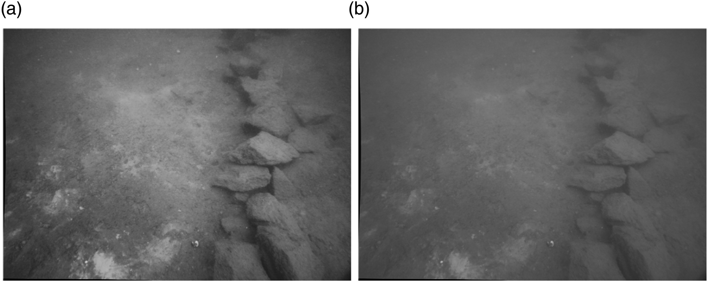
**图8**. (a) 使用CLAHE滤波器的预处理结果和(b) 在虚假墓地数据集上的相应原始图像。

[图9](https://journals.sagepub.com/doi/full/10.1177/02783649221110259#fig9-02783649221110259)至[图12](https://journals.sagepub.com/doi/full/10.1177/02783649221110259#fig12-02783649221110259)显示了SVIn2、OKVIS、ORB-SLAM3和VINS-Mono的轨迹以及上述数据集中由COLMAP生成的轨迹。为了公平比较，当轨迹相互比较时，SVIn2中禁用了DPP-声呐和压力数据。

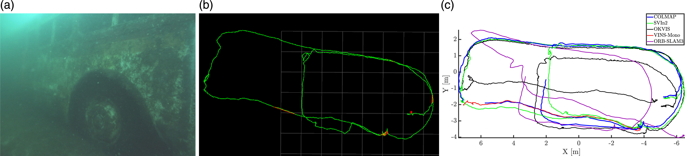
**图9**. (a) 沉没的巴士，Fantasy Lake，北卡罗来纳州，美国，轨迹长度53米；(b) 使用rviz显示的所有传感器启用情况下的SVIn2轨迹；(c) 与COLMAP（对比基线）、禁用DPP-声呐和水深的SVIn2、OKVIS、VINS-Mono和ORB-SLAM3对齐的轨迹（所有系统均使用CLAHE以提高能见度）。

[图9](https://journals.sagepub.com/doi/full/10.1177/02783649221110259#fig9-02783649221110259)显示了沉没的巴士数据集的结果。特别是，即使使用*直方图均衡*或CLAHE滤波器，当曝光增加了很长时间时，VINS-Mono丢失了跟踪，仅跟踪了总持续时间的21%——报告的RMSE仅针对此跟踪部分。未使用CLAHE时，VINS-Mono会产生类似的结果。ORB-SLAM3轨迹在曝光增加时显示出较大的漂移，并在从后门进入巴士后不久丢失了跟踪，导致使用CLAHE时跟踪持续时间为79%。它试图重新初始化，但无法成功跟踪。未使用CLAHE时，ORB-SLAM3根本无法跟踪，并且在初始化后立即丢失了跟踪。即使尺度漂移，OKVIS也能够在图像预处理步骤中使用CLAHE滤波器进行跟踪。未使用滤波器时，它在高曝光位置丢失了跟踪。我们提出的方法能够在使用CLAHE时成功跟踪、检测和校正闭环。未使用CLAHE时，它部分跟踪，持续时间为70%。

在Cavern1中——见[图10](https://journals.sagepub.com/doi/full/10.1177/02783649221110259#fig10-02783649221110259)——VINS-Mono始终成功跟踪。然而，如[图10(c)](https://journals.sagepub.com/doi/full/10.1177/02783649221110259#fig10-02783649221110259)所示，基于数据收集期间的经验观察，尺度不正确。ORB-SLAM3丢失了两次跟踪，每次大约10-20秒，但能够重新定位。OKVIS则产生了良好的轨迹，SVIn2也能够检测并闭合循环。未对上述任何SLAM系统（包括SVIn2）使用CLAHE：水很清澈，CLAHE会产生更差的结果。

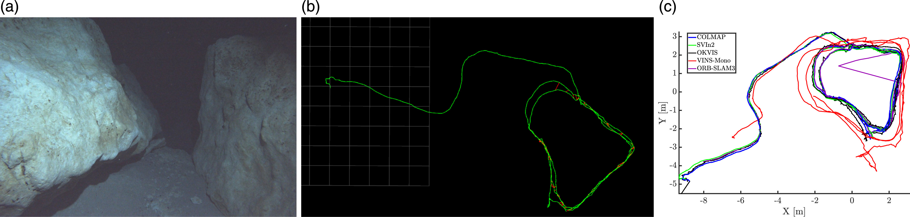
**图10**. (a) 洞穴环境，Ballroom，Ginnie Springs，佛罗里达州，美国，轨迹长度87米；(b) 使用rviz显示的所有传感器启用情况下的SVIn2轨迹；(c) 与COLMAP（对比基线）、禁用DPP-声呐和水深的SVIn2、OKVIS、VINS-Mono和ORB-SLAM3对齐的轨迹（未在任何系统中使用CLAHE）。

在Cavern2中——见[图11](https://journals.sagepub.com/doi/full/10.1177/02783649221110259#fig11-02783649221110259)——VINS-Mono在开始时丢失了跟踪，重新初始化后能够跟踪一段时间，并检测到一个闭环，然后再次丢失跟踪。如果图像经过不同滤波器预处理，VINS-Mono的表现更差。ORB-SLAM3在转弯时丢失了跟踪，并通过重新定位模块恢复——导致总跟踪持续时间为88%。OKVIS跟踪良好，但由于漂移随着时间累积，它无法将当前位置与预期的闭环位置连接起来。SVIn2能够通过成功的闭环闭合来跟踪并减少轨迹中的漂移。由于与Cavern1相同的原因，任何系统中都未使用CLAHE。

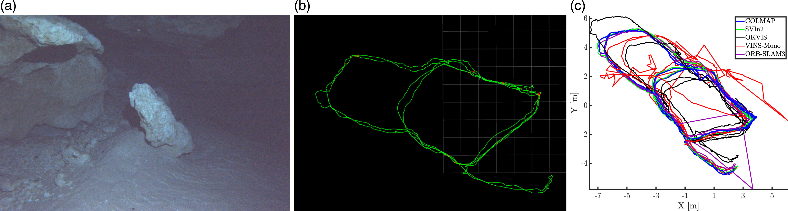
**图11**. (a) 洞穴环境，Ballroom，Ginnie Springs，佛罗里达州，美国，轨迹长度155米，覆盖两个不同区域的闭环；(b) 使用rviz显示的所有传感器启用情况下的SVIn2轨迹；(c) 与COLMAP（对比基线）、禁用DPP-声呐和水深的SVIn2、OKVIS、VINS-Mono和ORB-SLAM3对齐的轨迹（未在任何系统中使用CLAHE）。

在Cemetery数据集中——见[图12](https://journals.sagepub.com/doi/full/10.1177/02783649221110259#fig12-02783649221110259)——VINS-Mono和OKVIS在使用CLAHE时都能够跟踪，但VINS-Mono无法减少轨迹中的漂移，而SVIn2（使用CLAHE）能够校正闭环。未使用滤波器时，上述系统均无法正常工作。ORB-SLAM3能够部分跟踪，总持续时间为86%，使用CLAHE。未使用滤波器时，ORB-SLAM3的跟踪持续时间为30%。

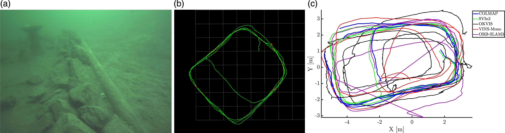
**图12**. (a) Aqua2在虚假墓地，Lake Jocassee，南卡罗来纳州，美国，轨迹长度80米；(b) 使用rviz显示的视觉、惯性和水深传感器（未使用DPP-声呐数据）的SVIn2轨迹；(c) 与COLMAP（对比基线）、禁用DPP-声呐和水深的SVIn2、OKVIS、VINS-Mono和ORB-SLAM3对齐的轨迹（所有系统均使用CLAHE以提高能见度）。

我们还记录了每个SLAM系统的每帧平均处理时间，并在[表3](https://journals.sagepub.com/doi/full/10.1177/02783649221110259#table3-02783649221110259)中报告了相应的运行时间分析。结果表明，尽管有额外的传感器，SVIn2的处理时间与其他SLAM系统相当。请注意，OKVIS的处理时间比其他系统短，因为它不执行任何位姿图优化或闭环，从而导致比其他SLAM系统更高的漂移。

**表3**. 在配备Intel i7-7700 CPU @ 3.6 GHz、32 GB RAM的台式电脑上SVIn2与其他SLAM方法的运行时间比较。

|                        | 平均处理时间（毫秒） |
| ---------------------- | -------------------- |
| SVIn2（所有传感器）    | 118                  |
| ORB-SLAM3（双目-惯性） | 115                  |
| OKVIS（双目）          | 57                   |
| VINS-Mono              | 198                  |

#### 7.2.3 基于AR标签的验证

在缺乏绝对地面真实数据的情况下，我们使用基于AR标签（识别标记）的3D地标验证来量化我们的SLAM方法的准确性。更具体地说，我们观察AR标签在整个轨迹长度上的位姿偏离其平均值的程度：如果轨迹漂移得到正确校正，我们应该在整个实验期间的多次访问中观察到标记位于相同的位置。请注意，标记位姿的准确性也受相机和标记之间相对位姿估计的准确性影响。

在实验设置方面，只有Cavern-2数据集中有一组六个打印在防水纸上的AR标签，固定放置在洞穴中。数据集中包含五个循环，可以观察到这些标签。为了确定相机和标签之间的相对位姿，我们使用了ROS *ar_track_alvar*[1](https://journals.sagepub.com/doi/full/10.1177/02783649221110259#fn1-02783649221110259)包，该包在标记检测中误差非常低（由于第六个标签的变色，只使用了六个标签中的五个）。一旦获得了*ar_track_alvar*的相对位姿信息，可以通过简单的几何变换获得标记的位姿。正式地，$\mathbf{W T_{M_k}} = \mathbf{T_{W C_i}} \mathbf{C_i T_{M_k}}$，其中$\mathbf{W T_{M_k}}$是在时间*k*时世界坐标系*W*中标记的位姿，$\mathbf{W T_{C_i}}^k$是在时间*k*时相机*C_i*在*W*中的位姿（由SLAM/里程计系统生成），$\mathbf{C_i T_{M_k}}$是在时间*k*时相机*C_i*和标记*M*之间的相对变换（由*ar_track_alvar*生成）。

[图13](https://journals.sagepub.com/doi/full/10.1177/02783649221110259#fig13-02783649221110259)显示了每个包在整个轨迹长度上标记相对于其平均位置的位移随时间的变化。标记在五个不同的时刻被检测到。[表4](https://journals.sagepub.com/doi/full/10.1177/02783649221110259#table4-02783649221110259)总结了平移和方向分量的标准差（SD）。SVIn2具有最低的标准差。这个结果表明，SVIn2产生了最一致的估计，有时甚至比COLMAP更好。

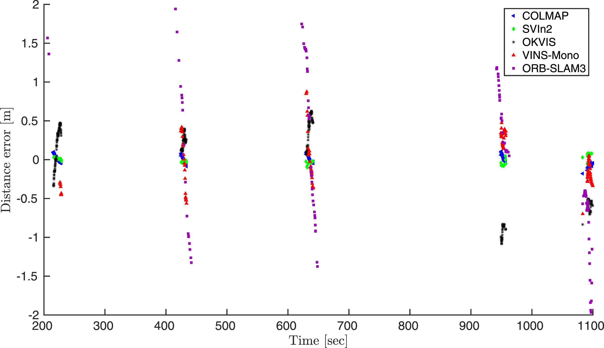**图13**. 标记的时间与位移误差。

**表4**. 检测到的标记的平移和旋转标准差以及平均距离误差（最低标准差以**粗体**标出）。未对任何系统使用CLAHE。

|                       | $t_x$ (m) | $t_y$ (m) | $t_z$ (m) | Avg dist. error (m) | Yaw, $\psi$ (deg) | Pitch, $\theta$ (deg) | Roll, $\phi$ (deg) |
| --------------------- | --------- | --------- | --------- | ------------------- | ----------------- | --------------------- | ------------------ |
| COLMAP                | 0.069     | **0.022** | 0.065     | 0.048               | **1.61**          | **0.67**              | **1.08**           |
| SVIn2                 | **0.036** | 0.032     | **0.038** | **0.026**           | 5.12              | 1.00                  | 5.79               |
| OKVIS (Stereo)        | 0.498     | 0.578     | 0.120     | 0.422               | 23.08             | 12.48                 | 20.52              |
| VINS-Mono             | 0.316     | 0.165     | 0.155     | 0.265               | 58.55             | 6.70                  | 31.05              |
| ORB-SLAM3 (Stereo-in) | 0.464     | 1.365     | 0.693     | 0.837               | 54.52             | 34.26                 | 11.57              |

在[图14](https://journals.sagepub.com/doi/full/10.1177/02783649221110259#fig14-02783649221110259)中，显示了SVIn2、OKVIS、VINS-Mono和ORB-SLAM3观察到标记的位置（品红色）以及标记的实际位置。[图14(g)](https://journals.sagepub.com/doi/full/10.1177/02783649221110259#fig14-02783649221110259)显示，在五个循环中，SVIn2中的标记出现在一起——表明轨迹中的漂移非常小。另一方面，OKVIS（[图14(h)](https://journals.sagepub.com/doi/full/10.1177/02783649221110259#fig14-02783649221110259)）、VINS-Mono（[图14(i)](https://journals.sagepub.com/doi/full/10.1177/02783649221110259#fig14-02783649221110259)）和ORB-SLAM3（[图14(j)](https://journals.sagepub.com/doi/full/10.1177/02783649221110259#fig14-02783649221110259)）显示出更高的误差，标记散布在四周。

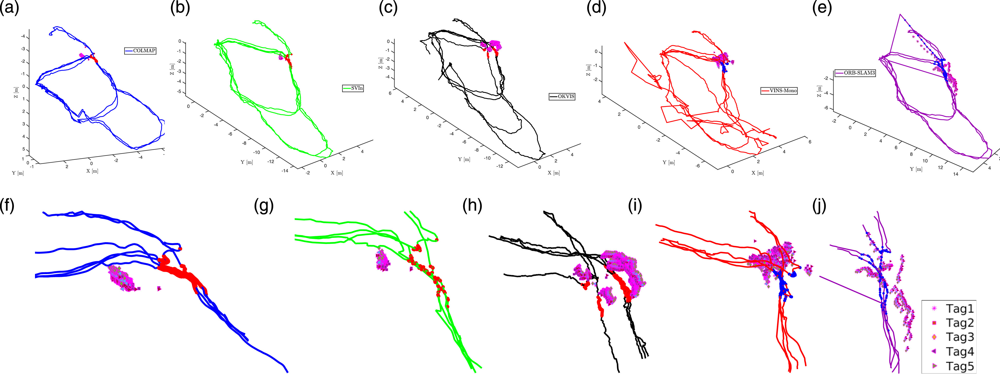**图14**. (a)–(e) 分别为COLMAP、SVIn2、OKVIS、VINS-Mono和ORB-SLAM3的轨迹，标记从观察到的位置（轨迹上的实心圆圈）和标记的位置。对应的放大版本（f）–(j)。

### 7.3. 消融研究

我们对（1）初始化和（2）整个SLAM系统进行了两项消融研究，以了解不同传感器的影响。

#### 7.3.1 不同传感器配置的初始化

我们研究了不同传感器组合如何影响我们提出的初始化方法的位姿估计准确性。为了将直接初始化效果与闭环隔离，在此分析中，我们计算了SVIn2在小区域内的ATE RMSE，而不是整个轨迹。特别地，我们考虑了Cavern2数据集的一部分，其中放置了两个手动测量距离约为7米的标签。[表5](https://journals.sagepub.com/doi/full/10.1177/02783649221110259#table5-02783649221110259)显示，*立体视觉*设置在提高准确性方面具有最大影响，而压力传感器提供了轻微的改进。*双目+压力传感器*组合具有最低的RMSE。

**表5**. 使用COLMAP进行初始化方法的消融研究（最低RMSE以**粗体**标出）。

| SVIn2 配置      | ATE RMSE (m) |
| --------------- | ------------ |
| Mono            | 0.0401       |
| Mono-pressure   | 0.0385       |
| Stereo          | 0.0224       |
| Stereo-pressure | **0.0205**   |

#### 7.3.2 具有不同传感器组合和闭环的SVIn2

本节研究了不同传感器的存在/不存在以及闭环组件对位姿估计准确性的影响。由于水下没有绝对的地面真实轨迹，我们使用Cavern2数据集中3D地标（AR标签）的位移作为评估状态估计准确性的度量。[表6](https://journals.sagepub.com/doi/full/10.1177/02783649221110259#table6-02783649221110259)显示了SVIn2中使用/不使用闭环组件、使用/不使用DPP声呐以及使用/不使用压力传感器的每个平移和旋转分量的平均距离误差和标准差。

**表6**. 使用3D地标位移作为评估指标的消融研究（最低标准差以**粗体**标出）。

| Loop closure | DPP-sonar | Pressure sensor | SD $t_x$(m) | SD $t_y$(m) | SD $t_z$(m) | Avg dist. error (m) | SD yaw, $\psi$(deg) | Pitch, $\theta$(deg) | Roll, $\phi$(deg) |
| ------------ | --------- | --------------- | ----------- | ----------- | ----------- | ------------------- | ------------------- | -------------------- | ----------------- |
| ✗            | ✗         | ✗               | 0.0364      | 0.0325      | 0.0380      | 0.0261              | 5.1289              | 1.0040               | 5.7990            |
| ✔            | ✔         | ✗               | **0.0277**  | 0.0243      | 0.0257      | 0.0198              | 5.9044              | 1.3722               | 5.6155            |
| ✔            | ✗         | ✗               | 0.0315      | 0.0307      | **0.0129**  | 0.0313              | 6.0991              | **0.9450**           | 6.4602            |
| ✔            | ✗         | ✔               | 0.0312      | **0.0192**  | 0.0223      | **0.0153**          | **4.8941**          | 1.3268               | **4.4823**        |
| ✗            | ✔         | ✗               | 0.4983      | 0.5788      | 0.1203      | 0.4221              | 23.0878             | 12.4800              | 20.5298           |
| ✗            | ✗         | ✗               | 0.2778      | 0.5675      | 0.2454      | 0.2373              | 22.2291             | 12.4886              | 20.5340           |
| ✗            | ✗         | ✔               | 0.3951      | 0.6424      | 0.1580      | 0.2162              | 24.6572             | 12.4809              | 20.5273           |
| ✗            | ✔         | ✔               | 0.3091      | 0.5726      | 0.1198      | 0.1248              | 22.4677             | 12.4797              | 20.5280           |

*闭环*（前四行）对产生无漂移轨迹的贡献最大。然而，*闭环+DPP声呐+压力传感器*产生了最小的平均距离误差。由于DPP声呐和压力传感器的误差项仅对机器人平移分量施加约束，因此无论是否使用DPP声呐和/或压力传感器，旋转分量（滚转、俯仰、偏航）都是相似的。

*没有闭环*（后四行），DPP声呐和压力传感器的贡献变得更加明显。仅使用压力传感器（倒数第二行）显示沿*Z*轴的误差减少。*DPP声呐+压力传感器*在没有闭环的情况下给出了最小的平均距离误差。由于上述相同的原因，无论是否使用DPP声呐和/或压力传感器，旋转分量也是相似的。

### 7.4. 在公开的水下数据集上的验证

[Ferrera等人（2019）](https://journals.sagepub.com/doi/full/10.1177/02783649221110259#bibr18-02783649221110259)提供了一组在海床附近获得的名为AQUALOC的水下数据集，这些数据集由配备单目黑白相机、MEMS-IMU和压力传感器的遥控潜水器（ROV）收集。请注意，虽然附加传感器可以提高SVIn2的性能，如消融研究所示，SVIn2可以在不同的传感器配置下工作，直到最小要求，即单目相机和IMU。因此，SVIn2适用于AQUALOC。

这些数据集的特点是浑浊、反向散射效应和ROV搅动的沉积物云——[图15](https://journals.sagepub.com/doi/full/10.1177/02783649221110259#fig15-02783649221110259)显示了站点的代表性图片。还提供了COLMAP轨迹作为“地面真实”来比较和评估SLAM系统的性能。请注意，在一些序列中——例如，序列4、6和7——由COLMAP生成的“地面真实”轨迹不是连续的，仅提供了相机位姿的部分信息。由于生成的数据是ROV连续运动的结果，这些不连续性代表了COLMAP状态估计过程的失败。我们在大约270米和380米深度的考古遗址上运行了SVIn2。SVIn2能够为所有序列生成完整的轨迹而不会丢失跟踪。RMSE误差通常约为其长度的2%，最低的序列8误差为0.5%，最高的序列5误差为6.4%，如[表7](https://journals.sagepub.com/doi/full/10.1177/02783649221110259#table7-02783649221110259)所示。

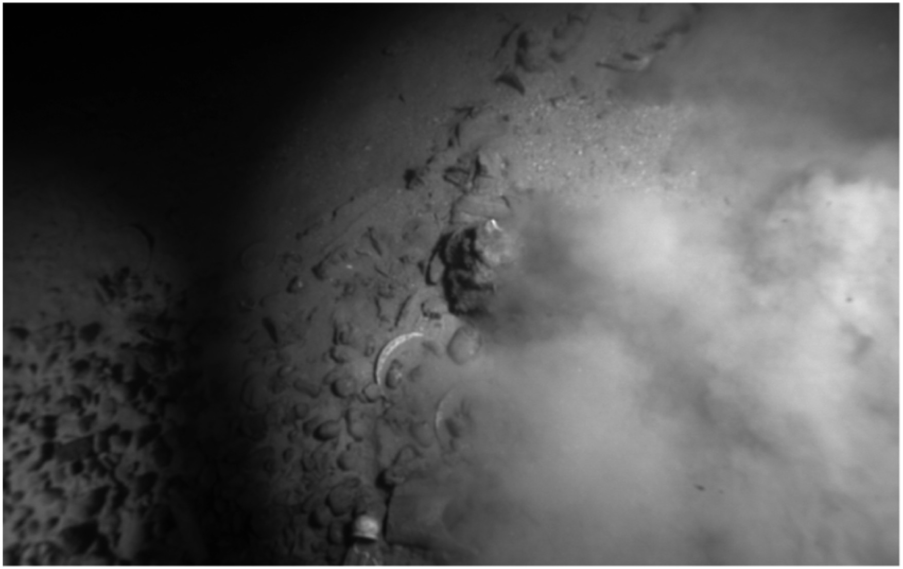**图15**. AQUALOC考古遗址序列中的示例图像（[Ferrera等，2019](https://journals.sagepub.com/doi/full/10.1177/02783649221110259#bibr18-02783649221110259)），受沙云、低对比度和重复纹理以及光线和特征缺乏的影响。

**表7**. 每个AQUALOC考古遗址序列的全轨迹长度上的RMSE（米）和误差百分比。请注意，序列4的COLMAP相机位姿估计高度不连续，似乎仅跟踪了轨迹的一小部分，因此未计算RMSE。

| 序列编号      | 1      | 2      | 3      | 4      | 5      |
| ------------- | ------ | ------ | ------ | ------ | ------ |
| SVIn2 RMSE(m) | 0.2311 | 2.4403 | 0.2801 | ––     | 2.7213 |
| Error %       | 2.0    | 3.79   | 2.617  | ––     | 6.48   |
| **序列编号**  | **6**  | **7**  | **8**  | **9**  | **10** |
| SVIn2 RMSE(m) | 0.6085 | 1.0526 | 0.2465 | 1.5092 | 2.3710 |
| Error %       | 1.91   | 0.86   | 0.59   | 2.30   | 2.83   |

由于COLMAP生成的轨迹为比例轨迹，我们*比例*对齐了SVIn2估计的轨迹和提供的地面真实数据，除了序列4，因为该数据集提供的“地面真实”高度不连续，因此未计算任何RMSE；见[图16](https://journals.sagepub.com/doi/full/10.1177/02783649221110259#fig16-02783649221110259)。

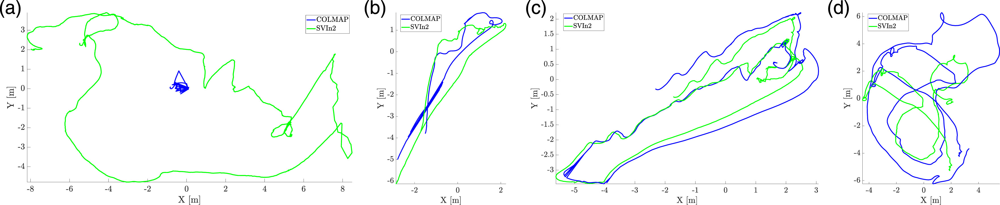**图16**. SVIn2轨迹和提供的COLMAP生成的“地面真实”轨迹对齐，分别用于考古序列4和6（a)-(b），显示提供的地面真实的不连续性。(c) 序列8，SVIn2显示低RMSE，(d) 序列10，SVIn2显示高RMSE。

总体而言，需要稳健的公共数据集来验证水下环境中的状态估计系统。

## 8. 结论和未来工作

本文研究了在水下环境中结合视觉、惯性、声学和水压信息的同时定位与地图构建问题。我们专注于设计和开发一个稳健且准确的系统，该系统利用不同传感器的互补性，使机器人能够在非常恶劣的环境中自主操作，具有稳健性、安全性和可靠性，以在有限的计算资源下实时完成任务。结果是SVIn2——一个紧耦合的基于关键帧的SLAM系统，集成了上述所有传感器，并通过两步尺度精炼、闭环和重新定位功能包括了一个稳健的初始化方法作为故障恢复机制。我们已经发布了我们系统的代码，可以在不同配置下工作，以便其他研究人员可以根据可用的传感器使用它。包括公开数据集和收集的水下数据集在内的挑战性水下环境中的实验结果证明了我们系统的有效性。提出方法的VIO部分在使用廉价运动相机（[Joshi等，2022](https://journals.sagepub.com/doi/full/10.1177/02783649221110259#bibr32-02783649221110259)）在沉船和水下洞穴内收集的数据集上提供了更好的性能。

未来的扩展包括但不限于集成水下通常使用的其他传感器——例如，DVL，USBL——合作定位和地图构建，以及在跟踪丢失时重新定位的能力。从长远来看，SVIn2将与规划一起用于AUV——如在AUV的初步路径规划中所做的那样（[Xanthidis等，2020](https://journals.sagepub.com/doi/full/10.1177/02783649221110259#bibr79-02783649221110259)）——以实现水下车辆在各种水下环境中的安全操作，如[图17](https://journals.sagepub.com/doi/full/10.1177/02783649221110259#fig17-02783649221110259)中所描绘的。

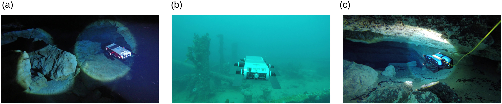**图17**. (a) Aqua 2车辆在洞穴内，佛罗里达州Ginnie Springs；(b) Aqua 2车辆在巴巴多斯Stavronikita沉船上方；(c) 在Ginnie Springs洞穴内部署的BlueROV2。

## 致谢

作者们还要感谢Woodville Karst Plain Project (WKPP) 和 El Centro Investigador del Sistema Acuífero de Quintana Roo A.C. (CINDAQ) 在数据收集、提供进入具有挑战性的水下洞穴的机会以及指导我们进行水下洞穴探索方面的帮助。感谢Nare Karapetyan、Marios Xanthidis、Hunter Damron、John Rose、Steve Cox和Casey McKinlay在数据收集方面的宝贵支持。最后但同样重要的是，我们要感谢Halcyon Dive Systems对设备的支持。
