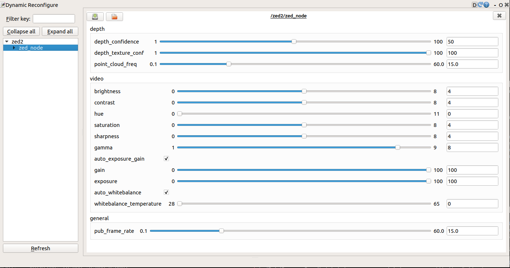

# ZED ROS  WRAPPER

[ZED ROS WRAPPER](https://github.com/stereolabs/zed-ros-wrapper)可让您将 ZED 立体相机与 ROS 结合使用。 它可以访问以下数据：

- 左右修正/未修正图像
- 深度图
- 彩色 3D 点云
- 视觉里程测量： 摄像机的位置和方向
- 姿态跟踪： 固定摄像机的位置和方向，并与 IMU 数据融合
- 空间绘图： 融合三维点云
- 传感器数据：加速计、陀螺仪、气压计、磁力计、内部温度传感器

ZED ROS wrapper 位于 GitHub 上，细分为三个软件源：

- [zed-ros-wrapper](https://github.com/stereolabs/zed-ros-wrapper): 提供 ZED ROS 封装节点的主软件包

- [zed-ros-interfaces](https://github.com/stereolabs/zed-ros-wrapper): 声明自定义主题、服务和操作的软件包

- [zed-ros-examples](https://github.com/stereolabs/zed-ros-examples)：包含如何使用 ZED ROS 封装器的示例和教程的支持包 

建议在机器人上安装wrapper功能包，并在台式电脑上使用examples功能包。毕竟只是用来测试，有没有不影响功能。

`zed-ros-interfaces` 资源库会被 `zed-ros-wrapper` 自动集成为一个 git 子模块，以满足所有必要的依赖项。

您必须在远程系统上安装 `zed-ros-interfaces` 资源库，该远程系统必须检索 ZED 封装器发送的主题（例如，通过对象检测模块获得的检测对象列表）或调用服务和操作来控制 ZED 封装器的状态。

**zed-ros-wrapper** 是一个 catkin 软件包，依赖于以下 ROS 软件包：

  | 软件包                  | 描述                                                         |
  | ----------------------- | :----------------------------------------------------------- |
  | `nav_msgs`              | 包含用于导航的消息类型，如 `Odometry`（里程计）和 `Path`（路径）。 |
  | `tf2_geometry_msgs`     | 提供几何消息（点、向量、四元数）在不同坐标系之间的转换功能。 |
  | `message_runtime`       | 包含生成的消息、服务和动作的运行时依赖项，允许其他包使用已生成的消息类型。 |
  | `catkin`                | ROS 的构建系统，结合了 CMake 和 Python，管理包的构建和依赖关系。 |
  | `roscpp`                | ROS 的 C++ 客户端库，提供编写 ROS 节点的基本功能，包括订阅和发布消息、服务调用等。 |
  | `stereo_msgs`           | 包含用于立体相机的消息类型，如 `DisparityImage`（视差图像）。 |
  | `rosconsole`            | 提供日志记录功能，使节点可以输出调试、信息、警告和错误消息。 |
  | `robot_state_publisher` | 从 `tf` 变换广播机器人模型中的关节状态，使用 URDF 模型生成变换。 |
  | `urdf`                  | 统一机器人描述格式，用于定义机器人的链节、关节及其物理属性。 |
  | `sensor_msgs`           | 包含用于传感器数据的标准消息类型，如图像、激光扫描和点云。   |
  | `image_transport`       | 提供图像传输和订阅功能，优化图像的传输效率和带宽利用率。     |
  | `roslint`               | 提供代码风格检查工具，确保代码符合 ROS 社区的编码标准和规范。 |
  | `diagnostic_updater`    | 提供更新和发布诊断信息的工具，使节点能够报告其状态和性能指标。 |
  | `dynamic_reconfigure`   | 允许在运行时动态调整节点的参数，提供接口通过图形界面或命令行工具更改参数值。 |
  | `tf2_ros`               | 提供 `tf2` 的 ROS 接口，用于管理和使用坐标变换，支持变换广播、监听和缓冲。 |
  | `message_generation`    | 提供生成 ROS 消息、服务和动作类型的工具，通过消息描述文件生成相应的代码。 |
  | `nodelet`               | 提供在同一进程中加载多个节点的机制，减少进程间通信的开销，提高效率。 |

ZED ROS Weapper软件包循序ROS软件包的编译过程：

```bash
cd ~/catkin_ws/src
git clone --recursive https://github.com/stereolabs/zed-ros-wrapper.git
cd ../
rosdep install --from-paths src --ignore-src -r -y
catkin_make -DCMAKE_BUILD_TYPE=Release
source ./devel/setup.bash
```

**注意**：如果使用不同的控制台界面，如 `zsh` ，则必须更改 `source` 命令如下： `echo source $(pwd)/devel/setup.zsh >> ~/.zshrc` 和 `source ~/.zshrc` 命令。

## zed-ros-interfaces

`zed_interfaces` 是一个 catkin 软件包。 它依赖于以下 ROS 软件包：

- catkin
- std_msgs
- sensor_msgs
- actionlib_msgs
- geometry_msgs
- message_generation

打开终端，进入wrapper的工作空间的src文件夹下，clone下interfaces的代码：

```bash
  cd ~/catkin_ws/src
  git clone https://github.com/stereolabs/zed-ros-interfaces.git
  cd ../
  rosdep install --from-paths src --ignore-src -r -y
  catkin_make -DCMAKE_BUILD_TYPE=Release
  source ./devel/setup.bash
```

**注意**：此软件包不需要 CUDA，因此也可用于在未配备 NVIDIA® GPU 的机器上接收 ZED 数据。

custom topic：

这些自定义话题用于在 ROS 中传递特定类型的数据，通常与 ZED 相机的功能和输出相关。

| Topic            | Description                                            |
| ---------------- | ------------------------------------------------------ |
| `BoundingBox2Df` | 2D 浮点型边界框，表示图像中检测到的物体边界。          |
| `BoundingBox2Di` | 2D 整型边界框，表示图像中检测到的物体边界。            |
| `BoundingBox3D`  | 3D 边界框，表示空间中的物体边界。                      |
| `Keypoint2Df`    | 2D 浮点型关键点，表示图像中的特征点。                  |
| `Keypoint2Di`    | 2D 整型关键点，表示图像中的特征点。                    |
| `Keypoint3D`     | 3D 关键点，表示空间中的特征点。                        |
| `Object`         | 表示一个检测到的物体，包含物体的各种属性。             |
| `ObjectsStamped` | 带时间戳的物体列表，表示在某个时间点检测到的所有物体。 |
| `RGBDSensors`    | 表示 RGB-D 传感器的数据，包含 RGB 图像和深度信息。     |
| `Skeleton2D`     | 2D 骨架数据，表示图像中人体的骨架结构。                |
| `Skeleton3D`     | 3D 骨架数据，表示空间中人体的骨架结构。                |

Custom Services

这些自定义服务用于在 ROS 中触发特定操作，通常与 ZED 相机的控制和设置相关。

| Service                  | Description                                        |
| ------------------------ | -------------------------------------------------- |
| `reset_odometry`         | 重置里程计数据，将里程计的位置信息重置为初始状态。 |
| `reset_tracking`         | 重置跟踪数据，将相机的跟踪信息重置为初始状态。     |
| `set_led_status`         | 设置相机的 LED 状态，控制 LED 的开关。             |
| `set_pose`               | 设置相机的位置和姿态，用于初始化或校正相机姿态。   |
| `save_3d_map`            | 保存当前的 3D 地图数据，将三维信息保存到文件中。   |
| `save_area_memory`       | 保存区域记忆数据，将环境记忆信息保存到文件中。     |
| `start_3d_mapping`       | 开始 3D 映射过程，启动相机的 3D 映射功能。         |
| `start_object_detection` | 开始物体检测过程，启动相机的物体检测功能。         |
| `start_remote_stream`    | 开始远程流媒体传输，将数据流传输到远程设备。       |
| `start_svo_recording`    | 开始 SVO 录制，将相机数据录制到 SVO 文件中。       |
| `stop_3d_mapping`        | 停止 3D 映射过程，结束相机的 3D 映射功能。         |
| `stop_object_detection`  | 停止物体检测过程，结束相机的物体检测功能。         |
| `stop_remote_stream`     | 停止远程流媒体传输，结束数据流传输。               |
| `stop_svo_recording`     | 停止 SVO 录制，结束数据的录制过程。                |
| `toggle_led`             | 切换 LED 状态，改变 LED 的开关状态。               |

## zed-ros-examples

`zed-ros-examples` 资源库是 catkin 软件包的集合。 它们依赖于以下 ROS 软件包：

- catkin
- zed_wrapper
- sensor_msgs
- roscpp
- nav_msgs
- geometry_msgs
- ar_track_alvar
- ar_track_alvar_msgs
- nodelet
- depthimage_to_laserscan
- rtabmap
- rtabmap_ros
- rviz_imu_plugin
- rviz

打开终端，进入wrapper的工作空间的src文件夹下，clone下interfaces的代码：

```BASH
 cd ~/catkin_ws/src
 git clone https://github.com/stereolabs/zed-ros-examples.git
 cd ../
 rosdep install --from-paths src --ignore-src -r -y
 catkin_make -DCMAKE_BUILD_TYPE=Release
 source ./devel/setup.bash
```

## 启动 ZED 节点

在 ROS 中，ZED 可作为一个节点（node）向话题（topic）发布数据。 你可以在[这里](https://www.stereolabs.com/docs/ros/zed-node/#published-topics)阅读可用主题的完整列表。

打开终端并使用 `roslaunch` 启动 ZED 节点：

- **ZED** camera:          `$ roslaunch zed_wrapper zed.launch`
- **ZED Mini** camera: `$ roslaunch zed_wrapper zedm.launch`
- **ZED 2** camera:       `$ roslaunch zed_wrapper zed2.launch`
- **ZED 2i** camera:      `$ roslaunch zed_wrapper zed2i.launch`

**注意**：您可以设置自己的配置参数，修改文件 `param/common.yaml`, `param/zed.yaml`、`param/zedm.yaml` 和 `param/zed2.yaml` 如 [参数文档](https://www.stereolabs.com/docs/ros/zed-node/#zed-parameters)中所述。

## 显示 ZED 数据

###  [使用 RVIZ](https://www.stereolabs.com/docs/ros#using-rviz)

RVIZ 是 ROS 中一个有用的可视化工具。 使用 RVIZ，您可以将 ZED 的左右图像、深度、点云和 3D 轨迹可视化。

如果您安装了 [`zed-ros-examples` 资源库](https://www.stereolabs.com/docs/ros/#installation)，则可使用以下命令启动 ZED 封装器和 RVIZ：

```bash
roslaunch zed_display_rviz display_zed.launch
```

如果使用的是 ZED Mini 摄像头，则可以使用以下命令查看 IMU 数据的其他信息：

```bash
roslaunch zed_display_rviz display_zedm.launch
```

如果使用的是 ZED 2 摄像机，则可以可视化环境传感器的其他信息：

```bash
roslaunch zed_display_rviz display_zed2.launch
```

如果您使用的是 ZED 2i 摄像机，您可以将环境传感器的其他信息可视化：

```bash
roslaunch zed_display_rviz display_zed2i.launch
```

**注意**：如果您尚未配置自己的 RVIZ 界面，可以在[此处](https://www.stereolabs.com/docs/ros/rviz/)找到详细教程。

### 显示图像

ZED节点发布了原始和立体矫正（对齐）的左图像和右图像。在RVIZ中，使用图像预览模式并选择一个可用的图像话题。以下是主要图像话题的列表：

| 话题                          | 描述                             |
| ----------------------------- | -------------------------------- |
| `rgb/image_rect_color`        | 矫正后的彩色图像（默认左传感器） |
| `rgb/camera_info`             | 彩色相机校准数据                 |
| `rgb_raw/image_raw_color`     | 未矫正的彩色图像（默认左传感器） |
| `rgb_raw/camera_info`         | 未矫正的彩色相机校准数据         |
| `right/image_rect_color`      | 右相机矫正后的图像               |
| `right/camera_info`           | 右传感器校准数据                 |
| `right_raw/image_raw_color`   | 右相机未矫正的图像               |
| `right_raw/camera_info`       | 未矫正的右相机校准数据           |
| `confidence/confidence_image` | 作为图像的置信度图               |

**注意**：置信度图也可以作为32位浮点图像使用，订阅 `confidence/confidence_map` 话题。

###  [显示深度](https://www.stereolabs.com/docs/ros#displaying-depth)

深度图可通过以下主题在 RVIZ 中显示：

- **depth/depth_registered**: 以米为单位的 32 位深度值。 RVIZ 会将深度图归一化为 8 位，并显示为灰度深度图像。

> **注意**： `launch/zed_camera.launch` 文件中提供了 OpenNI 兼容模式。 将 `openni_depth_mode` 设置为 `1` 以获得毫米和 16 位精度的深度，然后重新启动 ZED 节点。

###  [显示差异](https://www.stereolabs.com/docs/ros#displaying-disparity)

订阅 **disparity/disparity_image** 主题可获得差异图像。

启动差异浏览器将其可视化：

```bash
rosrun image_view disparity_view image:=disparity/disparity_image
```

### 显示点云 

三维彩色点云可通过 **zed/zed_node/point_cloud/cloud_registered** 主题在 RVIZ 中显示。

在 RVIZ 中通过 **point_cloud** -> **cloud** -> **PointCloud2** 添加。 请注意，显示点云会减慢 RVIZ 的运行速度，因此如果要显示其他主题，请打开一个新实例。

### 显示位置和路径

随着时间的推移，ZED 在空间中的位置和方向在以下主题中发布：

- **odom**： 参照里程测量帧的里程测量姿态（ZED 仅采用视觉里程测量，ZED Mini 采用视觉惯性里程测量）
- **pose**： 参考地图帧的摄像机姿态（应用完整的数据融合算法）
- **pose_with_covariance**： 带有协方差的地图帧中的摄像机姿态
- **path_odom**：地图帧中的摄像机姿态序列
- **path_map**： 地图帧中的摄像机姿势序列

> **重要：** 默认情况下，RVIZ 不会正确显示里程测量数据。 打开左侧列表中新建的 **Odometry** 对象、 并将 **Position Tolerance** 和 **Angle Tolerance** 设置为 **0** ，将 **Keep** 设置为 **1** 。

## 使用录制的 SVO 视频启动

通过 ZED，您可以使用 .svo 文件格式录制和播放立体声视频。 要录制序列，请打开 [ZED Explorer](https://www.stereolabs.com/docs/installation/#run-zed-explorer) 应用程序，然后单击 **REC** 按钮。

要使用 SVO 文件启动 ROS 封装程序，请在启动软件包时在命令行中设置 **svoo_file** 路径 [启动参数](https://www.stereolabs.com/docs/ros/zed-node/)：

ZED Mini：

```bash
roslaunch zed_wrapper zedm.launch svoo_file:=/path/to/file.svo
```

## 动态重新配置 

在 ZED 节点执行期间，您可以动态更改许多配置参数。

您可以使用命令 *dynparam set* 设置参数，例如

```bash
$ rosrun dynamic_reconfigure dynparam set depth_confidence 80
```

或者您可以使用 `rqt` 堆栈提供的图形用户界面：

```bash
$ rosrun rqt_reconfigure rqt_reconfigure
```

此处提供了可用动态参数的完整列表



### Depth Parameters

| Parameter            | Description                                                  | Current Value |
| -------------------- | ------------------------------------------------------------ | ------------- |
| `depth_confidence`   | 设置深度置信度阈值，范围0到100。值越高，滤除的低置信度深度值越多，结果会更准确但可能会缺失部分深度信息。 | 50            |
| `depth_texture_conf` | 设置纹理置信度阈值，范围0到100。值越高，滤除的低纹理区域越多，有助于减少噪声。 | 100           |
| `point_cloud_freq`   | 设置点云数据的发布频率。值越大，发布的点云数据越频繁。       | 15.0 Hz       |

### Video Parameters

| Parameter                  | Description                                                  | Current Value |
| -------------------------- | ------------------------------------------------------------ | ------------- |
| `brightness`               | 调整图像的亮度，范围0到8。                                   | 4             |
| `contrast`                 | 调整图像的对比度，范围0到8。                                 | 4             |
| `hue`                      | 调整图像的色调，范围0到11。                                  | 0             |
| `saturation`               | 调整图像的饱和度，范围0到8。                                 | 4             |
| `sharpness`                | 调整图像的锐度，范围0到8。                                   | 4             |
| `gamma`                    | 调整图像的伽玛值，范围1到9。                                 | 8             |
| `auto_exposure_gain`       | 启用或禁用自动曝光和增益调整，勾选表示启用。                 | 启用          |
| `gain`                     | 手动调整增益，只有在禁用自动曝光和增益时有效，范围0到100。   | 100           |
| `exposure`                 | 手动调整曝光时间，只有在禁用自动曝光和增益时有效，范围0到100。 | 100           |
| `auto_whitebalance`        | 启用或禁用自动白平衡，勾选表示启用。                         | 启用          |
| `whitebalance_temperature` | 手动调整白平衡的色温，只有在禁用自动白平衡时有效，范围28到65。 | 0             |

### General Parameters

| Parameter        | Description                                                  | Current Value |
| ---------------- | ------------------------------------------------------------ | ------------- |
| `pub_frame_rate` | 设置图像和其他传感器数据的发布帧率。值越大，发布的数据越频繁。 | 15.0 Hz       |

# ZED SDK 开发教程

## 教程 - HELLO，ZED

本教程简单介绍了如何配置和打开 ZED、打印序列号以及关闭摄像头。 这是最基本的教程，也是使用 ZED SDK 的良好开端。

- 首先，下载最新版本的 [ZED SDK](https://www.stereolabs.com/developers/)。
- 下载 [Hello ZED](https://github.com/stereolabs/zed-examples/tree/master/tutorials/tutorial 1 - hello ZED) C++、Python 或 C# 示例代码。
- 按照说明在 Windows 和 Linux 上以 [C++](https://www.stereolabs.com/docs/app-development/cpp/linux/) 构建项目或以 [Python](https://www.stereolabs.com/docs/app-development/python/install/) 运行项目。

```cpp
#include <sl/Camera.hpp>

using namespace sl;

int main(int argc, char **argv) {

    // 创建一个ZED相机对象
    Camera zed;
    
	// 设置配置参数 
 	InitParameters init_params;
	init_params.camera_resolution = RESOLUTION：:HD1080;
	init_params.camera_fps = 30;
    
    // 打开相机
    ERROR_CODE returned_state = zed.open();
    if (returned_state != ERROR_CODE::SUCCESS) {
        std::cout << "错误 " << returned_state << "，程序退出。\n";
        return EXIT_FAILURE;
    }

    // 获取相机信息（ZED序列号）
    auto camera_infos = zed.getCameraInformation();
    printf("你好！这是我的序列号：%d\n", camera_infos.serial_number);

    // 关闭相机
    zed.close();
    return EXIT_SUCCESS;
}
```

### 代码概述

ZED API 提供对摄像机控制和配置的底层访问。 要在应用程序中使用 ZED，您需要创建并打开一个摄像机对象。 该 API 可用于两种不同的视频输入：ZED 实时视频（实时模式）或使用 ZED API 以 SVO 格式录制的视频文件（回放模式）。

### 摄像机配置

要配置摄像机，请创建摄像机对象并指定`InitParameters`。 初始参数可让您调整摄像机分辨率、FPS、深度感应参数等。 这些参数只能在打开摄像机前设置，在摄像机使用过程中无法更改。

- [C++](https://www.stereolabs.com/docs/tutorials/hello-zed#tabCpp)
- [PYTHON](https://www.stereolabs.com/docs/tutorials/hello-zed#tabPython)
- [C#](https://www.stereolabs.com/docs/tutorials/hello-zed#tabCSharp)

```cpp
// 创建一个ZED相机对象
Camera zed;

// 设置配置参
InitParameters init_params;
init_params.camera_resolution = RESOLUTION::HD1080;
init_params.camera_fps = 30;
```

`InitParameters` 默认包含一个配置。 您可以设置以下初始参数：

- 摄像机配置参数，使用 `camera_*` 条目（分辨率、图像翻转...）。
- SDK 配置参数，使用 `sdk_*` 条目（冗长度、使用的 GPU 设备......）。
- 深度配置参数，使用 `depth_*` 条目（深度模式、最小距离...）。
- 坐标框架配置参数，使用 `coordinate_*` 条目（坐标系、坐标单位...）。
- 通过 ZED SDK 使用 Stereolabs 视频文件的 SVO 参数（文件名、实时模式...）

要获取可用参数列表，请参阅 [API](https://www.stereolabs.com/docs/api/structsl_1_1InitParameters.html) 文档。

### 打开摄像机

完成初始配置后，打开摄像机。

- [C++](https://www.stereolabs.com/docs/tutorials/hello-zed#tabCpp)
- [PYTHON](https://www.stereolabs.com/docs/tutorials/hello-zed#tabPython)
- [C#](https://www.stereolabs.com/docs/tutorials/hello-zed#tabCSharp)

```cpp
// Open the camera
err = zed.open(init_params);
if (err != ERROR_CODE::SUCCESS)
    exit(-1);
```

### 检索摄像机信息

可以为每只眼睛和分辨率检索焦距、视场或立体校准等摄像机参数。 这些值在 `CalibrationParameters` 中提供。 可以使用 `getCameraInformation()` 访问它们。 您还可以使用 [Sensors API](https://www.stereolabs.com/docs/sensors/using-sensors/) 访问 IMU 和传感器配置。

在本教程中，我们只需检索摄像机的序列号：

- [C++](https://www.stereolabs.com/docs/tutorials/hello-zed#tabCpp)
- [PYTHON](https://www.stereolabs.com/docs/tutorials/hello-zed#tabPython)
- [C#](https://www.stereolabs.com/docs/tutorials/hello-zed#tabCSharp)

```cpp
// Get camera information (serial number)
int zed_serial = zed.getCameraInformation().serial_number;
printf("Hello! This is my serial number: %d\n", zed_serial);
```

在控制台窗口中，您现在应该可以看到摄像机的序列号（也可以在 ZED USB 电缆上的贴纸上找到）。

### 关闭摄像机 

要正确关闭摄像机，请使用 `zed.close()` 并退出程序。

- [C++](https://www.stereolabs.com/docs/tutorials/hello-zed#tabCpp)
- [PYTHON](https://www.stereolabs.com/docs/tutorials/hello-zed#tabPython)
- [C#](https://www.stereolabs.com/docs/tutorials/hello-zed#tabCSharp)

```cpp
// 关闭摄像机 zed.close();
```

## 教程 - 图像捕捉

### 代码概述

### 打开摄像机 

与之前的教程一样，在这里我们创建、配置并打开 ZED。 我们将 3D 摄像头设置为 30 fps 的双高清 1080 分辨率。

- [C++](https://www.stereolabs.com/docs/tutorials/image-capture#tabCpp)
- [PYTHON](https://www.stereolabs.com/docs/tutorials/image-capture#tabPython)
- [C#](https://www.stereolabs.com/docs/tutorials/image-capture#tabCSharp)

```cpp
// Create a ZED camera object
Camera zed;

// Set configuration parameters
InitParameters init_params;
init_params.camera_resolution = RESOLUTION_HD1080; // Use HD1080 video mode
init_params.camera_fps = 30; // Set fps at 30

// Open the camera
ERROR_CODE err = zed.open(init_params);
if (err != ERROR_CODE::SUCCESS)
    exit(-1);
```

### 捕捉图像数据 

现在 ZED 已打开，我们可以捕捉来自摄像机的实时流。 让我们创建一个循环，捕捉 50 幅图像并退出。

要捕获图像并进行处理，您需要调用 `Camera::grab()` 函数。 该函数还可以接受运行时参数，但在本教程中我们将其设置为默认值。

如果 `grab()` 返回 `SUCCESS` 表示新图像已捕获并可用。 您还可以检查 `grab()` 的状态，以了解捕获过程中是否存在问题。

- [C++](https://www.stereolabs.com/docs/tutorials/image-capture#tabCpp)
- [PYTHON](https://www.stereolabs.com/docs/tutorials/image-capture#tabPython)
- [C#](https://www.stereolabs.com/docs/tutorials/image-capture#tabCSharp)

```cpp
// Grab an image
if (zed.grab() == ERROR_CODE::SUCCESS) {
	// A new image is available if grab() returns ERROR_CODE::SUCCESS
}
```

执行 `grab()` 方法后，您就可以检索新图像及其元数据。 在本教程中，我们将使用 `retrieveImage()` 和 `getTimestamp()` 来检索左侧图像及其时间戳。

`retrieveImage()` 将 `sl::Mat` 和 `VIEW` 模式作为参数。 创建 `Mat` 时，您无需分配内存。 第一次调用 `retrieveImage()` 时，Mat 将被填充为图像数据并自动分配内存。

- [C++](https://www.stereolabs.com/docs/tutorials/image-capture#tabCpp)
- [PYTHON](https://www.stereolabs.com/docs/tutorials/image-capture#tabPython)
- [C#](https://www.stereolabs.com/docs/tutorials/image-capture#tabCSharp)

```cpp
// Capture 50 frames and stop
int i = 0;
sl::Mat image;
while (i < 50) {
    // Grab an image
    if (zed.grab() == ERROR_CODE::SUCCESS) {
        // A new image is available if grab() returns ERROR_CODE::SUCCESS
        zed.retrieveImage(image, VIEW::LEFT); // Get the left image
        auto timestamp = zed.getTimestamp(sl::TIME_REFERENCE::IMAGE); // Get image timestamp
        printf("Image resolution: %d x %d  || Image timestamp: %llu\n", image.getWidth(), image.getHeight(), timestamp);
        i++;
    }
}
```

> **注意**：图像时间戳以纳秒和 Epoch 格式给出。 您可以比较两个 `grab()` 之间的时间戳：如果没有丢帧，时间戳应接近帧频时间。

有关摄像机和视频参数的更多信息，请阅读[使用视频 API](https://www.stereolabs.com/docs/video/using-video/)。

### 关闭摄像机 

现在我们已经捕获了 50 幅图像，让我们关闭摄像机并退出程序。

- [C++](https://www.stereolabs.com/docs/tutorials/image-capture#tabCpp)
- [PYTHON](https://www.stereolabs.com/docs/tutorials/image-capture#tabPython)
- [C#](https://www.stereolabs.com/docs/tutorials/image-capture#tabCSharp)

```cpp
// 关闭摄像机
zed.close();
```

#### 其他示例

要了解如何调整曝光、增益、对比度、锐度等相机设置并显示生成的图像，请查看 [Camera Control](https://github.com/stereolabs/zed-examples/tree/master/camera control) 示例代码。

## 教程 - 深度感知

本教程展示了如何从立体图像和点云中获取深度，并在终端打印给定像素的距离。 程序将循环运行，直到抓取 50 个帧为止。 我们假定你已经学习了前面的教程： [Hello ZED](https://www.stereolabs.com/docs/tutorials/hello-zed/) 和 [Image Capture](https://www.stereolabs.com/docs/tutorials/image-capture/).

### 代码概述 

### 打开摄像机 

与之前的教程一样，我们创建、配置并打开 ZED。 我们将 3D 摄像机设置为 60fps 的 HD720 模式，并在 `PERFORMANCE` 模式下启用深度。 有关此参数的更多信息，请参阅[深度模式](https://www.stereolabs.com/docs/depth-sensing/depth-settings/#depth-modes)。

- [C++](https://www.stereolabs.com/docs/tutorials/depth-sensing#tabCpp)
- [PYTHON](https://www.stereolabs.com/docs/tutorials/depth-sensing#tabPython)
- [C#](https://www.stereolabs.com/docs/tutorials/depth-sensing#tabCSharp)

```cpp
// 创建 ZED 摄像机 
 摄像机 zed;
// 创建配置参数 
 InitParameters init_params;
init_params.sdk_verbose = true; // 启用冗长日志记录 
init_params.depth_mode = DEPTH_MODE:：PERFORMANCE; // 将深度模式设置为性能（最快）
init_params.coordinate_units = UNIT：:MILLIMETER; // 使用毫米单位 
// 打开相机 
ERROR_CODE err = zed 。open(init_params);  zed.
if (err ！= ERROR_CODE::SUCCESS) {  err !
    cout << "Error" <； err << ", 退出程序。n\n"; // 显示错误 
 return -1;
}
```

> **注意**：默认情况下，深度感知处于 `ULTRA` 模式。 如果使用该模式，则无需在 InitParameters 中设置深度模式。

### 捕捉图像和深度

现在 ZED 已打开，我们可以捕捉图像和深度图。 在这里，我们循环操作，直到成功捕获 50 幅图像。 检索深度图就像 [检索图像](https://www.stereolabs.com/docs/tutorials/image-capture/)一样简单：

- 我们创建一个 Mat 来存储深度图。
- 我们调用 retrieveMeasure() 获取深度图。

- [C++](https://www.stereolabs.com/docs/tutorials/depth-sensing#tabCpp)
- [PYTHON](https://www.stereolabs.com/docs/tutorials/depth-sensing#tabPython)
- [C#](https://www.stereolabs.com/docs/tutorials/depth-sensing#tabCSharp)

```cpp
// Capture 50 images and depth, then stop
int i = 0;
sl::Mat image, depth, point_cloud;
while (i < 50) {
    // Grab an image
    if (zed.grab(runtime_parameters) == ERROR_CODE::SUCCESS) {
        // A new image is available if grab() returns ERROR_CODE::SUCCESS
        zed.retrieveImage(image, VIEW::LEFT); // Get the left image
        zed.retrieveMeasure(depth, MEASURE::DEPTH); // Retrieve depth matrix. Depth is aligned on the left RGB image.
        zed.retrieveMeasure(point_cloud, MEASURE::XYZRGBA); // Retrieve colored point cloud
        i++;
    }
}
```

有关深度和点云参数的更多信息，请阅读[使用深度 API](https://www.stereolabs.com/docs/depth-sensing/using-depth/)。

### 捕捉图像和深度

现在 ZED 已打开，我们可以捕捉图像和深度。 我们在此循环，直到成功捕捉 50 幅图像。 检索深度图和检索图像一样简单：

- 我们创造Mat来存储深度图
- 我们调用 retrieveMeasure()得到深度图

```cpp
// Get and print distance value in mm at the center of the image
// We measure the distance camera - object using Euclidean distance
int x = image.getWidth() / 2;
int y = image.getHeight() / 2;
sl::float4 point_cloud_value; // 定义点云数据结构
point_cloud.getValue(x, y, &point_cloud_value);//获取点云在x，y处的点云数据
// 计算距离(x^2+y^2+z^2)^0.5
float distance = sqrt(point_cloud_value.x*point_cloud_value.x + point_cloud_value.y*point_cloud_value.y + point_cloud_value.z*point_cloud_value.z);
printf("Distance to Camera at (%d, %d): %f mm\n", x, y, distance);
```

我们还可以直接使用深度图而不是点云来提取特定像素的深度值。

```cpp
int x = image.getWidth() / 2;
int y = image.getHeight() / 2;
float depth_value;
depth.getValue(x,y, &depth_value);//x,y处的将深度数值赋给depth_value，这里是使用指针传递
printf("Depth to Camera at (%d, %d): %f mm\n", x, y, depth_value);
```

## 教程 - 使用摄像机跟踪

本教程展示了如何实时获取摄像机的位置和方向。 我们假设您已经学习了前面的教程。

### 入门

- 首先，下载最新版本的 [ZED SDK](https://www.stereolabs.com/developers/)。
- 下载 [定位跟踪](https://github.com/stereolabs/zed-examples/tree/master/tutorials/tutorial 4 - positional tracking/) C++、Python 或 C# 示例代码。

### 代码概述

### 打开摄像机 

与之前的教程一样，我们创建、配置并打开 ZED。

- [C++](https://www.stereolabs.com/docs/tutorials/positional-tracking#tabCpp)
- [PYTHON](https://www.stereolabs.com/docs/tutorials/positional-tracking#tabPython)
- [C#](https://www.stereolabs.com/docs/tutorials/positional-tracking#tabCSharp)

```cpp
// 创建 ZED 摄像机对象 
Camera zed;

// 设置配置参数 
 InitParameters init_params;
init_params.camera_resolution = RESOLUTION：:HD720; // 使用 HD720 视频模式（默认帧速：60）
init_params.coordinate_system = COORDINATE_SYSTEM:：RIGHT_HANDED_Y_UP; // 使用右旋 Y-up 坐标系 
init_params.coordinate_units = UNIT：:METER; // 设置单位为米 

// 打开摄像机 
ERROR_CODE err = zed 。open(init_params); zed.
if (err ！= ERROR_CODE::SUCCESS) err !
    exit(-1);
```

### 启用位置跟踪

打开摄像机后，我们必须使用 `enablePositionalTracking()` 启用位置跟踪模块，以便获取 ZED 的位置和方向。

- [C++](https://www.stereolabs.com/docs/tutorials/positional-tracking#tabCpp)
- [PYTHON](https://www.stereolabs.com/docs/tutorials/positional-tracking#tabPython)
- [C#](https://www.stereolabs.com/docs/tutorials/positional-tracking#tabCSharp)

```cpp
// Enable positional tracking with default parameters
PositionalTrackingParameters tracking_parameters;
err = zed.enablePositionalTracking(tracking_parameters);
if (err != ERROR_CODE::SUCCESS)
    exit(-1);
```

在上述示例中，我们使用了 ZED SDK 中设置的默认跟踪参数。 有关可用参数列表，请查看[跟踪 API](https://www.stereolabs.com/docs/api/group__PositionalTracking__group.html) 文档。

### 捕捉姿势数据

既然已经启用了运动跟踪，我们就可以创建一个循环来捕捉和获取摄像机的位置。 摄像机位置由 Pose 类提供。 该类包含摄像机的平移和方向，以及图像时间戳和跟踪置信度。 

姿态总是与参考帧相关联。 SDK 提供了两个参照框架： `REFERENCE_FRAME::WORLD` and `REFERENCE_FRAME::CAMERA`。 更多信息，请参阅 "[坐标框架](https://www.stereolabs.com/docs/positional-tracking/coordinate-frames/) "部分。 

在本教程中，我们将检索摄像机在世界帧中的位置。

```cpp
// Track the camera position during 1000 frames
int i = 0;
sl::Pose zed_pose;
while (i < 1000) {
    if (zed.grab() == ERROR_CODE::SUCCESS) {

        // Get the pose of the left eye of the camera with reference to the world frame
        zed.getPosition(zed_pose, REFERENCE_FRAME::WORLD);

        // Display the translation and timestamp
        printf("Translation: Tx: %.3f, Ty: %.3f, Tz: %.3f, Timestamp: %llu\n", zed_pose.getTranslation().tx, zed_pose.getTranslation().ty, zed_pose.getTranslation().tz, zed_pose.timestamp);

        // Display the orientation quaternion
        printf("Orientation: Ox: %.3f, Oy: %.3f, Oz: %.3f, Ow: %.3f\n\n", zed_pose.getOrientation().ox, zed_pose.getOrientation().oy, zed_pose.getOrientation().oz, zed_pose.getOrientation().ow);
        i++;，
    }
}
```

### 惯性数据

如果有 IMU（例如：ZED 2、ZED Mini），位置跟踪模块将融合内部视觉和惯性数据，提供更好的位置跟踪。 

您也可以使用下面的代码访问 IMU 数据：

```cpp
if (zed.getSensorsData(sensor_data, TIME_REFERENCE::IMAGE) == ERROR_CODE::SUCCESS) {
     // Get IMU orientation
     auto imu_orientation = sensor_data.imu.pose.getOrientation();
     // Get IMU acceleration
     auto acceleration = sensor_data.imu.linear_acceleration;
     cout << "IMU Orientation: {" << imu_orientation << "}, Acceleration: {" << acceleration << "}\n";
}
```

有关 Camera-IMU 和其他机载传感器的更多信息，请查看[传感器](https://www.stereolabs.com/docs/sensors/)部分。

## 教程--使用空间贴图

本教程展示了如何使用 ZED 立体相机捕捉实时三维重建环境。 代码会启动 500 帧的空间映射，提取网格，过滤网格并将其保存为 OBJ 文件。

### 入门 

- 首先，下载最新版本的 [ZED SDK](https://www.stereolabs.com/developers/)。
- 下载 [Spatial Mapping](https://github.com/stereolabs/zed-examples/tree/master/tutorials/tutorial 5 - spatial mapping) C++、Python 或 C# 示例代码。

### 代码概述

### 打开摄像机

让我们初始化摄像机。 在本示例中，我们使用 60 fps 的`HD720`模式（该模式也具有较宽的 FOV），以确保摄像机跟踪的可靠性。 我们还选择了 Y 轴向上的右手坐标系，因为这是 3D 观察软件（例如 Meshlab）最常用的坐标系。

- [C++](https://www.stereolabs.com/docs/tutorials/spatial-mapping#tabCpp)
- [PYTHON](https://www.stereolabs.com/docs/tutorials/spatial-mapping#tabPython)
- [C#](https://www.stereolabs.com/docs/tutorials/spatial-mapping#tabCSharp)

```cpp
// 创建 ZED 摄像机对象 Camera zed;
// 设置配置参数  InitParameters init_params;init_params.camera_resolution = RESOLUTION：:HD720; // 使用 HD720 视频模式（默认帧速：60）init_params.coordinate_system = COORDINATE_SYSTEM:：RIGHT_HANDED_Y_UP; // 使用右旋 Y-up 坐标系 init_params.coordinate_units = UNIT：:METER; // 设置单位为米 
// 打开摄像机 ERROR_CODE err = zed 。open(init_params);  zed.if (err ！= ERROR_CODE::SUCCESS) err !    exit(-1);
```

### 启用位置跟踪

空间映射需要首先使用 `enablePositionalTracking()` 启用位置跟踪。

- [C++](https://www.stereolabs.com/docs/tutorials/spatial-mapping#tabCpp)
- [PYTHON](https://www.stereolabs.com/docs/tutorials/spatial-mapping#tabPython)
- [C#](https://www.stereolabs.com/docs/tutorials/spatial-mapping#tabCSharp)

```cpp
PositionalTrackingParameters tracking_parameters;
err = zed.enablePositionalTracking(tracking_parameters);
if (err != ERROR_CODE::SUCCESS)
    exit(-1);
```

### 启用空间映射

空间映射的设置方法与定位跟踪相同：我们创建一个空间映射参数(`SpatialMappingParameters`)设置，然后使用该参数调用 `enableSpatialMapping() `功能。

```cpp
SpatialMappingParameters mapping_parameters;
err = zed.enableSpatialMapping(mapping_parameters);
if (err != ERROR_CODE::SUCCESS)
    exit(-1);
```

本教程不打算详细介绍`SpatialMappingParameters` 类。 有关详细信息，请阅读 [API](https://www.stereolabs.com/docs/api/group__SpatialMapping__group.html) 文档。

### 运行实时 3D 重建 

要开始映射一个区域，无需在 `grab()` 循环中调用任何函数。ZED SDK 在后台检查是否有新的图像、深度和位置数据，并自动从这些数据中异步构建 3D 地图。

在本教程中，我们简单地抓取 500 帧，检查 3D 映射状态，然后停止循环以提取生成的网格。

- [C++](https://www.stereolabs.com/docs/tutorials/spatial-mapping#tabCpp)
- [PYTHON](https://www.stereolabs.com/docs/tutorials/spatial-mapping#tabPython)
- [C#](https://www.stereolabs.com/docs/tutorials/spatial-mapping#tabCSharp)

```CPP
// 抓取 500 帧数据
int i = 0;
Mesh mesh; // 创建一个网格对象
while (i < 500) {
    if (zed.grab() == ERROR_CODE::SUCCESS) {
        // 在后台，空间映射将使用新的图像、深度和姿态来创建和更新网格。在这里不需要特定的函数。
        SPATIAL_MAPPING_STATE mapping_state = zed.getSpatialMappingState();
        // 打印空间映射状态
        cout << "\rImages captured: " << i << " / 500  |  Spatial mapping state: " << mapping_state << "                     " << flush;
        i++;
    }
}
```

### 提取网格 

在捕捉 500 帧 3D 地图后，我们现在可以使用 `extractWholeSpatialMap()` 函数检索存储在 `Mesh` 对象中的网格。此函数将阻塞，直到完整的网格可用。

- [C++](https://www.stereolabs.com/docs/tutorials/spatial-mapping#tabCpp)
- [PYTHON](https://www.stereolabs.com/docs/tutorials/spatial-mapping#tabPython)
- [C#](https://www.stereolabs.com/docs/tutorials/spatial-mapping#tabCSharp)

```cpp
zed.extractWholeSpatialMap(mesh); // 提取整个网格
```

> **注意**：在映射期间可以异步检索网格。请参见 [使用空间映射 API](https://www.stereolabs.com/docs/spatial-mapping/using-mapping/) 部分。

此网格可以根据需要进行过滤，以去除重复的顶点和不需要的面。然后，我们将网格保存为 OBJ 文件以供外部使用。

- [C++](https://www.stereolabs.com/docs/tutorials/spatial-mapping#tabCpp)
- [PYTHON](https://www.stereolabs.com/docs/tutorials/spatial-mapping#tabPython)
- [C#](https://www.stereolabs.com/docs/tutorials/spatial-mapping#tabCSharp)

```cpp
mesh.filter(MeshFilterParameters::MESH_FILTER::LOW); // 过滤网格（移除不必要的顶点和面）
mesh.save("mesh.obj"); // 将网格保存为 OBJ 文件
```

### 禁用模块并退出

提取并保存网格后，不要忘记禁用映射和跟踪模块（按此顺序），并在退出应用程序之前关闭相机。

- [C++](https://www.stereolabs.com/docs/tutorials/spatial-mapping#tabCpp)
- [PYTHON](https://www.stereolabs.com/docs/tutorials/spatial-mapping#tabPython)
- [C#](https://www.stereolabs.com/docs/tutorials/spatial-mapping#tabCSharp)

```cpp
// 禁用跟踪和映射并关闭相机
zed.disableSpatialMapping();
zed.disablePositionalTracking();
zed.close();
```

### 高级示例

要学习如何捕捉环境的实时 3D 网格并将其显示为相机图像的叠加，请查看 [实时 3D 重建](https://github.com/stereolabs/zed-examples/tree/master/spatial_mapping) 示例代码。

### 下一步 

此时，你已经知道如何从 ZED 立体相机中检索图像、深度、里程计和 3D 映射数据。

阅读下一篇 [物体检测](https://www.stereolabs.com/docs/tutorials/3d-object-detection/) 教程，了解如何在 3D 中检测和跟踪人员。

## 教程 - 使用 3D 物体检测

本教程介绍如何使用 ZED 3D 摄像头检测、分类和定位空间中的人（仅与 ZED 2 兼容）。 检测和定位可与静态或移动摄像头一起使用。

### 入门

### 首先，下载最新版本的 [ZED SDK](https://www.stereolabs.com/developers/)。

- 下载 [对象检测](https://github.com/stereolabs/zed-examples/tree/master/tutorials/tutorial 6 - object detection) C++、Python 或 C# 示例代码。

### 代码概述 

### 打开摄像机

在本教程中，我们将使用 ZED SDK 的 [Object Detection](https://www.stereolabs.com/docs/object-detection/) AI 模块。 与之前的教程一样，我们创建、配置并打开摄像机。

- [C++](https://www.stereolabs.com/docs/tutorials/3d-object-detection#tabCpp)
- [PYTHON](https://www.stereolabs.com/docs/tutorials/3d-object-detection#tabPython)
- [C#](https://www.stereolabs.com/docs/tutorials/3d-object-detection#tabCSharp)

```cpp
// 创建 ZED 对象 摄像机 zed;InitParameters init_parameters;init_parameters.camera_resolution = RESOLUTION：:HD720;init_parameters.depth_mode = DEPTH_MODE：:ULTRA;
// 打开相机。ERROR_CODE zed_error = zed.open(init_parameters);  zed.if (zed_error ！= ERROR_CODE::SUCCESS) {	std:：cout << "Error" <； zed_error << ", 退出程序。n\n";	return 1; // 如果发生错误则退出 } 启用 3D 物体检测
```

### 启用 3D 对象检测

在启用对象检测之前，我们要指定模块的 `ObjectDetectionParameters` 参数。 在本教程中，我们使用以下设置：

- [C++](https://www.stereolabs.com/docs/tutorials/3d-object-detection#tabCpp)
- [PYTHON](https://www.stereolabs.com/docs/tutorials/3d-object-detection#tabPython)
- [C#](https://www.stereolabs.com/docs/tutorials/3d-object-detection#tabCSharp)

```cpp
// Define the Object Detection module parameters
ObjectDetectionParameters detection_parameters;
detection_parameters.image_sync = true;
detection_parameters.enable_tracking = true;
detection_parameters.enable_mask_output = true;

// Object tracking requires camera tracking to be enabled
if (detection_parameters.enable_tracking)
	zed.enablePositionalTracking();
```

- `image_sync` 决定物体检测是每帧运行一次，还是在单独的线程中异步运行。
- `enable_tracking` 允许跨帧跟踪物体，并尽可能保持相同的 ID。位置跟踪必须处于活动状态，以便独立于相机运动跟踪物体的移动。
- `enable_mask_output` 输出检测到的物体的 2D 掩码。由于这需要额外的处理，如果不使用此选项，请禁用它。

现在让我们启用物体检测，这将加载一个 AI 模型。此操作可能需要几秒钟。第一次使用该模块时，模型将针对您的硬件进行优化，这可能需要几分钟。模型优化操作只进行一次。

- [C++](https://www.stereolabs.com/docs/tutorials/3d-object-detection#tabCpp)
- [PYTHON](https://www.stereolabs.com/docs/tutorials/3d-object-detection#tabPython)
- [C#](https://www.stereolabs.com/docs/tutorials/3d-object-detection#tabCSharp)

```cpp
cout << "Object Detection: Loading Module..." << endl;
err = zed.enableObjectDetection(detection_parameters);
if (err != ERROR_CODE::SUCCESS) {
	cout << "Error " << err << ", exit program.\n";
	zed.close();
	return 1;
}
```

### 检索物体数据

要在图像中检索检测到的物体，请使用带有 `Objects` 参数的 `retrieveObjects()` 函数，该参数将存储物体的数据。

由于启用了 `image_sync`，对于每次 `grab` 调用，图像将被输入到 AI 模块中，该模块将输出每帧检测到的物体。我们还将物体置信度阈值设置为 40，以仅保留非常自信的检测。

- [C++](https://www.stereolabs.com/docs/tutorials/3d-object-detection#tabCpp)
- [PYTHON](https://www.stereolabs.com/docs/tutorials/3d-object-detection#tabPython)
- [C#](https://www.stereolabs.com/docs/tutorials/3d-object-detection#tabCSharp)

```cpp
// 将运行时参数置信度设置为 40
ObjectDetectionRuntimeParameters detection_parameters_runtime;
detection_parameters_runtime.detection_confidence_threshold = 40;

Objects objects;

// 抓取新帧并检测物体
while (zed.grab() == ERROR_CODE::SUCCESS) {
	err = zed.retrieveObjects(objects, detection_parameters_runtime);

	if (objects.is_new) {
        // 统计检测到的物体数量
        cout << objects.object_list.size() << " Object(s) detected" << endl;

        // 显示一个物体的 3D 位置  
        first_object = objects.object_list[0];   
        cout << " 3D position: " << first_object.position;

        // 显示其 3D 边界框坐标        
        cout << " Bounding box 3D \n";
        for (auto it : first_object.bounding_box)
          cout << "    " << it;    
	}
}
```

### 禁用模块并退出 

在退出应用程序之前，需要禁用模块并关闭相机。

> **注意**：`zed.close()` 也可以正确地禁用所有活动模块。如果需要，析构函数也会自动调用 `close()` 函数。

- [C++](https://www.stereolabs.com/docs/tutorials/3d-object-detection#tabCpp)
- [PYTHON](https://www.stereolabs.com/docs/tutorials/3d-object-detection#tabPython)
- [C#](https://www.stereolabs.com/docs/tutorials/3d-object-detection#tabCSharp)

```cpp
// 禁用物体检测并关闭相机
zed.disableObjectDetection();
zed.close();
```

就这样！

### 下一步 

此时，你已经知道如何从 ZED 立体相机中检索图像、深度和 3D 物体数据。

要检测场景中的物体并显示其 3D 边界框，请查看 [3D 物体检测](https://github.com/stereolabs/zed-examples/tree/master/object detection) 高级示例代码。

## 教程 - 检索传感器数据

本教程展示如何从 ZED 3D 摄像头（ZED 2、ZED Mini）检索 IMU、气压计和磁力计数据。 该示例将循环检索传感器数据样本 5 秒钟，并将数值打印在控制台中。

### 入门

- 首先，下载最新版本的 [ZED SDK](https://www.stereolabs.com/developers/)。
- 下载 [传感器数据](https://github.com/stereolabs/zed-examples/tree/master/tutorials/tutorial 7 - sensor data) C++、Python 或 C# 示例代码。N

### 代码概述

### 打开摄像机

与之前的教程一样，我们创建、配置并打开 ZED 3D 摄像头。 由于本教程不需要深度信息，我们可以使用 `DEPTH_MODE::NONE` 禁用深度捕捉。

- [C++](https://www.stereolabs.com/docs/tutorials/using-sensors#tabCpp)
- [PYTHON](https://www.stereolabs.com/docs/tutorials/using-sensors#tabPython)
- [C#](https://www.stereolabs.com/docs/tutorials/using-sensors#tabCSharp)

```cpp
// 创建 ZED 摄像机对象 Camera zed;
// 设置配置参数 InitParameters init_parameters;// 这里不需要深度计算 init_parameters.depth_mode = DEPTH_MODE：:NONE;
// 打开相机。ERROR_CODE err = zed 。open(init_parameters); zed.if (err ！= ERROR_CODE::SUCCESS) {    cout << "Error" <； err << ", 退出程序。n\n";    return -1;}
```

### 捕获传感器数据

不同传感器的数据可通过 `SensorsData` 类访问。 要检索传感器数据，请使用`getSensorsData()`，如下所示。

- [C++](https://www.stereolabs.com/docs/tutorials/using-sensors#tabCpp)
- [PYTHON](https://www.stereolabs.com/docs/tutorials/using-sensors#tabPython)
- [C#](https://www.stereolabs.com/docs/tutorials/using-sensors#tabCSharp)

```cpp
SensorsData sensors_data;
while(zed.grab() == ERROR_CODE::SUCCESS){
    zed.getSensorsData(sensors_data, TIME_REFERENCE::CURRENT);
}
```

这里我们使用 `TIME_REFERENCE::CURRENT` 提取每个传感器的最新数据。我们也可以使用 `TIME_REFERENCE::IMAGE` 提取与相机最新图像同时或接近捕获的传感器数据。

关于参考时间的更多信息，请参见[时间同步](https://www.stereolabs.com/docs/sensors/time-synchronization/)部分。

### 更新传感器数据

由于3D相机上的传感器具有不同的采样率，它们的数据更新频率不一致。要知道某个传感器数据是否已更新，我们比较用作唯一标识符的时间戳。如果它们相同，则传感器数据没有更新。

在本教程中，我们使用一个基本类 `TimestampHandler` 来存储时间戳并检查数据更新。

- [C++](https://www.stereolabs.com/docs/tutorials/using-sensors#tabCpp)
- [PYTHON](https://www.stereolabs.com/docs/tutorials/using-sensors#tabPython)
- [C#](https://www.stereolabs.com/docs/tutorials/using-sensors#tabCSharp)

```cpp
TimestampHandler ts;
if (ts.isNew(sensors_data.imu)) {
    // sensors_data.imu 包含新数据
}
```

如果有新数据，我们将在控制台中显示它：

- [C++](https://www.stereolabs.com/docs/tutorials/using-sensors#tabCpp)
- [PYTHON](https://www.stereolabs.com/docs/tutorials/using-sensors#tabPython)
- [C#](https://www.stereolabs.com/docs/tutorials/using-sensors#tabCSharp)

```cpp
// 检查IMU数据是否已更新
if (ts.isNew(sensors_data.imu)) {
    cout << "IMU Orientation: {" << sensors_data.imu.pose.getOrientation() << "}";
    cout << "IMU Linear Acceleration: {" << sensors_data.imu.linear_acceleration << "} [m/sec^2]";
    cout << "IMU Angular Velocity: {" << sensors_data.imu.angular_velocity << "} [deg/sec]";
}

// 检查磁力计数据是否已更新
if (ts.isNew(sensors_data.magnetometer)) {
    cout << " Magnetometer Magnetic Field: {" << sensors_data.magnetometer.magnetic_field_calibrated << "} [uT]";
}

// 检查气压计数据是否已更新
if (ts.isNew(sensors_data.barometer)) {
    cout << " Barometer Atmospheric pressure:" << sensors_data.barometer.pressure << " [hPa]";
}
```

您无需根据3D相机型号检查传感器是否可用。如果您的相机不支持某些传感器，其数据将包含 `NAN` 值，时间戳将为 `0`。

### 关闭相机

提取传感器数据后，不要忘记在退出程序前关闭相机。

- [C++](https://www.stereolabs.com/docs/tutorials/using-sensors#tabCpp)
- [PYTHON](https://www.stereolabs.com/docs/tutorials/using-sensors#tabPython)
- [C#](https://www.stereolabs.com/docs/tutorials/using-sensors#tabCSharp)

```cpp
cpp复制代码// 关闭相机
zed.close();
```

### 下一步 

到目前为止，您已经了解了如何从ZED 2和ZED Mini立体相机中检索传感器数据。有关相机传感器堆栈和API的更多信息：

- 阅读[传感器概述](https://www.stereolabs.com/docs/sensors/)以了解可以从3D相机中检索到哪些传感器数据。
- 阅读[使用传感器API](https://www.stereolabs.com/docs/sensors/using-sensors/)部分，以查看如何访问传感器数据的代码示例。

## 教程 - 使用人体跟踪

本教程介绍如何使用 ZED 3D 摄像头，使用 ZED 人体跟踪模块检测和跟踪人体。

### 入门

- 首先，下载最新版本的 [ZED SDK](https://www.stereolabs.com/developers/)。
- 下载 C++、Python 或 C# 中的 [Body Tracking](https://github.com/stereolabs/zed-examples/tree/master/tutorials/tutorial 8 - body tracking) 示例代码。

### 代码概述

### 打开摄像机 

在本教程中，我们将使用 ZED SDK 的人体跟踪 AI 模块。 与之前的教程一样，我们创建、配置并打开摄像机。

- [C++](https://www.stereolabs.com/docs/tutorials/body-tracking#tabCpp)
- [PYTHON](https://www.stereolabs.com/docs/tutorials/body-tracking#tabPython)
- [C#](https://www.stereolabs.com/docs/tutorials/body-tracking#tabCSharp)

```cpp
// 创建 ZED 对象
Camera zed;
InitParameters initParameters;
initParameters.camera_resolution = RESOLUTION：:HD720;
initParameters.depth_mode = DEPTH_MODE：:ULTRA;

// 打开摄像头 
ERROR_CODE zed_error = zed.open(initParameters);
if (zed_error ！= ERROR_CODE::SUCCESS) {
	std:：cout << "Error" <； zed_error << ", 退出程序。n\n";
	return 1; // 如果发生错误则退出 
} 启用 3D 物体检测
```

### 启用 3D 对象检测

在启用人体跟踪之前，我们要指定模块的 `BodyTrackingParameters` 参数。

> **注意**：身体跟踪需要位置跟踪，以便能够在世界参考帧中跟踪身体。

- [C++](https://www.stereolabs.com/docs/tutorials/body-tracking#tabCpp)
- [PYTHON](https://www.stereolabs.com/docs/tutorials/body-tracking#tabPython)
- [C#](https://www.stereolabs.com/docs/tutorials/body-tracking#tabCSharp)

```cpp
// 定义对象检测模块参数
BodyTrackingParameters detection_parameters;
// 可以选择不同的模型，以优化运行时间或准确性
detection_parameters.detection_model = BODY_TRACKING_MODEL::HUMAN_BODY_FAST;
// 为每次相机抓取运行检测
detection_parameters.image_sync = true;
// 启用跟踪以跨时间和空间检测对象
detection_parameters.enable_tracking = true;
// 优化人体关节位置，需要更多计算
detection_parameters.enable_body_fitting = true;

// 如果要启用对象跟踪，首先需要启用位置跟踪
if (detection_parameters.enable_tracking)
    zed.enablePositionalTracking();

```

然后我们可以启动模块，它将加载模型。这个操作可能需要几秒钟。第一次使用模块时，模型将为硬件进行优化，并需要更长时间。此操作仅进行一次。

```cpp
cout << "Body Tracking: Loading Module..." << endl;
returned_state = zed.enableObjectDetection(detection_parameters);
if (returned_state != ERROR_CODE::SUCCESS) {
    cout << "Error " << returned_state << ", exit program.\n";
    zed.close();
    return EXIT_FAILURE;
}
```

###  捕获数据
对象置信度阈值可以在运行时调整，以根据场景复杂性选择相关骨架。 由于参数已设置为 image_sync，每次抓取调用时，图像将被输入到AI模块，并输出每帧的检测结果。

```cpp
ObjectDetectionRuntimeParameters detection_parameters_rt;
// 设置运行时参数置信度为40
detection_parameters_rt.detection_confidence_threshold = 40;

Objects objects;

// 抓取新帧并检测对象
while (zed.grab() == ERROR_CODE::SUCCESS) {
    err = zed.retrieveObjects(objects, detection_parameters_runtime);
    if (objects.is_new) {
        // 统计检测到的对象数量
        cout << objects.object_list.size() << " Person(s) detected\n";
        if (!objects.object_list.empty()) {
            auto first_object = objects.object_list.front();
            // 显示第一个检测到的人的3D关键点坐标
            cout << " Keypoints 3D \n";
            for (int i = 0; i < first_object.keypoint.size(); i++) {
                auto &kp = first_object.keypoint[i];
                cout << "    " << kp.x << ", " << kp.y << ", " << kp.z << "\n";
            }
        }
    }
}
```

### 禁用模块并退出

程序结束后，可以禁用模块并关闭摄像机。 这一步是可选的，因为zed.close() 会关闭所有模块。 如有必要，析构函数也会自动调用该函数。

- [C++](https://www.stereolabs.com/docs/tutorials/body-tracking#tabCpp)
- [PYTHON](https://www.stereolabs.com/docs/tutorials/body-tracking#tabPython)
- [C#](https://www.stereolabs.com/docs/tutorials/body-tracking#tabCSharp)

```cpp
// Disable body tracking and close the camera
zed.disableBodyTracking();
zed.close();
```

### 下一步

要检测场景中的人类并在实时图像上显示他们的3D骨架，请查看[3D人体跟踪](https://github.com/stereolabs/zed-examples/tree/master/body tracking)高级示例代码。

# 示例教程总结

上面的内容是我直接从ZED官网down下来的，由于官网使用了最新的SDK，其中有一些函数方法无法实现，下面的代码是我根据上面内容进行总结的。上面的代码示例被我以oop的形式表现，可以直接用于SDKV3.8版本。在我自己的代码中加入了绘制边框图像和绘制人体骨骼点的功能，对数据进行可视化，需要调用Opencv的图像接口，在头文件中需要加入Opencv相关的hpp文件：

```cpp
#include <sl/Camera.hpp>
#include <opencv2/opencv.hpp>
#include <iostream>
using namespace sl;
using namespace std;
```

在cmake文件中需要添加对应的库文件，头文件。

```cmake
find_package(ZED 3 REQUIRED)
find_package(OpenCV REQUIRED)

include_directories(${ZED_INCLUDE_DIRS})
include_directories(${OpenCV_INCLUDE_DIRS})
```

当使用 `find_package(OpenCV REQUIRED)` 时，CMake 会查找 OpenCVConfig.cmake 文件（或者在旧版本中使用 OpenCVConfig-version.cmake 文件）。这些配置文件包含了 OpenCV 库的所有必要信息，包括库目录和头文件目录。这样，CMake 就不需要显式地指定 `link_directories`。

```cmake
link_directories(${ZED_LIBRARY_DIR})
```

连接库：

```cmake
TARGET_LINK_LIBRARIES(${PROJECT_NAME} ${ZED_LIBS} ${OpenCV_LIBS})
```

| 命令                    | 作用                                                     | 示例代码                                                     | 备注                                        |
| ----------------------- | -------------------------------------------------------- | ------------------------------------------------------------ | ------------------------------------------- |
| `find_package`          | 查找并加载外部库或包，设置相关变量以便后续使用           | `find_package(ZED 3 REQUIRED)`<br/>`find_package(OpenCV REQUIRED)`<br/>`find_package(CUDA ${ZED_CUDA_VERSION} REQUIRED)` | 通常用于依赖第三方库或包                    |
| `include_directories`   | 指定编译器搜索头文件的目录，确保正确解析包含指令         | `include_directories(${CUDA_INCLUDE_DIRS} ${ZED_INCLUDE_DIRS} ${OpenCV_INCLUDE_DIRS})` | 用于指定头文件目录                          |
| `link_directories`      | 指定链接器搜索库文件的目录，确保正确找到库文件           | `link_directories(${ZED_LIBRARY_DIR} ${CUDA_LIBRARY_DIRS})`  | 用于指定库文件目录                          |
| `TARGET_LINK_LIBRARIES` | 将指定的库文件链接到目标，以便在运行时正确解析库中的符号 | `TARGET_LINK_LIBRARIES(${PROJECT_NAME} ${ZED_LIBS} ${OpenCV_LIBS})` | 链接 `.lib`（Windows）和 `.a`（Linux） 文件 |

下面是完整的CMakeLists.txt文件，代码不需要CUDA，相关内容被注释掉：

```cmake
CMAKE_MINIMUM_REQUIRED(VERSION 3.5)
PROJECT(ZED_Tutorial_1)

set(CMAKE_CXX_STANDARD 14)
set(CMAKE_CXX_STANDARD_REQUIRED ON)

option(LINK_SHARED_ZED "Link with the ZED SDK shared executable" ON)

#if (NOT LINK_SHARED_ZED AND MSVC)
#    message(FATAL_ERROR "LINK_SHARED_ZED OFF : ZED SDK static libraries not available on Windows")
#endif()

find_package(ZED 3 REQUIRED)
find_package(OpenCV REQUIRED)
#find_package(CUDA ${ZED_CUDA_VERSION} REQUIRED)

#include_directories(${CUDA_INCLUDE_DIRS})
include_directories(${ZED_INCLUDE_DIRS})
include_directories(${OpenCV_INCLUDE_DIRS})

link_directories(${ZED_LIBRARY_DIR})
#link_directories(${CUDA_LIBRARY_DIRS})

ADD_EXECUTABLE(${PROJECT_NAME} main.cpp)

if (LINK_SHARED_ZED)
    SET(ZED_LIBS ${ZED_LIBRARIES} ${CUDA_CUDA_LIBRARY} ${CUDA_CUDART_LIBRARY})
else()
    SET(ZED_LIBS ${ZED_STATIC_LIBRARIES} ${CUDA_CUDA_LIBRARY} ${CUDA_LIBRARY})
endif()

TARGET_LINK_LIBRARIES(${PROJECT_NAME} ${ZED_LIBS} ${OpenCV_LIBS})
```

为了使代码结构更清晰、易于维护和扩展，将代码分为多个函数，每个函数负责一个特定的任务。同时，将这些函数放在一个ZEDCamera类中，使得代码更加模块化和面向对象，提高代码的复用性。

## **构造函数 `ZEDCamera()`**

- 初始化类的成员变量，包括`zed`（相机对象）、`init_params`（初始化参数对象）、`image`（图像对象）、`depth`（深度图对象）和`point_cloud`（点云对象）。

**`initialize` 函数**

- 该函数用于初始化ZED相机，并接受多个参数来配置相机：
  - `sdk_verbose`：布尔类型，是否启用详细日志记录，默认为`true`。
  - `depth_mode`：深度模式，默认为`DEPTH_MODE::PERFORMANCE`。
  - `coordinate_units`：坐标单位，默认为`UNIT::MILLIMETER`。
  - `camera_resolution`：相机分辨率，默认为`RESOLUTION::HD1080`。
  - `coordinate_system`：坐标系统，默认为`COORDINATE_SYSTEM::RIGHT_HANDED_Y_UP`。
  - `camera_fps`：帧率，默认为`30`。
- 根据传入的参数设置`init_params`对象的各项属性。
- 调用`zed`对象的`open`方法打开相机，并检查返回的状态码。如果状态码不是`SUCCESS`，则输出错误信息并返回`false`。
- 如果相机成功打开，返回`true`。

**私有成员变量**

- `Camera zed`：相机对象，用于操作ZED相机。
- `InitParameters init_params`：初始化参数对象，保存相机初始化的各种设置。
- `Mat image, depth, point_cloud`：分别用于存储图像、深度图和点云数据的对象。

```cpp
class ZEDCamera
{
public:
    // 构造函数，初始化类成员
    ZEDCamera() : zed(), init_params(), image(), depth(), point_cloud() {}

    // 初始化函数
    bool initialize(bool sdk_verbose = true, DEPTH_MODE depth_mode = DEPTH_MODE::PERFORMANCE,
                    UNIT coordinate_units = UNIT::MILLIMETER, RESOLUTION camera_resolution = RESOLUTION::HD1080,
                    COORDINATE_SYSTEM coordinate_system = COORDINATE_SYSTEM::RIGHT_HANDED_Y_UP, int camera_fps = 30)
    {
        // 设置初始化参数
        init_params.sdk_verbose = sdk_verbose; // 是否启用详细日志记录
        init_params.depth_mode = depth_mode; // 设置深度模式
        init_params.coordinate_units = coordinate_units; // 设置坐标单位
        init_params.camera_resolution = camera_resolution; // 设置相机分辨率
        init_params.coordinate_system = coordinate_system; // 设置坐标系统
        init_params.camera_fps = camera_fps; // 设置帧率

        // 打开相机并检查返回状态
        ERROR_CODE returned_state = zed.open(init_params);
        if (returned_state != ERROR_CODE::SUCCESS) {
            std::cout << "Error " << returned_state << ", exit program.\n";
            return false;
        }
        return true;
    }

private:
    Camera zed; // 相机对象
    InitParameters init_params; // 初始化参数对象
    Mat image, depth, point_cloud; // 图像、深度图和点云数据对象
};
```

## **公有方法函数** 

### captureFramesPrintInfo函数

```cpp
    void captureFramesPrintInfo(int frame_count){
        for (int i =0;i<frame_count;i++){
            if(zed.grab() == ERROR_CODE::SUCCESS){
                // 获取图像
                zed.retrieveImage(image, VIEW::LEFT); // 获取左视图图像并存储在 image 对象中
                zed.retrieveMeasure(depth, MEASURE::DEPTH); // 获得深度矩阵，深度在left图像上对齐
                zed.retrieveMeasure(point_cloud, MEASURE::XYZBGRA); // 彩色点云

                printFrameMiddleInfo();
            }
        }
    }
```


### printSerialNumber函数

```cpp
    void printSerialNumber()
    {
        auto camera_infos = zed.getCameraInformation();
        std::cout << "Hello! This is my serial number: " << camera_infos.serial_number << "\n";
    }c
```


### close函数

```cpp
    void printSerialNumber()
    {
        auto camera_infos = zed.getCameraInformation();
        std::cout << "Hello! This is my serial number: " << camera_infos.serial_number << "\n";
    }
```


### trackingPosition函数

```cpp
    void trackingPosition(const int frame_count)
    {
        enableTracking();
        Pose zed_pose;
        SensorsData sensor_data;
        for(int i = 0;i<frame_count;i++)
        {
            if (zed.grab()==ERROR_CODE::SUCCESS)
            {
                //获取左眼相机在世界帧中的参考位置
                zed.getPosition(zed_pose,REFERENCE_FRAME::WORLD);
                //显示变换和时间戳
                // cout<<"Transtion:TX:%.3f, Ty:%.3f, Tz:%.3f, Timestamp:%llu\n",
                printf("Transtion:TX:%.3f, Ty:%.3f, Tz:%.3f, Timestamp:%llu\n",zed_pose.getTranslation().tx,zed_pose.getTranslation().ty,zed_pose.getTranslation().tz,zed_pose.timestamp.getMilliseconds());
                //显示四元数
                printf("Orientation:OX:%.3f, Oy:%.3f, Oz:%.3f, Ow:%.3f\n",zed_pose.getOrientation().ox,zed_pose.getOrientation().oy,zed_pose.getOrientation().oz,zed_pose.getOrientation().ow);
                if (zed.getSensorsData(sensor_data, TIME_REFERENCE::IMAGE)==ERROR_CODE::SUCCESS)
                {
                    // 获得 imu 方向
                    auto imu_orientation = sensor_data.imu.pose.getOrientation();
                    // 获取 imu 加速度
                    auto imu_acceleration = sensor_data.imu.linear_acceleration;
                    std::cout<<"IMU|Orientation:{"<<imu_orientation<<"}"<<"IMU|Acceleration:{"<<imu_acceleration<<"}"<<endl;
                }
            }
        }
    }
```


### spatialMapping函数

```cpp
    void spatialMapping(const int frame_count)
    {
        // 创建网格对象
        Mesh mesh;
        enableTracking();// 空间映射要先启动追踪
        enableSpatialMapping();// 启用空间映射
        for (int i =0; i<frame_count; i++)
        {
            if(zed.grab() == ERROR_CODE::SUCCESS)
            {
                // 在后台，空间映射将使用新的图像、深度和姿态来创建和更新网格。在这里不需要特定的函数。
                SPATIAL_MAPPING_STATE mapping_state = zed.getSpatialMappingState();
                // 打印空间映射状态
                cout<<"\rImage captured:"<<i<<"/"<<frame_count<<" | Spatial mapping state:"<<mapping_state<<"         "<<flush;
            }
        }
        zed.extractWholeSpatialMap(mesh);//提取所有网格
        // 对网格进行滤除，去除重复的顶点和不需要的面。
        mesh.filter(MeshFilterParameters::MESH_FILTER::LOW);
        mesh.save("mesh.obj");// 保存网格到文件
        // 禁用映射和跟踪模块
        zed.disableSpatialMapping();
        zed.disablePositionalTracking();
    }
```


### objectDetection函数

```cpp
    void objectDetection()
    {
        //指定模块的 ObjectDetectionParameters 参数
        ObjectDetectionParameters detection_parameters;
        detection_parameters.image_sync = true;
        detection_parameters.enable_tracking = true;
        detection_parameters.enable_mask_output = true;
        // 物体追踪要求启用摄像头追踪功能
        enableTracking();
        // 加载AI模型
        cout<<"Object Detection Loding Module..."<<endl;
        ERROR_CODE err = zed.enableObjectDetection(detection_parameters);
        if (err != ERROR_CODE::SUCCESS)
        {
            cout<<"Error"<<err<<"Exit program"<<endl;
            exit(-1);
        }
        // 将运行时参数置信度设置为 40
        ObjectDetectionRuntimeParameters detection_runtime_parameters;
        detection_runtime_parameters.detection_confidence_threshold = 40;
        Objects objects;
        // 抓取新帧并检测物体
        while (zed.grab() == ERROR_CODE::SUCCESS)
        {
            zed.retrieveObjects(objects, detection_runtime_parameters);
            if(objects.is_new)
            {
                // 统计检测到物体的数量
                cout<<objects.object_list.size()<<"Object(s) dected"<<endl;
                if (!objects.object_list.empty())
                {
                    // 显示物体的3D位置
                    auto first_object = objects.object_list[0];
                    // 显示3D边界框坐标
                    cout<<"Bounding box in 3D \n";
                    for (const auto& it : first_object.bounding_box)
                    {
                        cout<<"     "<<it<<endl;
                    }
                }
            }
        }
        zed.disableObjectDetection();
    }
```


### drawObjectDetection函数

```cpp
    void drawObjectDetection()
    {
        //指定模块的 ObjectDetectionParameters 参数
        ObjectDetectionParameters detection_parameters;
        detection_parameters.image_sync = true;
        detection_parameters.enable_tracking = true;
        detection_parameters.enable_mask_output = true;
        // 物体追踪要求启用摄像头追踪功能
        enableTracking();

        // 加载AI模型
        cout<<"Object Detection Loding Module..."<<endl;
        ERROR_CODE err = zed.enableObjectDetection(detection_parameters);
        if (err != ERROR_CODE::SUCCESS)
        {
            cout<<"Error"<<err<<"Exit program"<<endl;
            exit(-1);
        }
        // 将运行时参数置信度设置为 40
        ObjectDetectionRuntimeParameters detection_runtime_parameters;
        detection_runtime_parameters.detection_confidence_threshold = 40;
        Objects objects;
        sl::Mat zed_image;
        // 抓取新帧并检测物体
        while (zed.grab() == ERROR_CODE::SUCCESS) {
            zed.retrieveObjects(objects, detection_runtime_parameters);
            zed.retrieveImage(zed_image, VIEW::LEFT);
            cv::Mat cv_image = slMat2cvMat(zed_image);

            if (objects.is_new) {
                // 统计检测到物体的数量
                cout << objects.object_list.size() << " Object(s) detected" << endl;

                if (!objects.object_list.empty()) {
                    for (const auto& obj : objects.object_list) {
                        // 显示物体的3D位置
                        cout << "Object ID: " << obj.id << endl;
                        cout << "Position: " << obj.position << endl;

                        // 绘制3D边界框坐标
                        cout << "Bounding box in 3D: " << endl;
                        for (const auto& it : obj.bounding_box) {
                            cout << "    " << it << endl;
                        }

                        // 绘制2D边界框
                        cv::Rect bbox(obj.bounding_box_2d[0].x, obj.bounding_box_2d[0].y,
                                      obj.bounding_box_2d[1].x - obj.bounding_box_2d[0].x,
                                      obj.bounding_box_2d[2].y - obj.bounding_box_2d[1].y);
                        cv::rectangle(cv_image, bbox, cv::Scalar(0, 255, 0), 2);
                    }

                    // 显示图像
                    cv::imshow("Object Detection", cv_image);
                    if (cv::waitKey(30) >= 0) break; // 等待按键按下
                } else {
                    cout << "No new objects detected." << endl;
                }
            }
        }
        zed.disableObjectDetection();
    }
```


### captureSensorData函数

```cpp
    void captureSensorData()
    {
        //引入了三个 Timestamp 变量（last_imu_ts、last_magnetometer_ts 和 last_barometer_ts），用于存储上一次更新的时间戳。然后，我们通过比较当前的传感器数据时间戳和上一次的时间戳来判断数据是否更新。
        SensorsData sensors_data;
        Timestamp last_imu_ts, last_magnetometer_ts, last_barometer_ts;
        while (zed.grab() == ERROR_CODE::SUCCESS)
        {
            zed.getSensorsData(sensors_data, TIME_REFERENCE::CURRENT);
            Timestamp ts;
            // 检查IMU数据是否更新
            if(sensors_data.imu.timestamp != last_imu_ts)
            {
                last_imu_ts = sensors_data.imu.timestamp;
                cout<<"Imu orientation:{"<<sensors_data.imu.pose.getOrientation()<<"}"<<endl;
                cout<<"Imu Linear acceleration:{"<<sensors_data.imu.linear_acceleration<<"}[m/sec^2]"<<endl;
                cout<<"Imu Angular Velocity:{"<<sensors_data.imu.angular_velocity<<"}[deg/sec]"<<endl;
            }
            // 检查磁力计数据是否更新
            if(sensors_data.magnetometer.timestamp != last_magnetometer_ts)
            {
                last_magnetometer_ts = sensors_data.magnetometer.timestamp;
                cout<<" Magnetometer Magnetic Field:{"<<sensors_data.magnetometer.magnetic_field_calibrated<<"}[uT]"<<endl;
            }
            // 检查气压计是否更新
            if(sensors_data.barometer.timestamp != last_barometer_ts)
            {
                last_barometer_ts = sensors_data.barometer.timestamp;
                cout<<" Barometer Atmospheric pressure:{"<<sensors_data.barometer.pressure<<"}[hPa]"<<endl;
            }
        }
    }
```


### humanBodyTracking函数

```cpp
    void humanBodyTracking()
    {
        // 定义对象检测模块参数
        // 定义对象检测模块参数
        ObjectDetectionParameters detection_parameters;
        detection_parameters.detection_model = sl::DETECTION_MODEL::HUMAN_BODY_FAST;
        detection_parameters.enable_tracking = true;
        detection_parameters.image_sync = true;
        // 启用位置跟踪
        enableTracking();
        // 然后我们可以启动模块，它将加载模型。
        // 这个操作可能需要几秒钟。
        // 第一次使用模块时，模型将为硬件进行优化，并需要更长时间。
        // 此操作仅进行一次。
        cout << "Body Tracking: Loading Module..." << endl;
        auto returned_state = zed.enableObjectDetection(detection_parameters);
        if (returned_state != sl::ERROR_CODE::SUCCESS) {
            cout << "Error " << returned_state << ", exit program.\n";
        }
        ObjectDetectionRuntimeParameters detection_parameters_rt;
        // 设置运行时的参数置信度为40
        detection_parameters_rt.detection_confidence_threshold = 40;

        Objects objects;

        // Grab new frames and detect objects
        while (zed.grab() == ERROR_CODE::SUCCESS) {
	        ERROR_CODE err = zed.retrieveObjects(objects, detection_parameters_rt);
	        if (objects.is_new) {
		        // Count the number of objects detected
		        cout << objects.object_list.size() << " Person(s) detected\n";
		        if (!objects.object_list.empty()) {
			        auto first_object = objects.object_list.front();
			        // Display the 3D keypoint coordinates of the first detected person
			        cout << " Keypoints 3D \n";
			        for (int i = 0; i < first_object.keypoint.size(); i++) {
				        auto &kp = first_object.keypoint[i];
				        cout << "    " << kp.x << ", " << kp.y << ", " << kp.z << "\n";
			        }
		        }
	        }
        }
    }
```


### humanBodyTrackingWithBone函数

```cpp
    void humanBodyTrackingWithBone() {
        // 定义对象检测模块参数
        ObjectDetectionParameters detection_parameters;
        detection_parameters.detection_model = sl::DETECTION_MODEL::HUMAN_BODY_FAST;
        detection_parameters.enable_tracking = true;
        detection_parameters.image_sync = true;

        // 启用位置跟踪
        enableTracking();

        // 启动模块，加载模型
        cout << "Body Tracking: Loading Module..." << endl;
        auto returned_state = zed.enableObjectDetection(detection_parameters);
        if (returned_state != sl::ERROR_CODE::SUCCESS) {
            cout << "Error " << returned_state << ", exit program.\n";
        }

        ObjectDetectionRuntimeParameters detection_parameters_rt;
        detection_parameters_rt.detection_confidence_threshold = 40;

        Objects objects;
        Mat image;

        // 获取新帧并检测对象
        while (zed.grab() == ERROR_CODE::SUCCESS) {
            // 获取图像
            zed.retrieveImage(image, VIEW::LEFT);

            // 检测对象
            ERROR_CODE err = zed.retrieveObjects(objects, detection_parameters_rt);
            if (objects.is_new) {
                // 计数检测到的对象数量
                cout << objects.object_list.size() << " Person(s) detected\n";
                if (!objects.object_list.empty()) {
                    auto first_object = objects.object_list.front();
                    // 显示第一个检测到的人的3D关键点坐标
                    cout << " Keypoints 3D \n";
                    for (int i = 0; i < first_object.keypoint.size(); i++) {
                        auto &kp = first_object.keypoint[i];
                        cout << "    " << kp.x << ", " << kp.y << ", " << kp.z << "\n";
                    }

                    // 在图像上显示骨骼
                    std::vector<cv::Point> image_points;
                    for (const auto &kp : first_object.keypoint) {
                        image_points.push_back(projectToImage(kp, zed, image.getWidth()));
                    }

                    // 连接骨骼点
                    cv::Mat cvImage = slMat2cvMat(image);
                    if (image_points.size() >= 2) { // 确保有足够的点进行连接
                        // 绘制骨骼点
                        for (const auto& point : image_points) {
                            cv::circle(cvImage, point, 5, cv::Scalar(0, 0, 255), -1);
                        }
                        //绘制骨骼
                        cv::line(cvImage, image_points[0], image_points[1], cv::Scalar(255, 0, 0), 2);// 头部到颈部
                        // 添加更多骨骼连接，例如：
                        cv::line(cvImage, image_points[1], image_points[2], cv::Scalar(255, 0, 0), 2); // 颈部到肩膀
                        cv::line(cvImage, image_points[1], image_points[5], cv::Scalar(255, 0, 0), 2); // 颈部到肩膀
                        cv::line(cvImage, image_points[2], image_points[3], cv::Scalar(255, 0, 0), 2); // 肩膀到手肘
                        cv::line(cvImage, image_points[5], image_points[6], cv::Scalar(255, 0, 0), 2); // 肩膀到手肘
                        cv::line(cvImage, image_points[3], image_points[4], cv::Scalar(255, 0, 0), 2); // 手肘到手腕
                        cv::line(cvImage, image_points[6], image_points[7], cv::Scalar(255, 0, 0), 2); // 手肘到手腕
                        // 在此处添加更多连接以绘制完整骨骼
                        // cv::line(cvImage, image_points[2], image_points[3], cv::Scalar(255, 0, 0), 2); // 颈部到肩膀
                        // cv::line(cvImage, image_points[3], image_points[4], cv::Scalar(255, 0, 0), 2); // 颈部到肩膀
                        // cv::line(cvImage, image_points[4], image_points[5], cv::Scalar(255, 0, 0), 2); // 颈部到肩膀
                        // cv::line(cvImage, image_points[5], image_points[6], cv::Scalar(255, 0, 0), 2); // 颈部到肩膀
                    }
                }
            }

            // 显示图像
            cv::Mat cvImage = slMat2cvMat(image);
            cv::imshow("Skeleton Tracking", cvImage);
            if (cv::waitKey(10) >= 0) break;
        }
    }
```


## **私有方法函数** 

### printFrameMiddleInfo

```cpp
    void printFrameMiddleInfo () const
    {
        // 获得图像中心的深度
        const int y = static_cast<int>(image.getHeight() / 2);
        const int x = static_cast<int>(image.getWidth() / 2);
        // int y = image.getHeight() / 2, x = image.getWidth() / 2;//显示转化了size_t类型到int
        sl::float4 point_cloud_value;
        point_cloud.getValue(x, y, &point_cloud_value);

        // 计算距离 (x^2 + y^2 + z^2)^0.5
        const float distance = std::sqrt(point_cloud_value.x * point_cloud_value.x +
                                   point_cloud_value.y * point_cloud_value.y +
                                   point_cloud_value.z * point_cloud_value.z);

        // 定义深度
        float depth_value;
        depth.getValue(x, y, &depth_value); // x, y 处的将深度数值赋给 depth_value，这里是使用指针传递

        // 打印深度信息
        // std::printf("Depth to Camera at (%d, %d): %f mm\n", x, y, depth_value);
        // 打印距离信息
        std::cout << "Distance to camera at (" << x << "," << y << "): " << distance << " mm\n";
    }
```


### enableTracking

```cpp
    void enableTracking()
    {
        //启用位置跟踪
        const PositionalTrackingParameters tracking_parameters;
        ERROR_CODE err = zed.enablePositionalTracking(tracking_parameters);

        if (err != ERROR_CODE::SUCCESS)
        {
            cerr<<"Error enable position tracking:"<<err<<std::endl;
            exit(-1);
        }
    }
```


### enableSpatialMapping

```cpp
    void enableSpatialMapping()
    {
        SpatialMappingParameters mapping_parameters;
        ERROR_CODE err = zed.enableSpatialMapping(mapping_parameters);
        if (err != ERROR_CODE::SUCCESS)
        {
            cerr<<"Error enable spayial mapping:"<<err<<std::endl;
            exit(-1);
        }
    }
```


### slMat2cvMat

```cpp
    cv::Mat slMat2cvMat(const sl::Mat& input) {// 将 sl::Mat 转换为 cv::Mat用于绘图
        int cv_type = -1;
        switch (input.getDataType()) {
        case MAT_TYPE::F32_C1:
            cv_type = CV_32FC1;
            break;
        case MAT_TYPE::F32_C2:
            cv_type = CV_32FC2;
            break;
        case MAT_TYPE::F32_C3:
            cv_type = CV_32FC3;
            break;
        case MAT_TYPE::F32_C4:
            cv_type = CV_32FC4;
            break;
        case MAT_TYPE::U8_C1:
            cv_type = CV_8UC1;
            break;
        case MAT_TYPE::U8_C2:
            cv_type = CV_8UC2;
            break;
        case MAT_TYPE::U8_C3:
            cv_type = CV_8UC3;
            break;
        case MAT_TYPE::U8_C4:
            cv_type = CV_8UC4;
            break;
        default:
            throw runtime_error("Unsupported sl::Mat data type.");
        }
        int height = static_cast<int>(input.getHeight());
        int width = static_cast<int>(input.getWidth());

        if (height <= 0 || width <= 0)
        {
            throw runtime_error("Invalid image dimensions.");
        }

        // return cv::Mat(input.getHeight(), input.getWidth(), cv_type, input.getPtr<sl::uchar1>(sl::MEM::CPU));
        return {height, width, cv_type, input.getPtr<sl::uchar1>(sl::MEM::CPU)};
    }
```


### projectToImage

将3D点转换为2D点的辅助函数

```cpp
    cv::Point projectToImage(sl::float3 point3D, sl::Camera &zed, int image_width) {
        sl::CalibrationParameters calibration_params = zed.getCameraInformation().calibration_parameters;
        sl::float2 point2D;
        point2D.x = (point3D.x / point3D.z) * calibration_params.left_cam.fx + calibration_params.left_cam.cx;
        point2D.y = (point3D.y / point3D.z) * calibration_params.left_cam.fy + calibration_params.left_cam.cy;
        // 修正左右映射
        int flipped_x = image_width - static_cast<int>(point2D.x);
        return cv::Point(flipped_x, static_cast<int>(point2D.y));
        // return cv::Point(static_cast<int>(point2D.x), static_cast<int>(point2D.y));
    }
```

## 存在问题

部分代码还是没有高效复用，比如humanBodyTracking和humanBodyTrackingWithBone，在humanBodyTrackingWithBone大量复制了humanBodyTracking中的代码，应该在humanBodyTrackingWithBone使用humanBodyTracking函数，重点关注如何绘制显示骨骼的。

## 所有代码

```cpp
#include <sl/Camera.hpp>
#include <opencv2/opencv.hpp>
#include <iostream>
using namespace sl;
using namespace std;

// 面向对象编程，将对相机操作封装到ZEDCamera类中

class ZEDCamera
{
public:
    // 初始化类 ，构造函数
    ZEDCamera() : zed(), init_params(), image(), depth(), point_cloud() {}

    bool initialize(bool sdk_verbose = true, DEPTH_MODE depth_mode = DEPTH_MODE::PERFORMANCE,
                    UNIT coordinate_units = UNIT::MILLIMETER, RESOLUTION camera_resolution = RESOLUTION::HD1080,
                    COORDINATE_SYSTEM coordinate_system = COORDINATE_SYSTEM::RIGHT_HANDED_Y_UP, int camera_fps = 30)
    {
        // 设置初始化参数
        init_params.sdk_verbose = sdk_verbose; // 是否启用详细日志记录
        init_params.depth_mode = depth_mode; // 设置深度模式
        init_params.coordinate_units = coordinate_units; // 设置坐标单位
        init_params.camera_resolution = camera_resolution; // 设置相机分辨率
        init_params.coordinate_system = coordinate_system; // 设置坐标系统
        init_params.camera_fps = camera_fps; // 设置帧率

        // 打开相机并检查返回状态
        ERROR_CODE returned_state = zed.open(init_params);
        if (returned_state != ERROR_CODE::SUCCESS) {
            std::cout << "Error " << returned_state << ", exit program.\n";
            return false;
        }
        return true;
    }
    void captureFramesPrintInfo(int frame_count){
        for (int i =0;i<frame_count;i++){
            if(zed.grab() == ERROR_CODE::SUCCESS){
                // 获取图像
                zed.retrieveImage(image, VIEW::LEFT); // 获取左视图图像并存储在 image 对象中
                zed.retrieveMeasure(depth, MEASURE::DEPTH); // 获得深度矩阵，深度在left图像上对齐
                zed.retrieveMeasure(point_cloud, MEASURE::XYZBGRA); // 彩色点云

                printFrameMiddleInfo();
            }
        }
    }
    void printSerialNumber()
    {
        auto camera_infos = zed.getCameraInformation();
        std::cout << "Hello! This is my serial number: " << camera_infos.serial_number << "\n";
    }
    void close()
    {
        zed.close();
    }
    void trackingPosition(const int frame_count)
    {
        enableTracking();
        Pose zed_pose;
        SensorsData sensor_data;
        for(int i = 0;i<frame_count;i++)
        {
            if (zed.grab()==ERROR_CODE::SUCCESS)
            {
                //获取左眼相机在世界帧中的参考位置
                zed.getPosition(zed_pose,REFERENCE_FRAME::WORLD);
                //显示变换和时间戳
                // cout<<"Transtion:TX:%.3f, Ty:%.3f, Tz:%.3f, Timestamp:%llu\n",
                printf("Transtion:TX:%.3f, Ty:%.3f, Tz:%.3f, Timestamp:%llu\n",zed_pose.getTranslation().tx,zed_pose.getTranslation().ty,zed_pose.getTranslation().tz,zed_pose.timestamp.getMilliseconds());
                //显示四元数
                printf("Orientation:OX:%.3f, Oy:%.3f, Oz:%.3f, Ow:%.3f\n",zed_pose.getOrientation().ox,zed_pose.getOrientation().oy,zed_pose.getOrientation().oz,zed_pose.getOrientation().ow);
                if (zed.getSensorsData(sensor_data, TIME_REFERENCE::IMAGE)==ERROR_CODE::SUCCESS)
                {
                    // 获得 imu 方向
                    auto imu_orientation = sensor_data.imu.pose.getOrientation();
                    // 获取 imu 加速度
                    auto imu_acceleration = sensor_data.imu.linear_acceleration;
                    std::cout<<"IMU|Orientation:{"<<imu_orientation<<"}"<<"IMU|Acceleration:{"<<imu_acceleration<<"}"<<endl;
                }
            }
        }
    }
    void spatialMapping(const int frame_count)
    {
        // 创建网格对象
        Mesh mesh;
        enableTracking();// 空间映射要先启动追踪
        enableSpatialMapping();// 启用空间映射
        for (int i =0; i<frame_count; i++)
        {
            if(zed.grab() == ERROR_CODE::SUCCESS)
            {
                // 在后台，空间映射将使用新的图像、深度和姿态来创建和更新网格。在这里不需要特定的函数。
                SPATIAL_MAPPING_STATE mapping_state = zed.getSpatialMappingState();
                // 打印空间映射状态
                cout<<"\rImage captured:"<<i<<"/"<<frame_count<<" | Spatial mapping state:"<<mapping_state<<"         "<<flush;
            }
        }
        zed.extractWholeSpatialMap(mesh);//提取所有网格
        // 对网格进行滤除，去除重复的顶点和不需要的面。
        mesh.filter(MeshFilterParameters::MESH_FILTER::LOW);
        mesh.save("mesh.obj");// 保存网格到文件
        // 禁用映射和跟踪模块
        zed.disableSpatialMapping();
        zed.disablePositionalTracking();
    }
    void objectDetection()
    {
        //指定模块的 ObjectDetectionParameters 参数
        ObjectDetectionParameters detection_parameters;
        detection_parameters.image_sync = true;
        detection_parameters.enable_tracking = true;
        detection_parameters.enable_mask_output = true;
        // 物体追踪要求启用摄像头追踪功能
        enableTracking();
        // 加载AI模型
        cout<<"Object Detection Loding Module..."<<endl;
        ERROR_CODE err = zed.enableObjectDetection(detection_parameters);
        if (err != ERROR_CODE::SUCCESS)
        {
            cout<<"Error"<<err<<"Exit program"<<endl;
            exit(-1);
        }
        // 将运行时参数置信度设置为 40
        ObjectDetectionRuntimeParameters detection_runtime_parameters;
        detection_runtime_parameters.detection_confidence_threshold = 40;
        Objects objects;
        // 抓取新帧并检测物体
        while (zed.grab() == ERROR_CODE::SUCCESS)
        {
            zed.retrieveObjects(objects, detection_runtime_parameters);
            if(objects.is_new)
            {
                // 统计检测到物体的数量
                cout<<objects.object_list.size()<<"Object(s) dected"<<endl;
                if (!objects.object_list.empty())
                {
                    // 显示物体的3D位置
                    auto first_object = objects.object_list[0];
                    // 显示3D边界框坐标
                    cout<<"Bounding box in 3D \n";
                    for (const auto& it : first_object.bounding_box)
                    {
                        cout<<"     "<<it<<endl;
                    }
                }
            }
        }
        zed.disableObjectDetection();
    }
    void drawObjectDetection()
    {
        //指定模块的 ObjectDetectionParameters 参数
        ObjectDetectionParameters detection_parameters;
        detection_parameters.image_sync = true;
        detection_parameters.enable_tracking = true;
        detection_parameters.enable_mask_output = true;
        // 物体追踪要求启用摄像头追踪功能
        enableTracking();

        // 加载AI模型
        cout<<"Object Detection Loding Module..."<<endl;
        ERROR_CODE err = zed.enableObjectDetection(detection_parameters);
        if (err != ERROR_CODE::SUCCESS)
        {
            cout<<"Error"<<err<<"Exit program"<<endl;
            exit(-1);
        }
        // 将运行时参数置信度设置为 40
        ObjectDetectionRuntimeParameters detection_runtime_parameters;
        detection_runtime_parameters.detection_confidence_threshold = 40;
        Objects objects;
        sl::Mat zed_image;
        // 抓取新帧并检测物体
        while (zed.grab() == ERROR_CODE::SUCCESS) {
            zed.retrieveObjects(objects, detection_runtime_parameters);
            zed.retrieveImage(zed_image, VIEW::LEFT);
            cv::Mat cv_image = slMat2cvMat(zed_image);

            if (objects.is_new) {
                // 统计检测到物体的数量
                cout << objects.object_list.size() << " Object(s) detected" << endl;

                if (!objects.object_list.empty()) {
                    for (const auto& obj : objects.object_list) {
                        // 显示物体的3D位置
                        cout << "Object ID: " << obj.id << endl;
                        cout << "Position: " << obj.position << endl;

                        // 绘制3D边界框坐标
                        cout << "Bounding box in 3D: " << endl;
                        for (const auto& it : obj.bounding_box) {
                            cout << "    " << it << endl;
                        }

                        // 绘制2D边界框
                        cv::Rect bbox(obj.bounding_box_2d[0].x, obj.bounding_box_2d[0].y,
                                      obj.bounding_box_2d[1].x - obj.bounding_box_2d[0].x,
                                      obj.bounding_box_2d[2].y - obj.bounding_box_2d[1].y);
                        cv::rectangle(cv_image, bbox, cv::Scalar(0, 255, 0), 2);
                    }

                    // 显示图像
                    cv::imshow("Object Detection", cv_image);
                    if (cv::waitKey(30) >= 0) break; // 等待按键按下
                } else {
                    cout << "No new objects detected." << endl;
                }
            }
        }
        zed.disableObjectDetection();
    }
    void captureSensorData()
    {
        //引入了三个 Timestamp 变量（last_imu_ts、last_magnetometer_ts 和 last_barometer_ts），用于存储上一次更新的时间戳。然后，我们通过比较当前的传感器数据时间戳和上一次的时间戳来判断数据是否更新。
        SensorsData sensors_data;
        Timestamp last_imu_ts, last_magnetometer_ts, last_barometer_ts;
        while (zed.grab() == ERROR_CODE::SUCCESS)
        {
            zed.getSensorsData(sensors_data, TIME_REFERENCE::CURRENT);
            Timestamp ts;
            // 检查IMU数据是否更新
            if(sensors_data.imu.timestamp != last_imu_ts)
            {
                last_imu_ts = sensors_data.imu.timestamp;
                cout<<"Imu orientation:{"<<sensors_data.imu.pose.getOrientation()<<"}"<<endl;
                cout<<"Imu Linear acceleration:{"<<sensors_data.imu.linear_acceleration<<"}[m/sec^2]"<<endl;
                cout<<"Imu Angular Velocity:{"<<sensors_data.imu.angular_velocity<<"}[deg/sec]"<<endl;
            }
            // 检查磁力计数据是否更新
            if(sensors_data.magnetometer.timestamp != last_magnetometer_ts)
            {
                last_magnetometer_ts = sensors_data.magnetometer.timestamp;
                cout<<" Magnetometer Magnetic Field:{"<<sensors_data.magnetometer.magnetic_field_calibrated<<"}[uT]"<<endl;
            }
            // 检查气压计是否更新
            if(sensors_data.barometer.timestamp != last_barometer_ts)
            {
                last_barometer_ts = sensors_data.barometer.timestamp;
                cout<<" Barometer Atmospheric pressure:{"<<sensors_data.barometer.pressure<<"}[hPa]"<<endl;
            }
        }
    }
    void humanBodyTracking()
    {
        // 定义对象检测模块参数
        // 定义对象检测模块参数
        ObjectDetectionParameters detection_parameters;
        detection_parameters.detection_model = sl::DETECTION_MODEL::HUMAN_BODY_FAST;
        detection_parameters.enable_tracking = true;
        detection_parameters.image_sync = true;
        // 启用位置跟踪
        enableTracking();
        // 然后我们可以启动模块，它将加载模型。
        // 这个操作可能需要几秒钟。
        // 第一次使用模块时，模型将为硬件进行优化，并需要更长时间。
        // 此操作仅进行一次。
        cout << "Body Tracking: Loading Module..." << endl;
        auto returned_state = zed.enableObjectDetection(detection_parameters);
        if (returned_state != sl::ERROR_CODE::SUCCESS) {
            cout << "Error " << returned_state << ", exit program.\n";
        }
        ObjectDetectionRuntimeParameters detection_parameters_rt;
        // 设置运行时的参数置信度为40
        detection_parameters_rt.detection_confidence_threshold = 40;

        Objects objects;

        // Grab new frames and detect objects
        while (zed.grab() == ERROR_CODE::SUCCESS) {
	        ERROR_CODE err = zed.retrieveObjects(objects, detection_parameters_rt);
	        if (objects.is_new) {
		        // Count the number of objects detected
		        cout << objects.object_list.size() << " Person(s) detected\n";
		        if (!objects.object_list.empty()) {
			        auto first_object = objects.object_list.front();
			        // Display the 3D keypoint coordinates of the first detected person
			        cout << " Keypoints 3D \n";
			        for (int i = 0; i < first_object.keypoint.size(); i++) {
				        auto &kp = first_object.keypoint[i];
				        cout << "    " << kp.x << ", " << kp.y << ", " << kp.z << "\n";
			        }
		        }
	        }
        }
    }
    void humanBodyTrackingWithBone() {
        // 定义对象检测模块参数
        ObjectDetectionParameters detection_parameters;
        detection_parameters.detection_model = sl::DETECTION_MODEL::HUMAN_BODY_FAST;
        detection_parameters.enable_tracking = true;
        detection_parameters.image_sync = true;

        // 启用位置跟踪
        enableTracking();

        // 启动模块，加载模型
        cout << "Body Tracking: Loading Module..." << endl;
        auto returned_state = zed.enableObjectDetection(detection_parameters);
        if (returned_state != sl::ERROR_CODE::SUCCESS) {
            cout << "Error " << returned_state << ", exit program.\n";
        }

        ObjectDetectionRuntimeParameters detection_parameters_rt;
        detection_parameters_rt.detection_confidence_threshold = 40;

        Objects objects;
        Mat image;

        // 获取新帧并检测对象
        while (zed.grab() == ERROR_CODE::SUCCESS) {
            // 获取图像
            zed.retrieveImage(image, VIEW::LEFT);

            // 检测对象
            ERROR_CODE err = zed.retrieveObjects(objects, detection_parameters_rt);
            if (objects.is_new) {
                // 计数检测到的对象数量
                cout << objects.object_list.size() << " Person(s) detected\n";
                if (!objects.object_list.empty()) {
                    auto first_object = objects.object_list.front();
                    // 显示第一个检测到的人的3D关键点坐标
                    cout << " Keypoints 3D \n";
                    for (int i = 0; i < first_object.keypoint.size(); i++) {
                        auto &kp = first_object.keypoint[i];
                        cout << "    " << kp.x << ", " << kp.y << ", " << kp.z << "\n";
                    }

                    // 在图像上显示骨骼
                    std::vector<cv::Point> image_points;
                    for (const auto &kp : first_object.keypoint) {
                        image_points.push_back(projectToImage(kp, zed, image.getWidth()));
                    }

                    // 连接骨骼点
                    cv::Mat cvImage = slMat2cvMat(image);
                    if (image_points.size() >= 2) { // 确保有足够的点进行连接
                        // 绘制骨骼点
                        for (const auto& point : image_points) {
                            cv::circle(cvImage, point, 5, cv::Scalar(0, 0, 255), -1);
                        }
                        //绘制骨骼
                        cv::line(cvImage, image_points[0], image_points[1], cv::Scalar(255, 0, 0), 2);// 头部到颈部
                        // 添加更多骨骼连接，例如：
                        cv::line(cvImage, image_points[1], image_points[2], cv::Scalar(255, 0, 0), 2); // 颈部到肩膀
                        cv::line(cvImage, image_points[1], image_points[5], cv::Scalar(255, 0, 0), 2); // 颈部到肩膀
                        cv::line(cvImage, image_points[2], image_points[3], cv::Scalar(255, 0, 0), 2); // 肩膀到手肘
                        cv::line(cvImage, image_points[5], image_points[6], cv::Scalar(255, 0, 0), 2); // 肩膀到手肘
                        cv::line(cvImage, image_points[3], image_points[4], cv::Scalar(255, 0, 0), 2); // 手肘到手腕
                        cv::line(cvImage, image_points[6], image_points[7], cv::Scalar(255, 0, 0), 2); // 手肘到手腕
                        // 在此处添加更多连接以绘制完整骨骼
                        // cv::line(cvImage, image_points[2], image_points[3], cv::Scalar(255, 0, 0), 2); // 颈部到肩膀
                        // cv::line(cvImage, image_points[3], image_points[4], cv::Scalar(255, 0, 0), 2); // 颈部到肩膀
                        // cv::line(cvImage, image_points[4], image_points[5], cv::Scalar(255, 0, 0), 2); // 颈部到肩膀
                        // cv::line(cvImage, image_points[5], image_points[6], cv::Scalar(255, 0, 0), 2); // 颈部到肩膀
                    }
                }
            }

            // 显示图像
            cv::Mat cvImage = slMat2cvMat(image);
            cv::imshow("Skeleton Tracking", cvImage);
            if (cv::waitKey(10) >= 0) break;
        }
    }


private:
    void printFrameMiddleInfo () const
    {
        // 获得图像中心的深度
        const int y = static_cast<int>(image.getHeight() / 2);
        const int x = static_cast<int>(image.getWidth() / 2);
        // int y = image.getHeight() / 2, x = image.getWidth() / 2;//显示转化了size_t类型到int
        sl::float4 point_cloud_value;
        point_cloud.getValue(x, y, &point_cloud_value);

        // 计算距离 (x^2 + y^2 + z^2)^0.5
        const float distance = std::sqrt(point_cloud_value.x * point_cloud_value.x +
                                   point_cloud_value.y * point_cloud_value.y +
                                   point_cloud_value.z * point_cloud_value.z);

        // 定义深度
        float depth_value;
        depth.getValue(x, y, &depth_value); // x, y 处的将深度数值赋给 depth_value，这里是使用指针传递

        // 打印深度信息
        // std::printf("Depth to Camera at (%d, %d): %f mm\n", x, y, depth_value);
        // 打印距离信息
        std::cout << "Distance to camera at (" << x << "," << y << "): " << distance << " mm\n";
    }
    void enableTracking()
    {
        //启用位置跟踪
        const PositionalTrackingParameters tracking_parameters;
        ERROR_CODE err = zed.enablePositionalTracking(tracking_parameters);

        if (err != ERROR_CODE::SUCCESS)
        {
            cerr<<"Error enable position tracking:"<<err<<std::endl;
            exit(-1);
        }
    }
    void enableSpatialMapping()
    {
        SpatialMappingParameters mapping_parameters;
        ERROR_CODE err = zed.enableSpatialMapping(mapping_parameters);
        if (err != ERROR_CODE::SUCCESS)
        {
            cerr<<"Error enable spayial mapping:"<<err<<std::endl;
            exit(-1);
        }
    }
    cv::Mat slMat2cvMat(const sl::Mat& input) {// 将 sl::Mat 转换为 cv::Mat用于绘图
        int cv_type = -1;
        switch (input.getDataType()) {
        case MAT_TYPE::F32_C1:
            cv_type = CV_32FC1;
            break;
        case MAT_TYPE::F32_C2:
            cv_type = CV_32FC2;
            break;
        case MAT_TYPE::F32_C3:
            cv_type = CV_32FC3;
            break;
        case MAT_TYPE::F32_C4:
            cv_type = CV_32FC4;
            break;
        case MAT_TYPE::U8_C1:
            cv_type = CV_8UC1;
            break;
        case MAT_TYPE::U8_C2:
            cv_type = CV_8UC2;
            break;
        case MAT_TYPE::U8_C3:
            cv_type = CV_8UC3;
            break;
        case MAT_TYPE::U8_C4:
            cv_type = CV_8UC4;
            break;
        default:
            throw runtime_error("Unsupported sl::Mat data type.");
        }
        int height = static_cast<int>(input.getHeight());
        int width = static_cast<int>(input.getWidth());

        if (height <= 0 || width <= 0)
        {
            throw runtime_error("Invalid image dimensions.");
        }

        // return cv::Mat(input.getHeight(), input.getWidth(), cv_type, input.getPtr<sl::uchar1>(sl::MEM::CPU));
        return {height, width, cv_type, input.getPtr<sl::uchar1>(sl::MEM::CPU)};
    }
    // 将3D点转换为2D点的辅助函数
    cv::Point projectToImage(sl::float3 point3D, sl::Camera &zed, int image_width) {
        sl::CalibrationParameters calibration_params = zed.getCameraInformation().calibration_parameters;
        sl::float2 point2D;
        point2D.x = (point3D.x / point3D.z) * calibration_params.left_cam.fx + calibration_params.left_cam.cx;
        point2D.y = (point3D.y / point3D.z) * calibration_params.left_cam.fy + calibration_params.left_cam.cy;
        // 修正左右映射
        int flipped_x = image_width - static_cast<int>(point2D.x);
        return cv::Point(flipped_x, static_cast<int>(point2D.y));
        // return cv::Point(static_cast<int>(point2D.x), static_cast<int>(point2D.y));
    }

    Camera zed; // 相机对象
    InitParameters init_params; // 初始化参数对象
    Mat image, depth, point_cloud; // 图像、深度图和点云数据对象
};


int main(int argc, char **argv) {
    ZEDCamera zed_camera;
    //自定义初始化参数
    if (!zed_camera.initialize(true, DEPTH_MODE::ULTRA, UNIT::METER, RESOLUTION::HD720, COORDINATE_SYSTEM::RIGHT_HANDED_Y_UP,60))
    {
        return EXIT_FAILURE;
    }
    // zed_camera.printSerialNumber();//打印相机序列号
    // zed_camera.captureFramesPrintInfo(50);//打印帧信息，给出像素或点云位置信息
    // zed_camera.trackingPosition(100);//打印视觉里程计信息，包括平移和旋转以及IMU信息
    // zed_camera.spatialMapping(100);//三维重建，生成obj文件
    // zed_camera.objectDetection();//物体检测
    // zed_camera.drawObjectDetection();//绘制物体检测边框
    // zed_camera.captureSensorData();//获取传感器数据，气压计，磁力计，IMU
    // zed_camera.humanBodyTracking();//提取骨骼
    // zed_camera.humanBodyTrackingWithBone();//提取骨骼并追踪

    zed_camera.close();

    return EXIT_SUCCESS;
}
```

